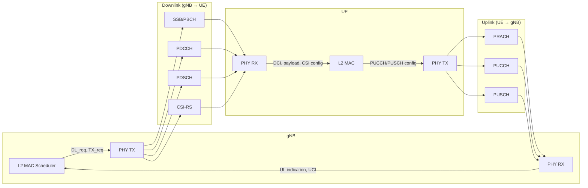

# 5G NR Channels: Implementation, Data Flow, and Research Modifications

This guide is for researchers and developers **starting from scratch** with the OAI 5G repository. It explains where each 5G channel (gNB↔UE) is implemented, how to trace data flow, and how to modify the implementation for experimental research.

---

## 1. Repository layout (relevant to PHY/L1)

```
openairinterface5g/
├── openair1/                    # PHY (Layer 1)
│   ├── PHY/
│   │   ├── NR_TRANSPORT/        # Common/gNB: generation (TX) of DL signals
│   │   │   ├── nr_pbch.c        # PBCH generation
│   │   │   ├── nr_dci.c         # PDCCH/DCI generation
│   │   │   ├── nr_dlsch.c       # PDSCH generation
│   │   │   ├── nr_prach.c       # PRACH (sequence)
│   │   │   ├── nr_ulsch.c       # PUSCH coding/scrambling
│   │   │   └── ...
│   │   ├── NR_UE_TRANSPORT/     # UE: reception (RX) and UE TX
│   │   │   ├── nr_pbch.c        # PBCH RX (extract, decode)
│   │   │   ├── dci_nr.c         # PDCCH RX (demod, decode DCI)
│   │   │   ├── nr_dlsch_decoding.c, nr_dlsch_demodulation.c  # PDSCH RX
│   │   │   ├── csi_rx.c         # CSI-RS RX (channel est, RI/PMI/CQI)
│   │   │   ├── pucch_nr.c       # PUCCH encoding (UE TX)
│   │   │   ├── nr_ulsch_ue.c    # PUSCH encoding (UE TX)
│   │   │   ├── nr_prach.c       # PRACH TX (UE)
│   │   │   └── ...
│   │   ├── NR_ESTIMATION/       # Channel estimation (gNB UL, UE DL)
│   │   │   ├── nr_dl_channel_estimation.c  # PBCH/PDCCH/PDSCH DL channel est
│   │   │   └── nr_ul_channel_estimation.c # PUSCH UL channel est (gNB)
│   │   ├── NR_REFSIG/           # Reference signals (DMRS, etc.)
│   │   ├── nr_phy_common/       # Shared: CSI-RS generation, etc.
│   │   └── TOOLS/               # ImScope, phy_scope_interface
│   ├── SCHED_NR/                # gNB PHY orchestration (slot TX/RX)
│   │   └── phy_procedures_nr_gNB.c   # phy_procedures_gNB_TX, UL RX
│   └── SCHED_NR_UE/             # UE PHY orchestration
│       └── phy_procedures_nr_ue.c     # SSB/PBCH/PDCCH/PDSCH/CSI-RS RX, PUCCH/PUSCH TX
├── openair2/                    # Layer 2 (RLC, MAC, RRC)
│   ├── LAYER2/NR_MAC_gNB/       # gNB MAC: scheduler, UCI decode, CSI report
│   │   ├── gNB_scheduler.c      # Top-level slot scheduling (MIB, SIB, CSI-RS, RA, DLSCH)
│   │   ├── gNB_scheduler_uci.c  # PUCCH processing, CSI report decode
│   │   ├── gNB_scheduler_primitives.c  # PDSCH/PUSCH/CSI-RS scheduling, DL_req fill
│   │   └── ...
│   └── LAYER2/NR_MAC_UE/        # UE MAC: config, DCI handling, UL scheduling
├── executables/
│   ├── nr-softmodem.c           # gNB main
│   ├── nr-uesoftmodem.c         # UE main
│   └── nr-gnb.c, nr-ue.c        # gNB/UE slot loop (call PHY + L2)
└── doc/                         # Documentation (this file, SW_archi.md, etc.)
```

The **L1–L2 interface** is nFAPI-like: the MAC builds **DL TTI request** (PDCCH/PDSCH/CSI-RS/SSB PDUs) and **TX data request** (payloads); the PHY generates I/Q and sends. In the reverse direction, the PHY produces **RX indications** (PBCH decoded, DCI, PDSCH payload, etc.) and **UL TTI** (PUCCH/PUSCH) for the gNB; the MAC consumes them and runs the scheduler/UCI.

### High-level channel flow (gNB ↔ UE)



**Block diagram image:** `assets/5g_channels_flow_diagram.png`

---

## 2. Channel overview: where is it implemented?

| Channel | Direction | gNB side (generation / reception) | UE side (reception / generation) | L2 scheduling / config |
|--------|-----------|------------------------------------|-----------------------------------|--------------------------|
| **SSB (PSS/SSS/PBCH)** | DL | `nr_common_signal_procedures` → `nr_generate_pbch`, `nr_generate_pbch_dmrs` (SCHED_NR, NR_TRANSPORT) | `nr_search_ssb_common` → `nr_pbch_detection` → `nr_ue_pbch_procedures` (SCHED_NR_UE, NR_UE_TRANSPORT, NR_UE_ESTIMATION) | `schedule_nr_mib` fills SSB PDU in DL_req |
| **PDCCH (DCI)** | DL | `nr_generate_dci` (NR_TRANSPORT/nr_dci.c) | `nr_pdcch_generate_llr` → DCI decode → `nr_pdcch_dci_indication` (dci_nr.c, NR_UE_ESTIMATION) | Scheduler fills PDCCH PDU per UE/CORESET |
| **PDSCH** | DL | `nr_generate_pdsch` (NR_TRANSPORT/nr_dlsch.c) | `nr_ue_pdsch_procedures` → `nr_rx_pdsch`, `nr_dlsch_decoding` (SCHED_NR_UE, NR_UE_TRANSPORT) | `prepare_pdsch_pdu`, DLSCH scheduler fill DL_req + TX_req |
| **CSI-RS** | DL | `nr_generate_csi_rs_gNB` → `nr_generate_csi_rs` (SCHED_NR, nr_phy_common) | `nr_ue_csi_rs_procedures` → `nr_process_csi_rs` (csi_rx.c) | `nr_csirs_scheduling` (gNB_scheduler_primitives) fills CSI-RS PDU |
| **PRACH** | UL | RU/PHY receives; MAC: `handle_nr_rach` (gNB_scheduler_uci) | `generate_nr_prach` (NR_UE_TRANSPORT/nr_prach.c) | UE MAC triggers; gNB schedules RAR in DL |
| **PUCCH** | UL | `nr_fill_nfapi_pucch` (scheduling); RX: PUCCH decode in PHY → `handle_nr_uci_pucch_*` (gNB_scheduler_uci) | PUCCH encoding in pucch_nr.c; UE scheduler configures resource | `nr_schedule_pucch`, `schedule_pucch_core` (gNB_scheduler_uci) |
| **PUSCH** | UL | `nr_ulsch_procedures` → `nr_pusch_channel_estimation`, `nr_ulsch_decoding` (SCHED_NR, NR_ESTIMATION, NR_TRANSPORT) | `nr_ulsch_ue` (encoding), UE MAC fills UL config | gNB scheduler fills UL_tti_req; PHY fills UL indication |
| **SRS** | UL | SRS reception / measurement (nr_measurements_gNB, SRS RX in PHY) | SRS generation (if used) | Configured via RRC/MAC |

---

## 3. Downlink data flow (gNB → UE)

### 3.1 Who fills the DL request?

- **Entry:** `gNB_scheduler.c`: `schedule_nr_gnb()` (or equivalent) runs per slot and calls:
  - `schedule_nr_mib()` → SSB PDU in `DL_req`
  - `schedule_nr_sib1()` / `schedule_nr_other_sib()` → PDCCH + PDSCH for SIB
  - `nr_csirs_scheduling()` → CSI-RS PDUs in `DL_req`
  - `nr_schedule_RA()`, DLSCH scheduler, etc. → PDCCH + PDSCH PDUs and `TX_req` (payloads)

- **Structure:** `nfapi_nr_dl_tti_request_t` (e.g. `sched_info->DL_req`) contains `dl_tti_request_body.dl_tti_pdu_list[]` with PDU types: `NFAPI_NR_DL_TTI_SSB_PDU_TYPE`, `NFAPI_NR_DL_TTI_PDCCH_PDU_TYPE`, `NFAPI_NR_DL_TTI_CSI_RS_PDU_TYPE`, `NFAPI_NR_DL_TTI_PDSCH_PDU_TYPE`.

### 3.2 gNB PHY TX (slot)

- **Entry:** `phy_procedures_gNB_TX()` in `openair1/SCHED_NR/phy_procedures_nr_gNB.c`.
- **Flow:** For each PDU in `DL_req`:
  - SSB → `nr_common_signal_procedures()` → `nr_generate_pbch()`, `nr_generate_pbch_dmrs()`
  - PDCCH → `nr_generate_dci()`
  - CSI-RS → `nr_generate_csi_rs_gNB()` → `nr_generate_csi_rs()`
  - PDSCH → `nr_generate_pdsch()` (uses `TX_req` for payload).
- **Output:** Time-domain samples written into `gNB->common_vars.txdataF[]`; then OFDM/rotation and sent to RU.

**Trace:** Set breakpoints in `phy_procedures_gNB_TX` and in `nr_generate_pbch`, `nr_generate_dci`, `nr_generate_csi_rs`, `nr_generate_pdsch`. Log `DL_req->dl_tti_request_body.nPDUs` and each `PDUType`.

### 3.3 UE PHY RX (slot)

- **Entry:** From the UE slot loop (e.g. `nr-ue.c`), the DL slot processing calls into `phy_procedures_nr_ue.c`:
  - **SSB/PBCH:** In the same file, SSB search and PBCH decode (e.g. `nr_search_ssb_common`, `nr_pbch_detection`, `nr_ue_pbch_procedures`) run when the slot contains an SSB.
  - **PDCCH:** Configured by MAC via `dl_config`; UE runs `nr_pdcch_generate_llr()` and DCI decode, then `nr_pdcch_dci_indication()` to pass DCI to MAC.
  - **PDSCH:** If DLSCH is active for the slot, `pdsch_processing()` → `nr_ue_pdsch_procedures()` (channel estimation, `nr_rx_pdsch`, LLR, `nr_dlsch_decoding`), then `nr_fill_dl_indication` / `nr_fill_rx_indication` and `ue->if_inst->dl_indication()` to MAC.
  - **CSI-RS:** If CSI-RS config is active, `nr_ue_csi_rs_procedures()` → `nr_process_csi_rs()` in `csi_rx.c` (channel estimation, RI/PMI/CQI, optional recording/scope).

**Trace:** Set breakpoints in `pdsch_processing`, `nr_ue_csi_rs_procedures`, and in `nr_pdcch_dci_indication`, `nr_fill_rx_indication`. Follow `phy_data->dlsch[0].active` and `phy_data->csirs_vars.active`.

---

## 4. Uplink data flow (UE → gNB)

### 4.1 UE PHY TX (PUCCH / PUSCH / PRACH)

- **PUCCH:** UE MAC configures PUCCH resources; encoding and mapping in `openair1/PHY/NR_UE_TRANSPORT/pucch_nr.c`. The UE slot TX path builds the UL slot buffer (PUCCH + PUSCH) and sends to RF.
- **PUSCH:** Encoding and scrambling in `nr_ulsch_ue.c`; UE MAC provides transport blocks and UL grant (from DCI). Data is placed in the UL slot buffer.
- **PRACH:** `generate_nr_prach()` in `nr_prach.c` generates the PRACH sequence; triggered by UE MAC when RA is needed.

**Trace:** Search for `nr_ue_slot_select`, UL slot handling in the UE executable, and for `pucch`, `nr_ulsch_ue`, `generate_nr_prach` in PHY.

### 4.2 gNB PHY RX (slot)

- **Entry:** `phy_procedures_gNB_uespec_RX()` (or equivalent) in `phy_procedures_nr_gNB.c`: for each UL slot, the gNB processes received I/Q.
- **PUCCH:** Decode per configured PUCCH → UCI (HARQ-ACK, SR, CSI). Results are passed to MAC: `handle_nr_uci_pucch_0_1`, `handle_nr_uci_pucch_2_3_4` in `gNB_scheduler_uci.c` (decode CSI report, HARQ-ACK, etc.).
- **PUSCH:** `nr_ulsch_procedures()` → `nr_pusch_channel_estimation()`, `nr_ulsch_decoding()`; then CRC and `UL_INFO` to MAC (`handle_nr_ulsch`).

**Trace:** Set breakpoints in `nr_ulsch_procedures`, `nr_ulsch_decoding`, and in `handle_nr_uci_pucch_2_3_4`, `extract_pucch_csi_report` for CSI feedback.

---

## 4.3 End-to-end CSI (CSI-RS/SSB) reporting over PUCCH (UCI)

This section explains **how CSI measurements are turned into a CSI report**, how that report is **quantized and bit-packed into UCI**, how it is **carried on PUCCH**, and how it is **decoded and consumed at the gNB**.

There are 2 distinct “CSI” concepts that often get mixed:

- **CSI-RS processing at UE PHY**: estimate channel/RSRP and compute RI/PMI/CQI (or RSRP only) from CSI-RS (`openair1/PHY/NR_UE_TRANSPORT/csi_rx.c`).
- **CSI reporting at UE MAC**: take the latest measurements and **encode a 3GPP CSI report bitfield** (CSI part1/part2) for transmission on PUCCH/PUSCH (`openair2/LAYER2/NR_MAC_UE/nr_ue_procedures.c`).

### 4.3.1 RRC config decides what is reported (reportQuantity)

The gNB configures CSI reporting via `CSI-MeasConfig` / `CSI-ReportConfig` (RRC). The key field is:

- `CSI-ReportConfig.reportQuantity` (Rel-15) – examples implemented/used in OAI:
  - `ssb-Index-RSRP`
  - `cri-RSRP` (CSI-RS based RSRP)
  - `cri-RI-PMI-CQI` (full CSI feedback: RI/PMI/CQI, with optional CRI)
- `CSI-ReportConfig.ext2.reportQuantity-r16` (Rel-16 extension) – examples in code:
  - `ssb-Index-SINR-r16`
  - `cri-SINR-r16` (decode path exists on gNB; UE encoding currently logs “not yet available”)

Where to look:

- **gNB RRC/MAC config generation**: `openair2/LAYER2/NR_MAC_gNB/nr_radio_config.c` (builds CSI report configs).
- **UE MAC scheduling decision** (periodic): `nr_get_csi_measurements()` in `openair2/LAYER2/NR_MAC_UE/nr_ue_procedures.c` checks `(frame,slot)` against the configured periodicity and chooses the PUCCH CSI resource.

### 4.3.2 UE PHY computes CSI measurements (RI/PMI/CQI, RSRP, SINR)

On CSI-RS reception, UE PHY runs:

- `nr_ue_csi_rs_procedures()` in `openair1/SCHED_NR_UE/phy_procedures_nr_ue.c`
- which calls `nr_process_csi_rs()` in `openair1/PHY/NR_UE_TRANSPORT/csi_rx.c`
- which (when configured) does:
  - channel estimation (`nr_csi_rs_channel_estimation`)
  - RI estimation (`nr_csi_rs_ri_estimation`)
  - PMI estimation (`nr_csi_rs_pmi_estimation`)
  - CQI derivation from SINR (`nr_csi_rs_cqi_estimation`)

Important detail: **the “SINR” printed by UE PHY (e.g. 82 dB) is an internal UE value**, used mainly to derive CQI. It is **not automatically part of the CSI report** unless the reportQuantity is one of the SINR report types (Rel-16 `reportQuantity-r16`).

### 4.3.3 UE PHY → UE MAC: passing the measurements

UE MAC receives measurements from L1 via:

- `nr_ue_process_l1_measurements()` in `openair2/LAYER2/NR_MAC_UE/nr_ue_procedures.c`

For CSI measurements (`l1_measurements->meas_type == NFAPI_NR_CSI_MEAS`), it updates:

- `mac->csirs_measurements.rsrp_dBm`
- `mac->csirs_measurements.ri` (0-based in MAC)
- `mac->csirs_measurements.i1` / `i2` (PMI indices)
- `mac->csirs_measurements.cqi`

These are the inputs used by the CSI report encoder.

### 4.3.4 Quantization and encoding: building CSI part1/part2 payload bits

The UE MAC builds the bit payload with:

- `nr_get_csi_measurements()` (select which report is due and which PUCCH resource to use)
- `nr_get_csi_payload()` (dispatch by `reportQuantity` / `reportQuantity-r16`)

Main encoders (all in `openair2/LAYER2/NR_MAC_UE/nr_ue_procedures.c`):

- **SSB RSRP report** (`ssb-Index-RSRP`):
  - `get_ssb_rsrp_payload()`
  - Uses `get_rsrp_index()` and differential indices (`get_rsrp_diff_index()`), then packs:
    - optional SSB index (if multiple RS reported)
    - 7-bit strongest RSRP index + 4-bit differentials
- **SSB SINR report** (Rel-16 `ssb-Index-SINR-r16`):
  - `get_ssb_sinr_payload()`
  - Uses `get_sinr_index()` and `get_sinr_diff_index()` (TS 38.133 tables), packs:
    - optional SSB index
    - 7-bit strongest SINR index + 4-bit differentials
- **CSI-RS RSRP report** (`cri-RSRP`):
  - `get_csirs_RSRP_payload()`
  - Quantizes RSRP with `get_rsrp_index(mac->csirs_measurements.rsrp_dBm)`
- **Full CSI feedback** (`cri-RI-PMI-CQI`):
  - `get_csirs_RI_PMI_CQI_payload()`
  - Fetches bit lengths from `mac->csi_report_template[...].csi_meas_bitlen` and packs:
    - `RI` (rank), `PMI` (i1/i2), `CQI`, and (future) `CRI`
  - Handles **different mapping modes**:
    - on PUSCH: puts (CRI/RI/CQI) in part1 and PMI in part2
    - on PUCCH wideband: puts all into part1 (+ optional zero padding)

Bit ordering detail (very important for tracing):

- UE MAC uses `reverse_bits(payload, n_bits)` before returning `nfapi_nr_ue_csi_payload_t`.
- gNB MAC decoding uses `pickandreverse_bits()` to recover fields from the received byte array.

So end-to-end, you need to keep track of:

- field bit lengths (`nr_csi_report_t` templates)
- concatenation order (RI/PMI/CQI/…)
- whether padding bits exist
- where the bit reversal happens (UE side vs gNB side)

### 4.3.5 Mapping to PUCCH UCI (physical transmission)

Once `nfapi_nr_ue_csi_payload_t` is built (part1_payload + bit length, optionally part2), the UE schedules it on PUCCH.

Where to look:

- **UE MAC scheduler** decides whether CSI goes on PUCCH or is multiplexed on PUSCH:
  - `openair2/LAYER2/NR_MAC_UE/nr_ue_scheduler.c` and helpers in `nr_ue_procedures.c`
  - `nr_get_csi_measurements()` also has a `csi_on_pusch` flag affecting mapping and bit split.
- **PUCCH PHY** encoding/mapping:
  - `openair1/PHY/NR_UE_TRANSPORT/pucch_nr.c` (PUCCH formats 2/3/4 are used for CSI payloads).

At a high level, CSI part1 bits become the `csi_part1_payload` carried by PUCCH format 2/3/4, and the gNB receives that as `nfapi_nr_uci_pucch_pdu_format_2_3_4_t` with fields:

- `csi_part1.csi_part1_payload` (byte array)
- `csi_part1.csi_part1_bit_len`
- `csi_part1.csi_part1_crc` (CRC result)

### 4.3.6 gNB decoding (UCI → CSI_report_t)

On the gNB, PUCCH CSI is decoded in:

- `handle_nr_uci_pucch_2_3_4()` in `openair2/LAYER2/NR_MAC_gNB/gNB_scheduler_uci.c`
- which calls `extract_pucch_csi_report(...)`

Within `extract_pucch_csi_report`, OAI selects the matching `CSI-ReportConfig` for the current (frame,slot) and decodes fields with:

- `evaluate_cri_report()`
- `evaluate_ri_report()` (RI is decoded as an index constrained by `ri_restriction`, then stored 0-based in MAC)
- `evaluate_pmi_report()`
- `evaluate_cqi_report()`
- `evaluate_rsrp_report()` (SSB/CSI-RS RSRP report)
- `evaluate_sinr_report()` (Rel-16 SINR report types)

All those extract bitfields using `pickandreverse_bits(payload, bitlen, start_bit)` and write into:

- `sched_ctrl->CSI_report` (`CSI_report_t` in `openair2/LAYER2/NR_MAC_gNB/nr_mac_gNB.h`)

### 4.3.7 How the decoded CSI is used by other gNB processes

The decoded CSI influences scheduling and link adaptation, e.g.:

- `sched_ctrl->dl_max_mcs` can be updated based on SINR report (see `evaluate_sinr_report()`).
- RI/PMI/CQI are used in:
  - layer selection (number of layers) and precoding selection
  - MCS selection (CQI → MCS mapping)

Entry points to follow:

- `openair2/LAYER2/NR_MAC_gNB/gNB_scheduler_primitives.c` (helpers like `get_dl_nrOfLayers`, PMI mapping into precoding matrix index).
- `openair2/LAYER2/NR_MAC_gNB/gNB_scheduler_dlsch.c` (DL scheduling decisions).

### 4.3.8 Practical tracing recipe (end-to-end)

To trace one CSI report end-to-end for a given UE (RNTI):

1. **Confirm CSI-RS is scheduled at gNB**:
   - `nr_csirs_scheduling()` in `gNB_scheduler_primitives.c` (check CSI-RS PDU presence; optionally use `--csi-record-path` → `gnb_csirs_scheduling.csv`).
2. **Confirm UE ran CSI-RS processing**:
   - `nr_ue_csi_rs_procedures()` → `nr_process_csi_rs()`; log `rank_indicator`, `i1/i2`, `cqi`.
3. **Confirm UE MAC received the CSI measurements**:
   - `nr_ue_process_l1_measurements()` updates `mac->csirs_measurements.*`.
4. **Confirm UE MAC builds the CSI payload**:
   - `nr_get_csi_measurements()` and `nr_get_csi_payload()`; log `p1_bits`, `part1_payload`.
5. **Confirm gNB decoded the UCI CSI payload**:
   - `handle_nr_uci_pucch_2_3_4()` and `extract_pucch_csi_report()`; log `sched_ctrl->CSI_report.*`.
6. **Confirm scheduler uses it**:
   - check where RI/PMI/CQI are consulted for layers/precoding/MCS (see 4.3.7).

If you change the packing order or bit lengths, make matching changes on both UE packer (`nr_ue_procedures.c`) and gNB unpacker (`gNB_scheduler_uci.c`).

## 5. How to trace data flow (practical steps)

### 5.1 Find the slot entry points

- **gNB:** `nr-gnb.c` (or main gNB loop) → per slot: get `frame`, `slot` → call L2 scheduler (fills `DL_req`, `UL_tti_req`) → call `phy_procedures_gNB_TX()` for DL and, after RX, PHY RX and then L2 `handle_nr_*` for UL.
- **UE:** `nr-ue.c` (or main UE loop) → per slot: `nr_ue_slot_select()` → if DL slot: FEP (OFDM) → `phy_procedures_nr_ue`-style processing (SSB/PDCCH/PDSCH/CSI-RS); if UL slot: build PUCCH/PUSCH and send.

### 5.2 Grep patterns to follow a channel

| Goal | Suggested grep / search |
|------|--------------------------|
| SSB/PBCH generation | `nr_generate_pbch`, `nr_common_signal_procedures` |
| PDCCH generation | `nr_generate_dci` |
| PDSCH generation | `nr_generate_pdsch` |
| CSI-RS generation | `nr_generate_csi_rs`, `nr_generate_csi_rs_gNB` |
| PBCH RX | `nr_pbch_detection`, `nr_ue_pbch_procedures` |
| PDCCH RX | `nr_pdcch_generate_llr`, `nr_pdcch_dci_indication` |
| PDSCH RX | `nr_ue_pdsch_procedures`, `nr_dlsch_decoding`, `nr_rx_pdsch` |
| CSI-RS RX | `nr_process_csi_rs`, `nr_ue_csi_rs_procedures` |
| PUCCH CSI decode | `extract_pucch_csi_report`, `handle_nr_uci_pucch` |
| PUSCH RX (gNB) | `nr_ulsch_decoding`, `nr_pusch_channel_estimation` |
| DL_req fill | `nr_csirs_scheduling`, `schedule_nr_mib`, `prepare_pdsch_pdu` |

### 5.3 Logging

- Use `LOG_D(PHY, ...)`, `LOG_I(NR_MAC, ...)` etc. (see `common/utils/LOG/`). Control level at runtime or compile-time.
- Add temporary `printf` or file writes (e.g. frame/slot, PDU type, RNTI) at the entry of the functions above to confirm order and presence of PDUs.

---

## 6. Modifying the implementation for experimental research

### 6.1 Adding instrumentation (non-invasive)

- **ImScope:** Use the existing scope types (see `doc/IMSCOPE_CSI_MODIFICATIONS.md`). Add new `scopeDataType` in `phy_scope_interface.h`, feed data with `UEscopeCopyWithMetadata` / `gNBscopeCopyWithMetadata` at the point of interest (e.g. after channel estimation, after decode), and add a new panel in `imscope.cpp` that reads `scope_array[your_type]`. No change to algorithm logic.
- **CSI recording:** Use `--csi-record-path` (see `doc/CSI_RECORD_MODIFICATIONS.md`): UE writes `csi_reports.csv` and `H_f*_s*.bin`; gNB writes `gnb_csi_feedback.csv` and `gnb_csirs_scheduling.csv`. You can add more columns or new files in the same style (mutex-protected append, one-time header).

### 6.2 Changing algorithms (e.g. channel estimation, CQI/RI/PMI)

- **UE DL channel estimation:** `openair1/PHY/NR_UE_ESTIMATION/nr_dl_channel_estimation.c` — e.g. `nr_pdsch_channel_estimation`, `nr_pdcch_channel_estimation`, `nr_pbch_channel_estimation`. Replace or wrap with your own implementation and compare with existing.
- **UE CSI-RS (RI/PMI/CQI):** `openair1/PHY/NR_UE_TRANSPORT/csi_rx.c` — `nr_csi_rs_channel_estimation`, `nr_csi_rs_ri_estimation`, `nr_csi_rs_pmi_estimation`, `nr_csi_rs_cqi_estimation`. Good place for ML-based or alternative CSI feedback.
- **gNB PUSCH channel estimation:** `openair1/PHY/NR_ESTIMATION/nr_ul_channel_estimation.c` — `nr_pusch_channel_estimation`. You can plug in different estimators or post-processing.

### 6.3 Changing scheduling / content (L2)

- **What is sent in DL:** Modify the MAC code that fills `DL_req` and `TX_req`: e.g. `gNB_scheduler_primitives.c` (CSI-RS, PDSCH allocation), `gNB_scheduler_dlsch.c`, `gNB_scheduler_RA.c` (RAR, Msg4). You can change resource allocation, periodicity, or MCS.
- **What is reported in UL (CSI):** RRC/MAC configure the CSI report (report quantity, resources). Decoding is in `gNB_scheduler_uci.c` (`extract_pucch_csi_report`); you can add new report types or log more fields for experiments.

### 6.4 New channel or new processing step

- **New DL signal:** Add a new PDU type (or reuse one) in the scheduler that fills a custom PDU in `DL_req`; in `phy_procedures_gNB_TX` add a `case` that calls your generation function and writes into `txdataF`. On the UE, add RX handling in the UE PHY slot (FEP + your decode) and optionally feed scope/recording.
- **Post-processing hook:** At the end of `nr_process_csi_rs` or after `nr_dlsch_decoding`, call your function (e.g. export to Python, write to shared memory, or update a global struct) without changing the rest of the pipeline.

### 6.5 Debugging and sanity checks

- **Single-channel test:** Use simulation targets (e.g. `dlsim`, `ulsim`) or RF simulator to isolate one channel; disable others in the config or scheduler so only one PDU type is scheduled per slot.
- **Compare with logs:** Enable PHY/MAC logs and compare frame/slot, RNTI, and payload sizes with your instrumentation to ensure you are tracing the right slot and UE.

---

## 7. Quick reference: key files per channel

| Channel | gNB TX / scheduling | gNB RX | UE RX | UE TX |
|---------|---------------------|--------|-------|-------|
| SSB/PBCH | SCHED_NR/phy_procedures_nr_gNB.c, NR_TRANSPORT/nr_pbch.c | — | SCHED_NR_UE (SSB search), NR_UE_TRANSPORT/nr_pbch.c, NR_UE_ESTIMATION (PBCH channel est) | — |
| PDCCH | NR_TRANSPORT/nr_dci.c | — | NR_UE_TRANSPORT/dci_nr.c, NR_UE_ESTIMATION (PDCCH channel est) | — |
| PDSCH | NR_TRANSPORT/nr_dlsch.c | — | SCHED_NR_UE/phy_procedures_nr_ue.c, NR_UE_TRANSPORT (nr_dlsch_*), NR_UE_ESTIMATION | — |
| CSI-RS | nr_phy_common (nr_generate_csi_rs), SCHED_NR (nr_generate_csi_rs_gNB) | — | NR_UE_TRANSPORT/csi_rx.c | — |
| PRACH | — | RU + MAC handle_nr_rach | — | NR_UE_TRANSPORT/nr_prach.c |
| PUCCH | gNB_scheduler_uci (schedule) | PHY PUCCH decode → gNB_scheduler_uci (handle_nr_uci_*) | — | NR_UE_TRANSPORT/pucch_nr.c |
| PUSCH | — | SCHED_NR (nr_ulsch_procedures), NR_TRANSPORT/nr_ulsch_decoding, NR_ESTIMATION (nr_pusch_channel_estimation) | — | NR_UE_TRANSPORT/nr_ulsch_ue.c |

---

## 8. Related documentation

- **`doc/SW_archi.md`** — High-level gNB RX/TX flow (Mermaid diagram).
- **`doc/IMSCOPE_CSI_MODIFICATIONS.md`** — How CSI-RS and CSI report are fed to ImScope and how to add new scope types.
- **`doc/CSI_RECORD_MODIFICATIONS.md`** — How CSI recording works at gNB and UE (`csi_record_path`, CSV and binary outputs).

Using this guide you can, from scratch, locate each 5G channel in the codebase, trace its data flow from L2 to PHY (or vice versa), and apply the suggested modification points for your experiments.
