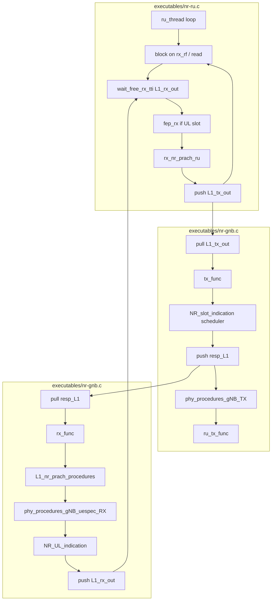

# 5G NR Stack Architecture: From Graphs to Code and Data Flow

This document **unifies** the architecture described in `SW_archi.md` and `SW-archi-graph.md`, **links each block to the actual files and functions** in the repository, and **maps the flow to DL (gNB→UE) and UL (UE→gNB) channels**. It is intended for **beginners** who need a single place to understand how the 5G stack is implemented and how to trace data flow.

**Summary:** The gNB runs three threads driven by FIFO queues: **ru_thread** (blocks on RF RX, pushes TX jobs), **L1_tx_thread** (runs scheduler then PHY TX, then triggers RX), and **L1_rx_thread** (decodes PUCCH/PUSCH, then runs NR_UL_indication). DL is built in `phy_procedures_gNB_TX`; UL is decoded in `phy_procedures_gNB_uespec_RX` and handed to MAC in `NR_UL_indication`. This doc ties each graph block to source files and gives a beginner-friendly path to follow DL/UL and per-channel flow.

---

## 1. What the existing architecture docs tell us

### 1.1 From `SW-archi-graph.md` (L1 threading)

The graphs describe **three threads** and **three FIFO queues** that drive gNB processing:

| Concept          | Meaning                                                                                                                                                                                                                                                   |
| ---------------- | --------------------------------------------------------------------------------------------------------------------------------------------------------------------------------------------------------------------------------------------------------- |
| **ru_thread**    | Main thread that blocks on **radio RX**. Derives frame/slot from RX timestamp. For UL slots: may run RX FEP (DFT), then PRACH extraction; then **pushes a TX job** into `L1_tx_out` and returns to block on RX again.                                     |
| **L1_tx_out**    | Queue of **TX jobs** (one per slot). Consumed by **L1_tx_thread**.                                                                                                                                                                                        |
| **L1_tx_thread** | For each TX job: (1) runs **scheduler** via **NR_slot_indication** (Slot.indication), (2) **pushes an RX job** into `resp_L1`, (3) runs **phy_procedures_gNB_TX**, (4) calls **ru_tx_func** to send I/Q to the radio.                                     |
| **resp_L1**      | Queue of **RX jobs** (triggered by TX thread). Consumed by **L1_rx_thread**.                                                                                                                                                                              |
| **L1_rx_thread** | For each RX job: (1) **L1_nr_prach_procedures**, (2) optional **apply_nr_rotation_RX**, (3) **phy_procedures_gNB_uespec_RX** (PUCCH/PUSCH decode), (4) **NR_UL_indication** (scheduler with decoded UCI/UL-SCH), (5) signals completion on **L1_rx_out**. |
| **L1_rx_out**    | Completion queue so that **ru_thread** can limit how many RX jobs are in flight (`wait_free_rx_tti`).                                                                                                                                                     |

**Important takeaway:** TX path is **scheduler-first**: the scheduler runs **before** PHY TX for that slot, and it **triggers** the RX path for the corresponding UL slot. So the order is: **RF RX (ru_thread) → push TX job → L1_tx_thread runs scheduler then PHY TX then RU TX → L1_rx_thread runs PHY RX then NR_UL_indication**.

### 1.2 From `SW_archi.md` (gNB procedures and above)

- **phy_procedures_gNB_TX**: builds DL slot (SSB, PDCCH, CSI-RS, PDSCH) from `DL_req` / `TX_req`.
- **phy_procedures_gNB_uespec_RX**: decodes PUCCH (UCI), PUSCH (UL-SCH), fills structures that **NR_UL_indication** uses.
- **NR_UL_indication**: handles decoded UL (RACH, UCI, ULSCH), runs **gNB_dlsch_ulsch_scheduler**, then **NR_Schedule_response**.
- **Scheduler** (invoked from NR_slot_indication or NR_UL_indication): fills `DL_req`, `UL_tti_req`, `TX_req` for PHY; uses RLC/PDCP interfaces for data.
- **RLC/PDCP/GTP**: data plane and control plane above MAC; see SW_archi.md for sequence diagrams.

---

## 2. Where each block lives in the codebase (gNB)

| Block / step                                            | File(s)                                                                            | Function / symbol                                                                                                                                                              |
| ------------------------------------------------------- | ---------------------------------------------------------------------------------- | ------------------------------------------------------------------------------------------------------------------------------------------------------------------------------ |
| **ru_thread** (main loop: block RX → FEP → push TX job) | `executables/nr-ru.c`                                                              | Main loop in the thread that calls `ru->ifdevice.read()` (or equivalent); `wait_free_rx_tti()`; `ru->feprx()`; `rx_nr_prach_ru()`; `pushNotifiedFIFO(&gNB->L1_tx_out, resTx)`. |
| **L1_tx_out**, **resp_L1**, **L1_rx_out**               | `executables/nr-gnb.c`, `PHY/defs_gNB.h`                                           | `gNB->L1_tx_out`, `gNB->resp_L1`, `gNB->L1_rx_out` (notified FIFOs).                                                                                                           |
| **L1_tx_thread**                                        | `executables/nr-gnb.c`                                                             | Thread that `pullNotifiedFIFO(&gNB->L1_tx_out)` then calls **tx_func**.                                                                                                        |
| **tx_func**                                             | `executables/nr-gnb.c`                                                             | `ifi->NR_slot_indication()` (scheduler), then `pushNotifiedFIFO(&gNB->resp_L1)` (trigger RX), then `phy_procedures_gNB_TX()`, then `ru_tx_func()`.                             |
| **NR_slot_indication**                                  | `openair2/NR_PHY_INTERFACE/NR_IF_Module.c`                                         | Pointer: `run_scheduler_monolithic` or `pnf_send_slot_ind` (nFAPI). Monolithic: runs scheduler that fills `DL_req`, `TX_req`, `UL_tti_req`.                                    |
| **phy_procedures_gNB_TX**                               | `openair1/SCHED_NR/phy_procedures_nr_gNB.c`                                        | Builds DL slot: SSB, PDCCH, CSI-RS, PDSCH (see §4).                                                                                                                            |
| **ru_tx_func**                                          | `executables/nr-ru.c`                                                              | Sends time-domain samples to RU (precoding, IDFT, then device write).                                                                                                          |
| **L1_rx_thread**                                        | `executables/nr-gnb.c`                                                             | Thread that `pullNotifiedFIFO(&gNB->resp_L1)` then calls **rx_func**.                                                                                                          |
| **rx_func**                                             | `executables/nr-gnb.c`                                                             | `L1_nr_prach_procedures()`, optional rotation, **phy_procedures_gNB_uespec_RX()**, then **gNB->if_inst->NR_UL_indication(&UL_INFO)**.                                          |
| **phy_procedures_gNB_uespec_RX**                        | `openair1/SCHED_NR/phy_procedures_nr_gNB.c`                                        | PUCCH decode, PUSCH process (channel est., LLR, **nr_ulsch_decoding**), fills `UL_INFO`.                                                                                       |
| **NR_UL_indication**                                    | `openair2/NR_PHY_INTERFACE/NR_IF_Module.c` (monolithic); nFAPI uses different path | `NR_UL_indication()` calls `handle_nr_rach`, `handle_nr_uci` (incl. CSI decode), `handle_nr_ulsch`, then **gNB_dlsch_ulsch_scheduler**, then schedule response.                |

---

## 3. Single diagram: gNB threads and queues (with file refs)

---

## 4. Relating the graph to DL (gNB→UE) and UL (UE→gNB)

### 4.1 Downlink (gNB → UE): where it is built and sent

| Step                            | What happens                                                                                     | File(s) / function                                                                                                                                                       |
| ------------------------------- | ------------------------------------------------------------------------------------------------ | ------------------------------------------------------------------------------------------------------------------------------------------------------------------------ |
| 1. Scheduler decides DL content | For the slot, scheduler fills `DL_req` (SSB, PDCCH, CSI-RS, PDSCH PDUs) and `TX_req` (payloads). | `openair2/LAYER2/NR_MAC_gNB/gNB_scheduler.c` (e.g. `schedule_nr_gnb`), `schedule_nr_mib`, `schedule_nr_sib1`, `nr_csirs_scheduling`, `nr_schedule_ue_spec` (DLSCH), etc. |
| 2. PHY TX builds I/Q            | **phy_procedures_gNB_TX** reads `DL_req` and writes into `gNB->common_vars.txdataF`.             | `openair1/SCHED_NR/phy_procedures_nr_gNB.c`                                                                                                                              |
| 2a. SSB/PBCH                    |                                                                                                  | `nr_common_signal_procedures` → `nr_generate_pbch`, `nr_generate_pbch_dmrs`; `openair1/PHY/NR_TRANSPORT/nr_pbch.c`                                                       |
| 2b. PDCCH                       |                                                                                                  | `nr_generate_dci`; `openair1/PHY/NR_TRANSPORT/nr_dci.c`                                                                                                                  |
| 2c. CSI-RS                      |                                                                                                  | `nr_generate_csi_rs_gNB` → `nr_generate_csi_rs`; `openair1/PHY/nr_phy_common/src/nr_phy_common_csirs.c`                                                                  |
| 2d. PDSCH                       |                                                                                                  | `nr_generate_pdsch`; `openair1/PHY/NR_TRANSPORT/nr_dlsch.c`                                                                                                              |
| 3. Send to air                  | **ru_tx_func**: precoding, IDFT, write to device.                                                | `executables/nr-ru.c` (ru_tx_func), RU-specific FEP                                                                                                                      |

So for **DL**, the flow is: *Scheduler (nr-gnb.c tx_func) → phy_procedures_gNB_TX (SCHED_NR) → NR_TRANSPORT/nr_ → ru_tx_func**.

### 4.2 Uplink (UE → gNB): where it is received and decoded

| Step                   | What happens                                                                                                      | File(s) / function                                                                                                                                    |
| ---------------------- | ----------------------------------------------------------------------------------------------------------------- | ----------------------------------------------------------------------------------------------------------------------------------------------------- |
| 1. RF RX + FEP         | **ru_thread** gets samples; for UL slot, FEP (e.g. DFT) produces frequency-domain RX.                             | `executables/nr-ru.c` (main loop, `ru->feprx`)                                                                                                        |
| 2. RX job runs         | **L1_rx_thread** runs **rx_func**: PRACH, then **phy_procedures_gNB_uespec_RX**.                                  | `executables/nr-gnb.c` (rx_func)                                                                                                                      |
| 3. PUCCH decoded       | PUCCH decoding produces UCI (HARQ-ACK, SR, **CSI report**).                                                       | Inside `phy_procedures_gNB_uespec_RX`; UCI to MAC via `UL_INFO`.                                                                                      |
| 4. PUSCH decoded       | **nr_ulsch_procedures** → channel est., LLR, **nr_ulsch_decoding**.                                               | `openair1/SCHED_NR/phy_procedures_nr_gNB.c`, `openair1/PHY/NR_ESTIMATION/nr_ul_channel_estimation.c`, `openair1/PHY/NR_TRANSPORT/nr_ulsch_decoding.c` |
| 5. MAC uses decoded UL | **NR_UL_indication**: handle RACH, UCI (incl. **handle_nr_uci_pucch_2_3_4** → CSI decode), ULSCH, then scheduler. | `openair2/LAYER2/NR_MAC_gNB/gNB_scheduler_uci.c` (e.g. handle_nr_uci*, extract_pucch_csi_report)                                                      |

So for **UL**, the flow is: **ru_thread (RX+FEP) → L1_rx_thread → rx_func → phy_procedures_gNB_uespec_RX → NR_UL_indication (handle_nr_uci, handle_nr_ulsch, scheduler)**.

---

## 5. UE side (DL and UL)

Compared to the gNB, the UE uses a **simplified** slot loop. Still, DL and UL follow a consistent chain:

*DL (gNB → UE)*: RU reads samples → UE PHY processes SSB/PDCCH/CSI‑RS/PDSCH → UE notifies MAC via `dl_indication`.
*UL (UE → gNB)*: UE MAC provides UL configuration to PHY → PHY builds PUSCH/SRS/PUCCH → RU writes samples to the air interface.

### 5.1 Downlink (gNB → UE): receive, estimate/decode, and notify MAC

| Step | What happens | File(s) / function(s) |
|------|--------------|-------------------------|
| 1. RF RX + read samples for slots | UE reads time-domain samples from the RU/device for each slot (DL or mixed slots). | `executables/nr-ue.c` (`readFrame()`) → `nrue_ru_read()` |
| 2. DL slot preprocessing | Before decoding payload, UE sends an initial DL indication to L2 (so scheduling/DCI handling can proceed), then runs SSB/PBCH and PDCCH processing. | `executables/nr-ue.c` (`UE_dl_preprocessing()`) → `nr_fill_dl_indication()` → `UE->if_inst->dl_indication()`; then `pbch_processing()`; `pdcch_processing()` |
| 3. PDSCH + CSI‑RS processing (PHY RX) | UE runs PDSCH channel processing. When CSI‑RS is configured, CSI‑RS RX/estimation is executed as part of the same slot processing, then PDSCH channel estimation and DLSCH decoding are performed. | `executables/nr-ue.c` (`UE_dl_processing()`) → `pdsch_processing()` in `openair1/SCHED_NR_UE/phy_procedures_nr_ue.c` |
| 3a. CSI‑RS inside PDSCH slot processing | For symbols where CSI‑RS is present, the slot FEP is applied and CSI‑RS processing runs. | `openair1/SCHED_NR_UE/phy_procedures_nr_ue.c` (`pdsch_processing()`) → `nr_ue_csi_rs_procedures()` → (implementation in) `openair1/PHY/NR_UE_TRANSPORT/csi_rx.c` |
| 3b. PDSCH channel estimation + DLSCH decoding | UE performs `nr_ue_pdsch_procedures()` and then `nr_ue_dlsch_procedures()` to produce decoded data and/or LLRs. | `openair1/SCHED_NR_UE/phy_procedures_nr_ue.c` (`pdsch_processing()`) → `nr_ue_pdsch_procedures()` → `nr_ue_dlsch_procedures()` |
| 4. Notify MAC with decoded DL information | After DLSCH decoding, UE fills RX indication structures and calls DL indication back into L2/MAC. | `openair1/SCHED_NR_UE/phy_procedures_nr_ue.c` (`nr_ue_dlsch_procedures()`) → `nr_fill_dl_indication()`/`nr_fill_rx_indication()` → `ue->if_inst->dl_indication()` → handler `nr_ue_dl_indication()` in `openair2/NR_UE_PHY_INTERFACE/NR_IF_Module.c` |

So for **DL**, the flow is: **RU read → UE_dl_preprocessing (SSB/PDCCH indications) → UE_dl_processing (pdsch_processing: CSI‑RS + PDSCH + DLSCH decode) → nr_ue_dl_indication() → MAC**.

### 5.2 Uplink (UE → gNB): build UL waveforms and transmit

| Step | What happens | File(s) / function(s) |
|------|--------------|-------------------------|
| 1. Slot TX loop reaches an UL/mixed slot | For each slot, the UE TX thread selects TX slot type and triggers L2 to prepare UL config for this slot. | `executables/nr-ue.c` (`processSlotTX()`) → `UE->if_inst->ul_indication(&ul_indication)` |
| 2. Build UL payloads in PHY TX | PHY builds UL waveforms for that slot: PUSCH (UL-SCH), SRS (if enabled), and PUCCH (UCI, including CSI on PUCCH). | `openair1/SCHED_NR_UE/phy_procedures_nr_ue.c` (`phy_procedures_nrUE_TX()`) → `nr_ue_ulsch_procedures()`; `ue_srs_procedures_nr()`; `pucch_procedures_ue_nr()` |
| 2a. OFDM modulation + UL TX rotation | After generating UL frequency-domain data, UE performs OFDM modulation (IDFT), rotation/compensation as needed. | `openair1/SCHED_NR_UE/phy_procedures_nr_ue.c` (`phy_procedures_nrUE_TX()`) → `nr_tx_rotation_and_ofdm_mod()` |
| 3. Write samples to the RU/device (air interface TX) | The generated UL time-domain samples are written to the radio interface (USRP/rfsimulator). | `executables/nr-ue.c` (`processSlotTX()`) → `RU_write(...)`; actual RU write uses `nrue_ru_write_reorder()` / `nrue_ru_write()` in `nr-ue.c` |
| 4. gNB receives and decodes (context) | On the gNB side, PUCCH CSI/UCI and PUSCH decoding happen in the UL RX pipeline. | gNB path from section 4: `executables/nr-gnb.c` (`rx_func`) → `phy_procedures_gNB_uespec_RX` → `NR_UL_indication` → `gNB_scheduler_uci.c` (e.g., `handle_nr_uci_pucch_2_3_4`) |

So for **UL**, the flow is: **processSlotTX() → ul_indication (L2→PHY) → phy_procedures_nrUE_TX (PUSCH/SRS/PUCCH) → nr_tx_rotation_and_ofdm_mod → RU_write → gNB UL RX decode**.

See also **doc/5G_CHANNELS_IMPLEMENTATION_AND_TRACING_GUIDE.md** for more file-level detail (especially for CSI reporting on PUCCH).

---

## 6. Recommended way for a beginner to track data flow

### 6.1 One slot, one direction

1. **Pick one slot and one direction** (e.g. “DL slot 0” or “UL slot 7”).
2. **Set a breakpoint at the entry** of the path:
  - **DL**: `phy_procedures_gNB_TX()` in `openair1/SCHED_NR/phy_procedures_nr_gNB.c` (and optionally `tx_func` in `executables/nr-gnb.c` to see scheduler → TX order).
  - **UL**: `phy_procedures_gNB_uespec_RX()` in the same file (and optionally `rx_func` in `executables/nr-gnb.c`).
3. **Follow the data**:
  - DL: step through `DL_req` → SSB / PDCCH / CSI-RS / PDSCH generation; then `ru_tx_func`.
  - UL: step through PUCCH/PUSCH decode; then `NR_UL_indication` and `handle_nr_uci`* / `handle_nr_ulsch`.

### 6.2 Follow one channel end-to-end

Use the **channel–file table** in **5G_CHANNELS_IMPLEMENTATION_AND_TRACING_GUIDE.md** (§2 and §7):

- **DL example (PDSCH):** Scheduler fills PDSCH PDU and TX_req → `phy_procedures_gNB_TX` → `nr_generate_pdsch` (`openair1/PHY/NR_TRANSPORT/nr_dlsch.c`). On UE: `nr_ue_pdsch_procedures` → `nr_dlsch_decoding`.
- **UL example (CSI on PUCCH):** UE PHY measures CSI-RS → UE MAC encodes CSI → PUCCH; gNB PHY decodes PUCCH → **NR_UL_indication** → **handle_nr_uci_pucch_2_3_4** → **extract_pucch_csi_report** (`openair2/LAYER2/NR_MAC_gNB/gNB_scheduler_uci.c`).

### 6.3 Trace order (gNB) consistent with the graphs

- **ru_thread** blocks on RX; on UL slot it pushes to **L1_tx_out** and returns to RX.
- **L1_tx_thread** pops **L1_tx_out** → **tx_func** → **NR_slot_indication** (scheduler for *this* TX slot) → push **resp_L1** (trigger RX for the corresponding RX slot) → **phy_procedures_gNB_TX** → **ru_tx_func**.
- **L1_rx_thread** pops **resp_L1** → **rx_func** → PRACH + **phy_procedures_gNB_uespec_RX** → **NR_UL_indication** (uses *decoded* UL from *this* RX slot) → push **L1_rx_out** (free the slot for ru_thread).

So: **scheduler runs in TX thread before PHY TX**; **UL decode and NR_UL_indication run in RX thread** and use the *current* slot’s decoded data.

---

## 7. How the graphs relate to the full 5G stack

| Layer / concept             | In the graphs                                                     | In the code                                                                                             |
| --------------------------- | ----------------------------------------------------------------- | ------------------------------------------------------------------------------------------------------- |
| **RF / RU**                 | ru_thread, rx_rf, ru_tx_func                                      | `executables/nr-ru.c`, device-specific FEP and TX                                                       |
| **L1 PHY (gNB)**            | phy_procedures_gNB_TX, phy_procedures_gNB_uespec_RX, feprx, feptx | `openair1/SCHED_NR/phy_procedures_nr_gNB.c`, `openair1/PHY/NR_`*, `openair1/PHY/NR_ESTIMATION/*`        |
| **L2 MAC (scheduler, UCI)** | NR_slot_indication, NR_UL_indication, handle_nr_*                 | `openair2/LAYER2/NR_MAC_gNB/gNB_scheduler.c`, `gNB_scheduler_uci.c`, `gNB_scheduler_primitives.c`, etc. |
| **L2 RLC/PDCP**             | Described in SW_archi.md (data flow)                              | `openair2/LAYER2/nr_rlc`, `openair2/LAYER2/nr_pdcp`                                                     |
| **L3 RRC / NGAP / GTP**     | SW_archi.md (RRC, GTP)                                            | `openair2/RRC`, NGAP, GTP-U                                                                             |

The **graphs do not show** the UE or the content of each channel (SSB vs PDCCH vs PDSCH); they show **when** and **in which thread** the gNB runs scheduler, PHY TX, and PHY RX. This doc and the channels guide together give: **when** (graphs + this file) and **what per channel** (5G_CHANNELS_IMPLEMENTATION_AND_TRACING_GUIDE.md).

---

## 8. Quick reference: DL vs UL flow with files

| Direction       | Trigger                                 | Main functions                                                                                                          | Key files                                                                                                                   |
| --------------- | --------------------------------------- | ----------------------------------------------------------------------------------------------------------------------- | --------------------------------------------------------------------------------------------------------------------------- |
| **DL (gNB TX)** | L1_tx_thread (after NR_slot_indication) | phy_procedures_gNB_TX → nr_common_signal_procedures, nr_generate_dci, nr_generate_csi_rs_gNB, nr_generate_pdsch         | `nr-gnb.c` (tx_func), `phy_procedures_nr_gNB.c`, `NR_TRANSPORT/nr_*.c`, `nr_phy_common_csirs.c`                             |
| **UL (gNB RX)** | L1_rx_thread (after resp_L1)            | L1_nr_prach_procedures, phy_procedures_gNB_uespec_RX, NR_UL_indication (handle_nr_rach, handle_nr_uci, handle_nr_ulsch) | `nr-gnb.c` (rx_func), `phy_procedures_nr_gNB.c`, `gNB_scheduler_uci.c`, `nr_ul_channel_estimation.c`, `nr_ulsch_decoding.c` |

---

## 9. Related documents

- **SW_archi.md** — Original gNB procedure list, scheduler breakdown, RLC/PDCP/GTP description and sequence diagrams.
- **SW-archi-graph.md** — L1 threading (ru_thread, L1_tx_thread, L1_rx_thread) and queues.
- **5G_CHANNELS_IMPLEMENTATION_AND_TRACING_GUIDE.md** — Channel-by-channel implementation, files, and tracing (DL/UL channels, CSI on PUCCH).
- **NR_NFAPI_archi.md** — nFAPI split (if used).

Using this document, a beginner can start from the **graphs** (SW-archi-graph.md, SW_archi.md), map each box to **files and functions** (§2–4), then follow **DL/UL and channels** (§4, §6–8) and the **channel guide** for detailed tracing.