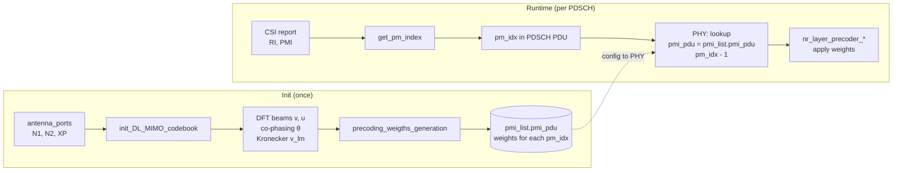
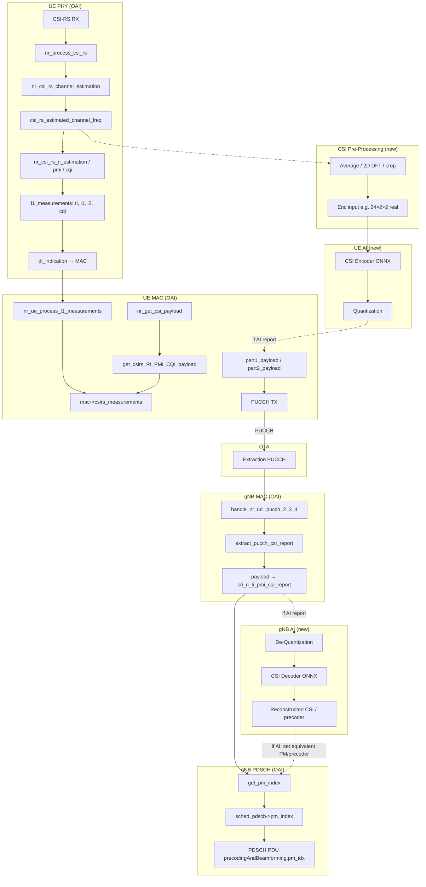

# Learning from "Real-time AI-enabled CSI Feedback Experimentation with Open RAN"

This document summarizes what can be learned from the paper **"Real-time AI-enabled CSI Feedback Experimentation with Open RAN"** and how to replicate or adapt its framework using the **current OpenAirInterface5G (OAI)** repository. It provides concrete file paths, function names, and a data/signal flow diagram.

---

## 1. What the paper does (summary)

- **Goal:** Run an **autoencoder-based CSI compression** model in real time over OAI: UE encodes channel estimates into a small latent (codewords), sends it over **PUCCH**; gNB decodes the latent and reconstructs CSI for **PDSCH** configuration.
- **Inference:** Both encoder and decoder use **ONNX Runtime** (no Python in the critical path at runtime; models can be trained in Python and exported to ONNX).
- **Auxiliary:** **Quantization** (encoder output → N-bit integers for OTA) and **De-quantization** (gNB received bits → float for decoder).
- **Integration:** AI/ML modules and auxiliary functions are integrated **alongside** existing OAI blocks; the paper suggests using a **separate thread for inference** to avoid blocking other OAI processing.
- **Setup:** 2×1 MIMO, band n78, 40 MHz (e.g. 106 PRB); latency in the order of sub-ms (pre-processing ~0.23 ms, encoder ~0.06–0.1 ms, decoder ~0.1–0.28 ms).

---

## 2. Framework mapping: paper blocks → current OAI repository

The paper’s block diagram (Fig. 1) can be mapped to existing and new code as follows.

### 2.1 nrUE (User Equipment) side


| Paper block                            | Role                                                                 | Current OAI location / replication                                                                                                                                                                                                                                                                                                                                                                                                                                                                                                                                                                                                                                  |
| -------------------------------------- | -------------------------------------------------------------------- | ------------------------------------------------------------------------------------------------------------------------------------------------------------------------------------------------------------------------------------------------------------------------------------------------------------------------------------------------------------------------------------------------------------------------------------------------------------------------------------------------------------------------------------------------------------------------------------------------------------------------------------------------------------------- |
| **CSI-RS Estimates**                   | Raw channel estimates from CSI-RS                                    | `**openair1/PHY/NR_UE_TRANSPORT/csi_rx.c`** — `nr_process_csi_rs()`. Channel array: `csi_rs_estimated_channel_freq[nb_antennas_rx][ports][ofdm_symbol_size + FILTER_MARGIN]`. Built by `nr_csi_rs_channel_estimation()` (same file).                                                                                                                                                                                                                                                                                                                                                                                                                                |
| **CSI Pre-Processing**                 | Prepare input for encoder (e.g. average, 2D DFT, crop, complex→real) | **New code.** Paper: `[1272, 14, 2]` → average over 14 symbols → `[1272, 2]` → 2D DFT → first 24 rows → `[24, 2]` → real/imag split → `[24, 2, 2]`. Can be a new function in `csi_rx.c` or a separate `csi_preprocess.c` called after channel estimation.                                                                                                                                                                                                                                                                                                                                                                                                           |
| **CSI Input (data)**                   | Store pre-processed CSI for evaluation / training                    | **Existing:** `--csi-record-path` → `csi_record_write()` in `csi_rx.c` writes `H_f{frame}_s{slot}.bin` and `csi_reports.csv`. Same data can feed an encoder path.                                                                                                                                                                                                                                                                                                                                                                                                                                                                                                   |
| **CSI Encoder (AI/ML) + ONNX Runtime** | Compress CSI to latent (e.g. `[2, 1]`)                               | **New:** Either (a) C code calling **ONNX Runtime C API** in a dedicated module (e.g. `openair1/PHY/NR_UE_TRANSPORT/csi_onnx_encoder.c`), or (b) **Python sidecar** over socket as in `doc/CSINET_EXPLORATION_WITH_TYPEI.md`. Paper uses ONNX Runtime.                                                                                                                                                                                                                                                                                                                                                                                                              |
| **Quantization**                       | Float latent → N-bit codewords for transmission                      | **New auxiliary function** (e.g. in same encoder module or a small `csi_quantization.c`). Output is the bit pattern that will be sent on PUCCH.                                                                                                                                                                                                                                                                                                                                                                                                                                                                                                                     |
| **Feedback via PUCCH**                 | Send codewords on PUCCH                                              | **Existing:** UE MAC builds CSI payload and sends via PUCCH. `**openair2/LAYER2/NR_MAC_UE/nr_ue_procedures.c`**: `nr_get_csi_payload()` → for `cri_RI_PMI_CQI` it calls `get_csirs_RI_PMI_CQI_payload()` which uses `mac->csirs_measurements` (ri, i1, i2, cqi). **Replication:** Either (1) add a new report quantity (e.g. “AI codeword”) and fill `part1_payload` from quantized encoder output, or (2) reuse part1/part2 bit container with a different interpretation when report config indicates “AI feedback.” **PUCCH payload assembly:** `nr_ue_procedures.c` (e.g. around 1688, 1724, 1743) uses `pucch->csi_payload.part1_payload` and `part2_payload`. |


**Key UE functions (existing):**

- `**openair1/PHY/NR_UE_TRANSPORT/csi_rx.c`**
  - `nr_process_csi_rs()` — entry; runs channel estimation, RI/PMI/CQI, then `csi_record_write()` and `ue->if_inst->dl_indication()` with `fapi_nr_l1_measurements_t` (rsrp_dBm, rank_indicator, i1, i2, cqi).
  - `nr_csi_rs_channel_estimation()` — builds `csi_rs_estimated_channel_freq`.
  - `nr_csi_rs_ri_estimation()`, `nr_csi_rs_pmi_estimation()`, `nr_csi_rs_cqi_estimation()` — Type I report.
  - `csi_record_write()` — writes H bin and CSV when `ue->csi_record_path` is set.
- `**openair2/NR_UE_PHY_INTERFACE/NR_IF_Module.c`**
  - `nr_ue_dl_indication()` → on `FAPI_NR_MEAS_IND` calls `**nr_ue_process_l1_measurements()**`.
- `**openair2/LAYER2/NR_MAC_UE/nr_ue_procedures.c**`
  - `nr_ue_process_l1_measurements()` — stores `l1_measurements` into `mac->csirs_measurements` (ri, i1, i2, cqi).
  - `nr_get_csi_payload()` — dispatches by report type; for `cri_RI_PMI_CQI` calls `get_csirs_RI_PMI_CQI_payload()` which reads `mac->csirs_measurements` and packs part1/part2.

### 2.2 gNB side


| Paper block                            | Role                                            | Current OAI location / replication                                                                                                                                                                                                                                                                                                                                                                                                                                                                                                                                                                                  |
| -------------------------------------- | ----------------------------------------------- | ------------------------------------------------------------------------------------------------------------------------------------------------------------------------------------------------------------------------------------------------------------------------------------------------------------------------------------------------------------------------------------------------------------------------------------------------------------------------------------------------------------------------------------------------------------------------------------------------------------------- |
| **Extraction PUCCH**                   | Decode PUCCH and get CSI payload                | `**openair2/LAYER2/NR_MAC_gNB/gNB_scheduler_uci.c`** — `handle_nr_uci_pucch_2_3_4()` receives `nfapi_nr_uci_pucch_pdu_format_2_3_4_t *uci_234`; when `(uci_234->pduBitmap >> 2) & 0x01` it calls `**extract_pucch_csi_report()`** with `uci_234->csi_part1.csi_part1_payload` and `csi_part1_bit_len`.                                                                                                                                                                                                                                                                                                              |
| **De-Quantization**                    | Received bits → float latent for decoder        | **New auxiliary function** (e.g. in gNB CSI AI module). Input: bit buffer from PUCCH; output: float array for ONNX decoder.                                                                                                                                                                                                                                                                                                                                                                                                                                                                                         |
| **CSI Decoder (AI/ML) + ONNX Runtime** | Reconstruct CSI from latent (e.g. `[24, 2, 2]`) | **New:** C module using ONNX Runtime C API (e.g. `openair2/LAYER2/NR_MAC_gNB/csi_onnx_decoder.c`) or Python sidecar; output is reconstructed channel or precoder.                                                                                                                                                                                                                                                                                                                                                                                                                                                   |
| **CSI Post-Processing**                | Optional processing of reconstructed CSI        | **New or reuse:** Convert decoder output into a form usable by PDSCH (e.g. precoding matrix or beam index).                                                                                                                                                                                                                                                                                                                                                                                                                                                                                                         |
| **Config PDSCH**                       | Use CSI for MCS, precoding, scheduling          | **Existing:** `**openair2/LAYER2/NR_MAC_gNB/gNB_scheduler_dlsch.c`** — PDSCH scheduling uses `**get_pm_index()`** (in `**openair2/LAYER2/NR_MAC_gNB/gNB_scheduler_primitives.c**`), which reads `**sched_ctrl->CSI_report.cri_ri_li_pmi_cqi_report**` (ri, pmi_x1, pmi_x2, csi_report_id) and computes the precoding matrix index. **Replication:** For AI feedback, either (1) feed decoder output into a path that sets an equivalent “PMI” or beam/precoder state used by `get_pm_index()` / PDSCH, or (2) add a separate precoding path that uses reconstructed CSI when report config indicates “AI feedback.” |


**Key gNB functions (existing):**

- `**openair2/LAYER2/NR_MAC_gNB/gNB_scheduler_uci.c`**
  - `handle_nr_uci_pucch_2_3_4()` — entry for PUCCH format 2/3/4; dispatches HARQ, SR, CSI.
  - `extract_pucch_csi_report()` — parses payload per report config; for `cri_RI_PMI_CQI` calls `evaluate_cri_report()`, `evaluate_ri_report()`, `evaluate_pmi_report()`, `evaluate_cqi_report()` and fills `**sched_ctrl->CSI_report.cri_ri_li_pmi_cqi_report`** (cri, ri, pmi_x1, pmi_x2, wb_cqi_1tb, wb_cqi_2tb, csi_report_id).
- `**openair2/LAYER2/NR_MAC_gNB/gNB_scheduler_primitives.c**`
  - `get_dl_nrOfLayers()` — returns `sched_ctrl->CSI_report.cri_ri_li_pmi_cqi_report.ri + 1`.
  - `**get_pm_index()**` — uses `UE->csi_report_template[report_id]` and `sched_ctrl->CSI_report.cri_ri_li_pmi_cqi_report` (pmi_x1, pmi_x2) to compute the precoding matrix index for the codebook.
- `**openair2/LAYER2/NR_MAC_gNB/gNB_scheduler_dlsch.c**`
  - PDSCH scheduling calls `get_pm_index()` and sets `sched_pdsch->pm_index`; later `**pdsch_pdu->precodingAndBeamforming.prgs_list[0].pm_idx = sched_pdsch->pm_index**` (around 1036).

### 2.3 From received CSI feedback to DL layers, precoding matrix, and MCS

How the gNB uses the **received** CSI report (RI, PMI, CQI) to schedule downlink **number of layers**, **precoding matrix**, and **MCS**:


| What                 | Source in CSI report   | Where it is set from feedback                                                                                                                                                                              | Where it is used for scheduling                                                                                                                                                                                                                                                                                                                                                                                                                                                                                                                                                               |
| -------------------- | ---------------------- | ---------------------------------------------------------------------------------------------------------------------------------------------------------------------------------------------------------- | --------------------------------------------------------------------------------------------------------------------------------------------------------------------------------------------------------------------------------------------------------------------------------------------------------------------------------------------------------------------------------------------------------------------------------------------------------------------------------------------------------------------------------------------------------------------------------------------- |
| **Number of layers** | RI                     | Parsed in `**gNB_scheduler_uci.c`**: `evaluate_ri_report()` → `sched_ctrl->CSI_report.cri_ri_li_pmi_cqi_report.ri`.                                                                                        | `**gNB_scheduler_primitives.c`**: `get_dl_nrOfLayers(sched_ctrl, dci_format)` returns `**ri + 1**` (DCI 1_1; DCI 1_0 always 1). `**gNB_scheduler_dlsch.c**`: `get_dl_nrOfLayers()` is used when building `NR_sched_pdsch_t` (e.g. `l = get_dl_nrOfLayers(...)`, `sched_pdsch.nrOfLayers = l`); same for retransmissions (lines 437–444, 542, 879–890). Finally `**prepare_pdsch_pdu()**`: `pdsch_pdu->nrOfLayers = sched_pdsch->nrOfLayers`.                                                                                                                                                  |
| **Precoding matrix** | PMI (i1 / i2 → x1, x2) | Parsed in `**gNB_scheduler_uci.c`**: `evaluate_pmi_report()` → `sched_ctrl->CSI_report.cri_ri_li_pmi_cqi_report.pmi_x1`, `pmi_x2`.                                                                         | `**gNB_scheduler_primitives.c`**: `**get_pm_index(nrmac, UE, dci_format, layers, xp_pdsch_antenna_ports)**` reads `cri_ri_li_pmi_cqi_report` and `UE->csi_report_template[report_id]` (N1, N2, bit lengths) and computes the codebook PM index. `**gNB_scheduler_dlsch.c**`: For new TX: `sched_pdsch.pm_index = get_pm_index(...)` (line 889); for retx: `pm_index = get_pm_index(...)` then `new_sched.pm_index = pm_index` (438, 543). `**prepare_pdsch_pdu()**`: `pdsch_pdu->precodingAndBeamforming.prgs_list[0].pm_idx = sched_pdsch->pm_index` (line 1036).                            |
| **MCS**              | CQI (wideband)         | Parsed in `**gNB_scheduler_uci.c`**: `evaluate_cqi_report()` → `wb_cqi_1tb` (and optionally `wb_cqi_2tb`), then `**sched_ctrl->dl_max_mcs = get_mcs_from_cqi(mcs_table, cqi_Table, cqi_idx)`** (line 668). | `**gNB_scheduler_primitives.c**`: `**get_mcs_from_cqi(mcs_table, cqi_table, cqi_idx)**` uses CQI tables (38.214, cqi_table1/2/3) to find the maximum MCS index that matches the reported (Qm, R). `**gNB_scheduler_dlsch.c**`: In `**pf_dl()**`, `max_mcs = min(sched_ctrl->dl_max_mcs, max_mcs_table)` (line 726); `selected_mcs` is then chosen (BLER-based or min/max) and stored in `iterator->selected_mcs`. When building the PDSCH schedule, `sched_pdsch.mcs = iterator->selected_mcs` (line 883). `**prepare_pdsch_pdu()**`: `pdsch_pdu->mcsIndex[0] = sched_pdsch->mcs` (line 987). |


**Summary call chain**

1. **UCI** → `handle_nr_uci_pucch_2_3_4()` → `extract_pucch_csi_report()` → `evaluate_ri_report()`, `evaluate_pmi_report()`, `evaluate_cqi_report()` → `sched_ctrl->CSI_report.cri_ri_li_pmi_cqi_report` and `sched_ctrl->dl_max_mcs`.
2. **Layers** → `get_dl_nrOfLayers(sched_ctrl, dci_format)` → used in DLSCH to set `sched_pdsch.nrOfLayers` → `pdsch_pdu->nrOfLayers`.
3. **Precoding** → `get_pm_index(..., layers, ...)` → `sched_pdsch.pm_index` → `pdsch_pdu->precodingAndBeamforming.prgs_list[0].pm_idx`.
4. **MCS** → CQI → `get_mcs_from_cqi()` → `sched_ctrl->dl_max_mcs` → in `pf_dl()`, `max_mcs = min(dl_max_mcs, ...)` → `selected_mcs` → `sched_pdsch.mcs` → `pdsch_pdu->mcsIndex[0]`.

**Flow diagram (section 2.3)**

```mermaid
flowchart TB
  subgraph UCI["gNB_scheduler_uci.c"]
    A[PUCCH CSI payload received]
    B[handle_nr_uci_pucch_2_3_4]
    C[extract_pucch_csi_report]
    D1[evaluate_ri_report]
    D2[evaluate_pmi_report]
    D3[evaluate_cqi_report]
    E[(cri_ri_li_pmi_cqi_report\nri, pmi_x1, pmi_x2, wb_cqi_1tb)]
    F[dl_max_mcs = get_mcs_from_cqi]
    A --> B --> C
    C --> D1
    C --> D2
    C --> D3
    D1 --> E
    D2 --> E
    D3 --> E
    D3 --> F
  end

  subgraph PRIM["gNB_scheduler_primitives.c"]
    G[get_dl_nrOfLayers]
    H[get_pm_index]
    I[get_mcs_from_cqi]
    E -.-> G
    E -.-> H
  end

  subgraph DLSCH["gNB_scheduler_dlsch.c"]
    J[pf_dl: max_mcs = min(dl_max_mcs, ...)]
    K[selected_mcs]
    L[Build NR_sched_pdsch_t]
    M[prepare_pdsch_pdu]
    G --> L
    H --> L
    F --> J --> K --> L
    L --> M
  end

  subgraph PDU["PDSCH PDU (FAPI)"]
    N[nrOfLayers]
    O[pm_idx]
    P[mcsIndex]
  end

  M --> N
  M --> O
  M --> P
```


Simplified view: **Layers** from RI via `get_dl_nrOfLayers` → `sched_pdsch.nrOfLayers` → `pdsch_pdu->nrOfLayers`. **Precoding** from PMI via `get_pm_index` → `sched_pdsch.pm_index` → `pdsch_pdu->precodingAndBeamforming.prgs_list[0].pm_idx`. **MCS** from CQI via `get_mcs_from_cqi` → `dl_max_mcs` → `pf_dl` → `selected_mcs` → `sched_pdsch.mcs` → `pdsch_pdu->mcsIndex[0]`.

### 2.4 Precoding matrices: precomputed vs runtime

In this repository the **precoding matrices (precoders) are precomputed once** at gNB initialization and **looked up at runtime** by index. They are **not** calculated on the fly for each PDSCH.


| Aspect          | What happens                                                                                                                                                                                                                                      |
| --------------- | ------------------------------------------------------------------------------------------------------------------------------------------------------------------------------------------------------------------------------------------------- |
| **When**        | All codebook matrices are **calculated once** at gNB init.                                                                                                                                                                                        |
| **Where**       | `**openair2/LAYER2/NR_MAC_gNB/config.c`**: `init_DL_MIMO_codebook()` + `precoding_weigths_generation()`.                                                                                                                                          |
| **Stored as**   | `**gNB_config.pmi_list.pmi_pdu[]`** — each entry has `pm_idx`, `numLayers`, `num_ant_ports`, `weights[layer][ant_port]` (Type I single-panel, fixed-point).                                                                                       |
| **At PDSCH TX** | Scheduler sends only `**pm_idx`** in the PDSCH PDU. PHY **looks up** `pmi_list.pmi_pdu[pm_idx - 1]` and applies the stored `**weights`** in `**openair1/PHY/NR_TRANSPORT/nr_dlsch.c`** via `nr_layer_precoder_simd()` / `nr_layer_precoder_cm()`. |


So: **precoders are already available** (precomputed); only the **index** is derived from CSI and used to select which stored precoder to apply.

**Flow diagram: precoder lifecycle**




**Left (init):** Codebook is built from N1/N2/XP: DFT beams and co-phasing are combined, then `precoding_weigths_generation()` fills every precoding matrix and stores it in `pmi_list.pmi_pdu[]`. **Right (runtime):** From the received CSI (RI, PMI), the MAC computes `pm_idx` and puts it in the PDSCH PDU; the PHY uses that index to select the precomputed matrix and apply it—no matrix calculation at TX time.

---

## 3. Data / signal flow (flowchart)

End-to-end flow from CSI-RS to PDSCH configuration, with existing OAI and optional AI blocks.




**Legend:**

- **Solid lines:** Existing OAI data flow (Type I: channel → RI/PMI/CQI → L1 meas → MAC → PUCCH → gNB extract → CSI_report → get_pm_index → PDSCH).
- **Dashed lines:** New or alternative path for AI: pre-processed channel → encoder → quantize → PUCCH payload; at gNB: payload → de-quantize → decoder → reconstructed CSI used for PDSCH (e.g. via get_pm_index or a parallel precoder path).

---

## 4. Paper’s NN and pre-processing (for replication)

- **Raw channel (paper):** One RX port, one slot: `[1272, 14, 2]` (1272 = 12×106 subcarriers, 14 OFDM symbols, 2 TX ports).
- **Pre-processing:** Average over 14 symbols → `[1272, 2]`; 2D DFT (sparsify); take first 24 rows → `[24, 2]`; complex → real (re/im) → **encoder input `[24, 2, 2]`**.
- **Encoder:** Input `[24, 2, 2]` → (Conv2D, BN, LeakyReLU, Permute, Flatten, Dense, Sigmoid) → **output `[2, 1]`** (latent). Then quantize to N bits (e.g. 4–8 bits) for PUCCH.
- **Decoder:** Input `[2, 1]` (quantized codewords) → (Dense, Reshape, RefineNet×2, Conv2D, BN, Add, LeakyReLU) → **output `[24, 2, 2]`** (reconstructed CSI).
- **In OAI:** Channel from `csi_rx.c` has shape `[nb_antennas_rx][ports][ofdm_symbol_size + FILTER_MARGIN]`. For 106 PRB, 30 kHz, the number of subcarriers and symbols per slot can be matched to the paper’s dimensions; pre-processing (average, DFT, crop, real) must be implemented to produce `[24, 2, 2]` (or your chosen size) before calling the encoder.

---

## 5. Replication steps with this repository

### 5.1 Data collection (no AI yet)

- Enable CSI-RS and **cri_RI_PMI_CQI** (see gNB config and `nr_radio_config.c`: `config_csi_meas_report()`, `config_csi_codebook()`).
- Run gNB and UE with `**--csi-record-path <dir>`** (see **doc/CSI_RECORD_MODIFICATIONS.md**).
- UE writes `H_f{frame}_s{slot}.bin` (header: frame, slot, nr_rx, n_ports, n_subc; then flat c16_t) and `csi_reports.csv` (frame, slot, ri, i1_0..i1_2, i2, cqi, sinr_dB).
- Implement **CSI pre-processing** (average, 2D DFT, crop, complex→real) so that each recorded H yields the encoder input shape (e.g. `[24, 2, 2]`). Use this pipeline offline to generate training/validation data (e.g. 10K/3K/2K as in the paper).

### 5.2 Train and export to ONNX

- Train the autoencoder (e.g. in Python with PyTorch/TensorFlow) on collected or synthetic (e.g. CDL) data; paper uses MATLAB CDL for training.
- Export **encoder** and **decoder** to **ONNX**.
- Optionally apply **post-training quantization** or mixed-precision to reduce latency (as suggested in the paper).

### 5.3 UE: encoder + quantization + PUCCH

- **Option A (ONNX in C):** Add a small module (e.g. `openair1/PHY/NR_UE_TRANSPORT/csi_onnx_encoder.c`) that:
  - After channel estimation in `nr_process_csi_rs()`, runs pre-processing (or calls a pre-processing function).
  - Runs the encoder via **ONNX Runtime C API**.
  - Quantizes the encoder output to N bits.
  - Feeds the bit pattern into the CSI feedback path. For minimal change, either:
    - Store the quantized codeword in a dedicated buffer and add a new “AI CSI” report type so that `nr_get_csi_payload()` (and thus `get_csirs_*_payload()`) packs that buffer into part1/part2 when the report config indicates AI feedback, or
    - Override or bypass `mac->csirs_measurements` for that report and pack the codeword in the same part1/part2 fields.
- **Option B (Python sidecar):** As in **doc/CSINET_EXPLORATION_WITH_TYPEI.md**, run the encoder in a separate process and use a thin C bridge (socket IPC) to send H and receive latent; then quantize in C and feed into the same PUCCH payload path. Use a **separate thread** (as in the paper) so that inference does not block the main PHY thread; on timeout, fall back to Type I.

### 5.4 gNB: de-quantization + decoder + PDSCH

- **Extract PUCCH:** Already done in `extract_pucch_csi_report()`. When the report is “AI,” do not run `evaluate_ri_report()` / `evaluate_pmi_report()` / `evaluate_cqi_report()` for that report; instead, treat `csi_part1_payload` (and if needed part2) as the quantized codeword.
- **De-quantization:** New small function: bits → float latent.
- **Decoder:** New module (e.g. `openair2/LAYER2/NR_MAC_gNB/csi_onnx_decoder.c`) using ONNX Runtime C API, or Python sidecar over socket. Input: de-quantized latent; output: reconstructed CSI (e.g. `[24, 2, 2]`).
- **Config PDSCH:** Map decoder output to the existing precoding path. Options:
  - **Option 1:** From reconstructed CSI compute an equivalent “PMI” (e.g. codebook index or custom index) and write it into `sched_ctrl->CSI_report.cri_ri_li_pmi_cqi_report` (pmi_x1, pmi_x2, ri) so that `**get_pm_index()`** and existing PDSCH code behave unchanged.
  - **Option 2:** Add a separate precoding path that uses the reconstructed channel/precoder when the report config indicates AI feedback, and keep Type I path for other reports.

### 5.5 Latency and threading

- Paper: pre-processing ~0.23 ms, encoder ~0.06–0.1 ms, decoder ~0.1–0.28 ms; **sub-ms total** so it fits within channel coherence for PDSCH configuration.
- Run **inference (and optionally pre-processing) in a separate thread** so that other OAI signal processing is not blocked; use a lock-free or double-buffer scheme to pass the latest channel to the inference thread and the latest codeword/precoder back to the MAC/PHY.

### 5.6 Configuration and fallback

- Use a **dedicated CSI report config** (or a flag in the report config) to indicate “AI codeword” so that:
  - UE sends the quantized encoder output on PUCCH for that config.
  - gNB parses payload as codeword, runs de-quant + decoder, and uses the result for PDSCH.
- **Fallback:** If the AI path is disabled (e.g. ONNX not loaded or inference timeout), use the existing Type I report (cri_RI_PMI_CQI) so that the link still works with codebook-based feedback.

---

## 6. File and function reference (quick index)


| Purpose                     | File                                                    | Function / symbol                                                                                      |
| --------------------------- | ------------------------------------------------------- | ------------------------------------------------------------------------------------------------------ |
| UE: CSI-RS processing entry | `openair1/PHY/NR_UE_TRANSPORT/csi_rx.c`                 | `nr_process_csi_rs()`                                                                                  |
| UE: Channel estimation      | `openair1/PHY/NR_UE_TRANSPORT/csi_rx.c`                 | `nr_csi_rs_channel_estimation()`                                                                       |
| UE: Channel array           | `openair1/PHY/NR_UE_TRANSPORT/csi_rx.c`                 | `csi_rs_estimated_channel_freq[][]`                                                                    |
| UE: Type I RI/PMI/CQI       | `openair1/PHY/NR_UE_TRANSPORT/csi_rx.c`                 | `nr_csi_rs_ri_estimation()`, `nr_csi_rs_pmi_estimation()`, `nr_csi_rs_cqi_estimation()`                |
| UE: L1 → MAC                | `openair1/PHY/NR_UE_TRANSPORT/csi_rx.c`                 | `ue->if_inst->dl_indication()` with `FAPI_NR_MEAS_IND`, `fapi_nr_l1_measurements_t`                    |
| UE: CSI recording           | `openair1/PHY/NR_UE_TRANSPORT/csi_rx.c`                 | `csi_record_write()`                                                                                   |
| UE: DL indication handler   | `openair2/NR_UE_PHY_INTERFACE/NR_IF_Module.c`           | `nr_ue_dl_indication()`, `nr_ue_process_l1_measurements()`                                             |
| UE: Store L1 meas           | `openair2/LAYER2/NR_MAC_UE/nr_ue_procedures.c`          | `nr_ue_process_l1_measurements()` → `mac->csirs_measurements`                                          |
| UE: Build CSI payload       | `openair2/LAYER2/NR_MAC_UE/nr_ue_procedures.c`          | `nr_get_csi_payload()`, `get_csirs_RI_PMI_CQI_payload()`                                               |
| UE: PUCCH CSI part1/part2   | `openair2/LAYER2/NR_MAC_UE/nr_ue_procedures.c`          | `pucch->csi_payload.part1_payload`, `part2_payload` (e.g. 1688, 1724, 1743)                            |
| gNB: PUCCH UCI entry        | `openair2/LAYER2/NR_MAC_gNB/gNB_scheduler_uci.c`        | `handle_nr_uci_pucch_2_3_4()`                                                                          |
| gNB: Parse CSI from PUCCH   | `openair2/LAYER2/NR_MAC_gNB/gNB_scheduler_uci.c`        | `extract_pucch_csi_report()`, `evaluate_ri_report()`, `evaluate_pmi_report()`, `evaluate_cqi_report()` |
| gNB: CSI report storage     | `openair2/LAYER2/NR_MAC_gNB/gNB_scheduler_uci.c`        | `sched_ctrl->CSI_report.cri_ri_li_pmi_cqi_report`                                                      |
| gNB: PM index for PDSCH     | `openair2/LAYER2/NR_MAC_gNB/gNB_scheduler_primitives.c` | `get_pm_index()`, `get_dl_nrOfLayers()`                                                                |
| gNB: PDSCH scheduling       | `openair2/LAYER2/NR_MAC_gNB/gNB_scheduler_dlsch.c`      | `get_pm_index()`, `sched_pdsch->pm_index`, `pdsch_pdu->precodingAndBeamforming.prgs_list[0].pm_idx`    |
| gNB: CSI report config      | `openair2/LAYER2/NR_MAC_gNB/nr_radio_config.c`          | `config_csi_meas_report()`, `config_csi_codebook()` (Type I single-panel)                              |


---

## 7. Related docs in this repo

- **doc/CSI_RECORD_MODIFICATIONS.md** — CSI recording (H bin, CSV), `--csi-record-path`, file formats.
- **doc/CSINET_EXPLORATION_WITH_TYPEI.md** — CSINet exploration with Type I; offline vs online; **Python sidecar + thin C bridge** for inference without embedding Python in .c.
- **doc/5G_CHANNELS_IMPLEMENTATION_AND_TRACING_GUIDE.md** — Channels and tracing context.
- **doc/PUSCH_PDSCH_CONFIG_IN_GNB_CONF.md** — Where PUSCH/PDSCH are configured in the gNB config file.

---

## 8. Paper figures (local assets)

Screenshots from the paper are under `assets/`:

- **Fig. 1 – Framework:** End-to-end block diagram (nrUE: CSI-RS Estimates → Pre-Processing → Encoder + ONNX Runtime → Quantization → PUCCH; gNB: Extraction PUCCH → De-Quantization → Decoder + ONNX Runtime → Post-Processing → Config PDSCH). See `assets/Screenshot_from_2026-03-14_16-17-59-*.png` and `assets/Screenshot_from_2026-03-14_16-22-19-*.png`.
- **Fig. 2 – NN architecture:** Encoder input `[24, 2, 2]` → output `[2, 1]`; Decoder input `[2, 1]` → output `[24, 2, 2]`; RefineNet sub-module. See `assets/Screenshot_from_2026-03-14_16-23-02-*.png`.
- **Fig. 3 + Tables:** Experimental setup (UE/gNB host + radio), NMSE vs codeword bits, latency (pre-processing, encoder, decoder). See `assets/Screenshot_from_2026-03-14_16-23-32-*.png`.

---

## 9. References (paper and tools)

- Paper: **"Real-time AI-enabled CSI Feedback Experimentation with Open RAN"** (framework: encoder/decoder + ONNX Runtime, quantization, PUCCH feedback, PDSCH configuration; separate thread for inference; 2×1 MIMO, band n78; Arena/Colosseum testbeds).
- OpenAirInterface: [12] in the paper.
- ONNX Runtime: [13] in the paper; C/C++ API for embedding inference in OAI.

