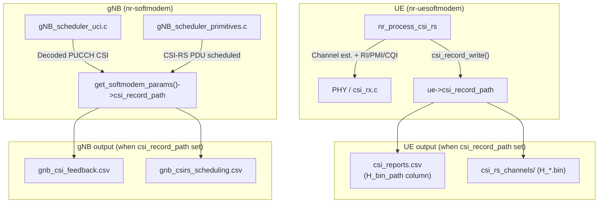
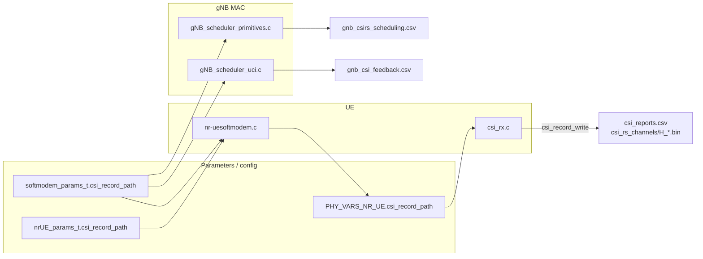

# CSI Record at gNB and UE – Block Diagram and Modifications

This document describes the **CSI recording** feature:

**Block diagram image:** `assets/csi_record_modifications_diagram.png` (UE/gNB data flow and output files). when a directory path is set (`csi_record_path`), the gNB writes decoded CSI feedback and CSI-RS scheduling to CSV files, and the UE writes CSI-RS channel estimates (binary) and CSI report labels (CSV) for monitoring and ML (e.g. CSI compression).

---

## High-level block diagram



---

## Data flow summary

| Side | Trigger | Output file(s) | Content |
|------|---------|-----------------|---------|
| **UE** | After CSI-RS processing in `nr_process_csi_rs()` | `csi_reports.csv` | One row per slot: **timestamp_utc_us**, frame, slot, **H_bin_path**, rsrp_dBm, ri, i1_0..i1_2, i2, cqi, sinr_dB (labels for ML). `H_bin_path` is the path to the corresponding H_*.bin in the `csi_rs_channels/` folder, or empty when no channel was written. |
| **UE** | Same, when channel estimation was done (measurement_bitmap > 1) | `csi_rs_channels/H_{timestamp_utc_us}_f{frame}_s{slot}.bin` | Binary: 5×int32 (frame, slot, nr_rx, n_ports, n_subc) + 1×int64 (timestamp_utc_us) + flat c16_t channel matrix. Stored under **csi_rs_channels/** under the CSI record path. Filename includes timestamp so each file is distinct across runs. |
| **gNB** | After decoding PUCCH CSI part1 (CRI/RI/PMI/CQI) | `gnb_csi_feedback.csv` | One row per decode: **timestamp_utc_us**, frame, slot, rnti, cri, ri, li, pmi_x1, pmi_x2, wb_cqi_1tb, wb_cqi_2tb, csi_report_id. |
| **gNB** | When scheduling NZP-CSI-RS PDU for a UE | `gnb_csirs_scheduling.csv` | One row per scheduled CSI-RS resource: **timestamp_utc_us**, frame, slot, rnti, resource_id, start_rb, nr_of_rbs, row, symb_l0, symb_l1, cdm_type, freq_density, scramb_id. |

---

## Configuration

| Executable | Option | Source | Effect |
|------------|--------|--------|--------|
| **gNB** | `--csi-record-path <dir>` | `softmodem_params.csi_record_path` | When set, gNB writes `gnb_csi_feedback.csv` and `gnb_csirs_scheduling.csv` under `<dir>`. |
| **UE** | `--csi-record-path <dir>` | `nrUE_params.csi_record_path` or fallback to `softmodem_params.csi_record_path` | When set, UE writes `csi_reports.csv` under `<dir>` and H_*.bin files under `<dir>/csi_rs_channels/`. Each CSV row includes column `H_bin_path` with the path to the corresponding H_*.bin (or empty if none). |

Config file (gNB): the same `csi_record_path` can be set via the common softmodem config (e.g. `CSI_RECORD_PATH` / `csi-record-path` in the parameter list).

### CSI-RS periodicity and slot offset (gNB)

The gNB configures the UE’s CSI-RS resources in RRC. For controlling **when** CSI-RS is transmitted:

- **`CSI_RS_periodicity_slots`**: sets the NZP-CSI-RS periodicity (standard 38.331 values).
- **`CSI_RS_slot_offset`**: sets the NZP-CSI-RS **slot offset** inside the periodicity (0..period-1). Use **-1** for auto (default behavior).

Example snippet (inside your `gNBs = ( { ... } );` block):

```c
do_CSIRS = 1;
CSI_RS_periodicity_slots = 20;  # choose from {4,5,8,10,16,20,40,80,160,320}
CSI_RS_slot_offset = 0;         # CSI-RS transmitted at offset slot within the periodicity
```

---

## Files modified (summary)



---

## File-by-file modifications

### 1. `executables/softmodem-common.h`

| Change | Description |
|--------|--------------|
| **Parameter** | `softmodem_params_t.csi_record_path` (char *): gNB directory to record CSI-RS scheduling and decoded CSI feedback. |
| **CLI** | `--csi-record-path` with help string for gNB (gnb_csirs_scheduling.csv, gnb_csi_feedback.csv). |

### 2. `executables/nr-uesoftmodem.h` and `executables/nr-uesoftmodem.c`

| Change | Description |
|--------|--------------|
| **Parameter** | `nrUE_params_t.csi_record_path`: UE-specific directory for CSI recording. |
| **CLI** | `--csi-record-path` with help string for UE (H bin files, csi_reports.csv). |
| **Init** | `UE_CC->csi_record_path = get_nrUE_params()->csi_record_path ? get_nrUE_params()->csi_record_path : get_softmodem_params()->csi_record_path`. Log "CSI recording enabled" when set. |

### 3. `openair1/PHY/defs_nr_UE.h`

| Change | Description |
|--------|--------------|
| **Field** | `PHY_VARS_NR_UE.csi_record_path` (char *): if non-NULL, record CSI-RS channel estimates and CSI reports to this directory for ML. |

### 4. `openair1/PHY/NR_UE_TRANSPORT/csi_rx.c`

| Change | Description |
|--------|--------------|
| **Includes** | `#include <limits.h>` for `PATH_MAX`. |
| **Statics** | `csi_record_mutex`, `csi_record_csv_header_done` for thread-safe CSV and one-time header. |
| **Function** | `csi_record_write(…)`: creates base directory and **csi_rs_channels/** folder under `csi_record_path` if needed; gets `timestamp_utc_us` (gettimeofday); when H_flat non-NULL writes `csi_rs_channels/H_{timestamp_utc_us}_f{frame}_s{slot}.bin` (header: 5×int32 + 1×int64 timestamp_utc_us; then flat c16_t); appends to `csi_reports.csv` (header: timestamp_utc_us, frame, slot, **H_bin_path**, rsrp_dBm, ri, i1_0, i1_1, i1_2, i2, cqi, sinr_dB). `H_bin_path` is the full path to the H_*.bin file for that row, or empty when no channel was written. |
| **Path buffers** | `csi_rs_channels_dir[PATH_MAX]`; `path[PATH_MAX + 64]` and `h_bin_path_buf[PATH_MAX + 64]`. The extra 64 bytes avoid GCC `-Wformat-truncation` when building the full path `csi_rs_channels_dir + "/H_<timestamp>_f<frame>_s<slot>.bin"` (compiler infers up to ~4149 bytes; `PATH_MAX` is 4096 on Linux). Do not reduce these sizes without re-checking the build warning. |
| **Call site** | At end of `nr_process_csi_rs()`, when `ue->csi_record_path` set: call `csi_record_write(…)` with channel pointer only when `measurement_bitmap > 1`, else NULL (RSRP-only: CSV only). |

### 5. `openair2/LAYER2/NR_MAC_gNB/gNB_scheduler_uci.c`

| Change | Description |
|--------|--------------|
| **Statics** | `gnb_csi_feedback_mutex`, `gnb_csi_feedback_csv_header_done`. |
| **Recording** | After decoding PUCCH format 2/3/4 CSI part1 (when CRC OK and report decoded): if `get_softmodem_params()->csi_record_path` set, get `timestamp_utc_us` (gettimeofday), create directory, open `gnb_csi_feedback.csv` in append; write header once (timestamp_utc_us, frame, slot, rnti, cri, ri, li, pmi_x1, pmi_x2, wb_cqi_1tb, wb_cqi_2tb, csi_report_id); append one row per decoded report. |

### 6. `openair2/LAYER2/NR_MAC_gNB/gNB_scheduler_primitives.c`

| Change | Description |
|--------|--------------|
| **Statics** | `gnb_csi_record_mutex`, `gnb_csirs_csv_header_done`. |
| **Recording** | When building NZP-CSI-RS PDU for a UE: if `get_softmodem_params()->csi_record_path` set, get `timestamp_utc_us` (gettimeofday), create directory, open `gnb_csirs_scheduling.csv` in append; write header once (timestamp_utc_us, frame, slot, rnti, resource_id, start_rb, nr_of_rbs, row, symb_l0, symb_l1, cdm_type, freq_density, scramb_id); append one row per scheduled CSI-RS resource. |

---

## Output file formats

### UE: `csi_reports.csv`

| Column | Description |
|--------|-------------|
| **timestamp_utc_us** | Microseconds since Unix epoch (UTC) at recording time; use for time-sync with gNB. |
| frame, slot | RX frame and slot. |
| **H_bin_path** | Full path to the corresponding H_*.bin file in the `csi_rs_channels/` folder for this slot, or empty if no channel was written (RSRP-only). Use this column to load the channel binary for each row. |
| rsrp_dBm | RSRP in dBm. |
| ri | Number of layers (1 or 2). |
| i1_0, i1_1, i1_2, i2 | PMI indices (0 when RSRP-only). |
| cqi | Wideband CQI (0 when RSRP-only). |
| sinr_dB | Precoded SINR in dB (UE-side; 0 when RSRP-only). |

### UE: `csi_rs_channels/H_{timestamp_utc_us}_f{frame}_s{slot}.bin`

- Stored in the **csi_rs_channels/** folder under the CSI record path.
- First 5 × int32: `frame`, `slot`, `nr_rx`, `n_ports`, `n_subc`.
- Then 1 × int64: `timestamp_utc_us` (microseconds since epoch).
- Then: `nr_rx * n_ports * n_subc` × c16_t (flat channel matrix). Only written when channel estimation was performed (measurement_bitmap > 1). Filename includes timestamp so each file is distinct across runs. The path to each file is recorded in `csi_reports.csv` column `H_bin_path`.

### gNB: `gnb_csi_feedback.csv`

| Column | Description |
|--------|-------------|
| **timestamp_utc_us** | Microseconds since Unix epoch (UTC) at decode time; use for time-sync with UE. |
| frame, slot | UL frame/slot of PUCCH. |
| rnti | UE RNTI. |
| cri, ri, li, pmi_x1, pmi_x2 | Decoded CRI/RI/LI/PMI (0-based ri). |
| wb_cqi_1tb, wb_cqi_2tb | Wideband CQI. |
| csi_report_id | Report config ID. |

### gNB: `gnb_csirs_scheduling.csv`

| Column | Description |
|--------|-------------|
| **timestamp_utc_us** | Microseconds since Unix epoch (UTC) at scheduling time. |
| frame, slot | DL frame/slot. |
| rnti | UE RNTI. |
| resource_id | nzp_CSI_RS_ResourceId. |
| start_rb, nr_of_rbs, row, symb_l0, symb_l1, cdm_type, freq_density, scramb_id | CSI-RS PDU parameters. |

---

## Time-sync for supervised ML

All CSVs and the H_bin filename/header use **timestamp_utc_us** (microseconds since Unix epoch via `gettimeofday()`). This allows building a time-synced dataset from gNB and UE recordings:

- **Same time base:** gNB and UE both record `timestamp_utc_us` at the moment they write each row/file. For best alignment, run gNB and UE on machines with synchronized clocks (e.g. NTP).
- **Pairing:** Join UE `csi_reports.csv` (and corresponding `H_*.bin` via the **H_bin_path** column) with gNB `gnb_csi_feedback.csv` by `timestamp_utc_us` (exact or within a small window to account for processing delay). UE (frame, slot) is the **DL** measurement slot; gNB (frame, slot) is the **UL** decode slot, so the report refers to a prior DL slot—pairing by timestamp in the same run is the intended way to get (channel, report) pairs for supervised ML.
- **csi_rs_channels folder and H_bin_path:** H_*.bin files are written under `<csi_record_path>/csi_rs_channels/`. Each row in `csi_reports.csv` has column **H_bin_path** with the full path to the H_*.bin for that slot (or empty when no channel was written), so datasets can reference channel files without assuming a fixed layout.
- **Distinct H_bin files:** Each binary channel file is named `H_{timestamp_utc_us}_f{frame}_s{slot}.bin` in `csi_rs_channels/`, so multiple runs or slots never overwrite the same file.

---

## Usage

- **gNB:** `./nr-softmodem … --csi-record-path /path/to/gnb_csi` → creates `gnb_csi_feedback.csv` and `gnb_csirs_scheduling.csv` under that directory.
- **UE:** `./nr-uesoftmodem … --csi-record-path /path/to/ue_csi` → creates `csi_reports.csv` in that directory and a **csi_rs_channels/** folder containing `H_{timestamp}_f*_s*.bin`; each CSV row includes `H_bin_path` pointing to the corresponding H_*.bin. UE can also inherit gNB path if only the common `--csi-record-path` is set.
- Ensure the directory exists or is creatable (mkdir is attempted with 0755). Recording is disabled when the path is NULL or empty.
