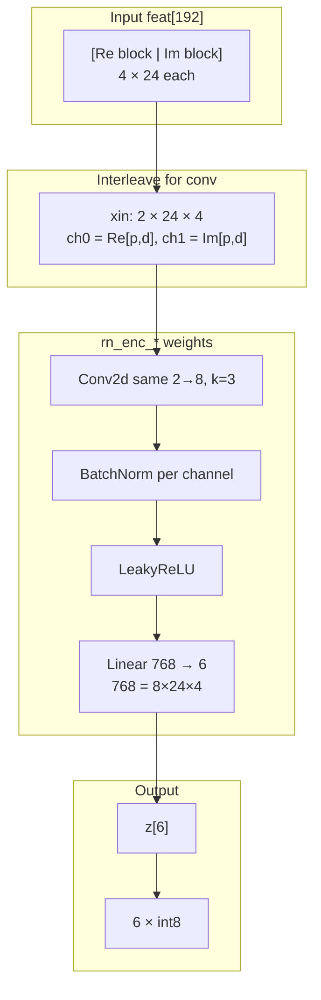
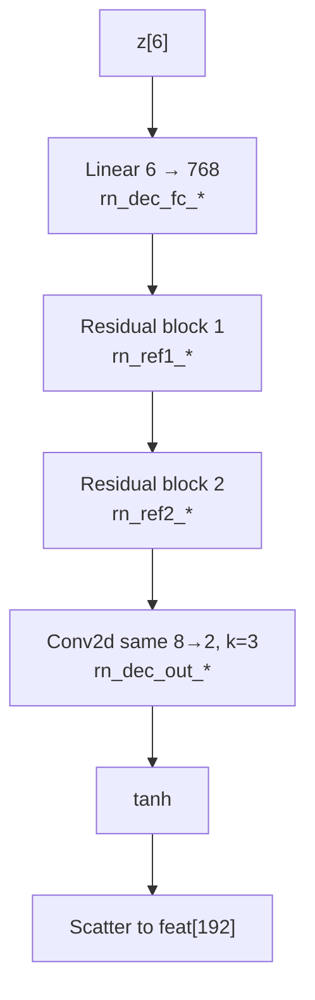
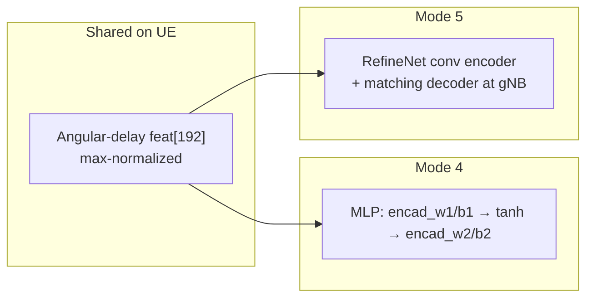

# AI CSI angular-delay encoder / decoder (impl modes 4 and 5)

This note documents the **custom AI feedback** path where the UE sends a **6-byte latent** derived from **wideband CSI-RS** features, and the gNB reconstructs a direction / PMI context for comparison with legacy CSI.

| `--ai-fb-impl-mode` | Enum | Name |
|---------------------|------|------|
| 4 | `AI_FB_IMPL_ANGULAR_DELAY_MLP` | `angular-delay-mlp` |
| 5 | `AI_FB_IMPL_ANGULAR_DELAY_REFINENET` | `angular-delay-refinenet` |

Modes **4** and **5** share the same **192-D angular–delay feature** extraction and normalization on the UE. They differ only in the **neural head**: a small **2-layer MLP** (mode 4) vs a **RefineNet-style conv autoencoder** (mode 5). Latent quantization uses **`AI_FB_ANGULAR_LATENT_QSTEP`** (`0.01f`, see `openair2/LAYER2/NR_MAC_COMMON/ai_fb_common.h`).

---

## 1. End-to-end flow (UE → UL → gNB)

```mermaid
flowchart LR
  subgraph UE["UE PHY"]
    H["CSI-RS est. H\n(rx × port × SC)"]
    F["nr_ai_fb_build_angular_delay_features\nmean_rx → spatial FFT → delay IFFT\n→ 4×24 complex → flatten"]
    N["nr_ai_fb_normalize_angular_features\nscale by max |·|"]
    E["Encoder\nmode 4: MLP\nmode 5: RefineNet"]
    Q["int8 × 6 latent"]
    H --> F --> N --> E --> Q
  end
  subgraph Air["UL"]
    UL["MAC CE / bundled payload\n6 bytes"]
    Q --> UL
  end
  subgraph gNB["gNB"]
    Dq["z = int8 × qstep"]
    D["Decoder\nmode 4: linear from z[0..3] (2p) / decad MLP (4p)\nmode 5: ai_fb_decode_refinenet"]
    V["2p: delay-mean → v̂₂\n4p: codebook correlation"]
    P["PMI / metrics\n2p angular: NR TPMI i2 ∈ {0,1}\nTab. 38.211 6.3.1.5-4"]
    RC["Heuristic RI/CQI\nfrom PMI metric (angular path)"]
    UL --> Dq --> D --> V --> P
    P --> RC
  end
```

---

## 2. Feature vector layout (`feat[192]`)

Constants: `AI_FB_AD_ROWS=24`, `AI_FB_AD_PORTS=4`, `AI_FB_AD_IN=192` (`openair2/LAYER2/NR_MAC_COMMON/ai_fb_model_loader.h`).

| Segment | Indices (conceptual) | Content |
|---------|----------------------|---------|
| First half | `0 … 95` | Real parts: port `p = 0..3`, delay `d = 0..23` → `idx = p * 24 + d` |
| Second half | `96 … 191` | Imaginary parts, same `(p,d)` ordering |

Fewer than four CSI-RS ports are **zero-padded** after the spatial FFT so the tensor always matches the trained shape.

---

## 3. Mode 5 — RefineNet **encoder** (UE)

Implementation: `ai_fb_encode_angular_refinenet_features()` in `openair1/PHY/NR_UE_TRANSPORT/ai_fb_encoder.c`.

---

## 4. Mode 5 — RefineNet **decoder** (gNB)

Implementation: `ai_fb_decode_refinenet()` in `openair2/LAYER2/NR_MAC_gNB/ai_fb_decoder.c`. For **2 ports**, `ai_fb_decode_rank1_2p()` then **averages over delay** for ports 0 and 1 to form `(x0,x1,x2,x3)`, builds unit-norm **`vhat2`**, and selects **`pmi_x2`** via **TS 38.211 Table 6.3.1.5-4** rows **0 and 1** (1-bit **i2** alignment with typical OAI configs).

---

## 5. Mode 4 vs mode 5

---

## 6. Code anchors

| Step | Location |
|------|----------|
| Feature build (aligned with `train_export_mlp_stub.py::_angular_delay_features`) | `nr_ai_fb_build_angular_delay_features()` in `openair1/PHY/NR_UE_TRANSPORT/csi_rx.c` |
| Normalize + dispatch to encoder | `nr_ai_fb_encode_dominant_v()` in `csi_rx.c` |
| MLP encoder (mode 4) | `ai_fb_encode_angular_delay_features()` in `ai_fb_encoder.c` |
| RefineNet encoder (mode 5) | `ai_fb_encode_angular_refinenet_features()` in `ai_fb_encoder.c` |
| RefineNet decoder | `ai_fb_decode_refinenet()` in `ai_fb_decoder.c` |
| 2p PMI from latent | `ai_fb_decode_rank1_2p()` in `ai_fb_decoder.c` |
| Weights / tensor names | `ai_fb_model_loader.c`, export in `tools/ai_fb/train_export_mlp_stub.py` |

---

## 7. Related changelog

Broader UL-SCH AI CSI history: `AI_CSI_LINEAR_ULSCH_IMPLEMENTATION_CHANGELOG.md` (same directory).

---

## 8. Stability knobs for static OTA experiments

To reduce visible `pmi_x2` chattering in **2-port rank-2** static setups (without changing the core AI model), the following knobs are available.

### gNB-side analysis-only debounced PMI (no OTA payload change)

- `--ai-fb-eff-pmi-hyst <N>` (default `3`)
  - Used only in bundled compare logging on gNB.
  - Effective/debounced `pmi_x2` switches only after `N` consecutive opposite raw samples.
  - Raw compare counters are still logged; this adds a smoother analysis view.

### UE-side i2 smoothing before legacy CSI reporting

- `--csi-i2-hyst-window <N>` (default `0`)
  - Majority window over raw rank-2 2-port `i2` decisions.
  - `0` or `1` disables majority filtering.
  - Max supported value is `64`.
- `--csi-i2-hyst-threshold <N>` (default `0`)
  - Hysteresis on top of the majority output: effective `i2` switches only after `N` consecutive opposite filtered decisions.
  - `0` disables hysteresis.

UE rank-2/2-port debug log (`--print-csi-debug=1`) now includes:
- `raw`, `majority`, and `effective` `i2`,
- `score0` / `score1` (the two rank-2 branch scores),
- `margin = |score0-score1|`,
- normalized confidence `margin / (|score0| + |score1| + 1)`.

### Suggested starting points

- Mild smoothing:
  - `--csi-i2-hyst-window 3 --csi-i2-hyst-threshold 2`
- Stronger smoothing:
  - `--csi-i2-hyst-window 5 --csi-i2-hyst-threshold 3`
- Keep OTA behavior untouched and smooth only analytics:
  - leave UE knobs at default (`0`) and tune only `--ai-fb-eff-pmi-hyst`.
