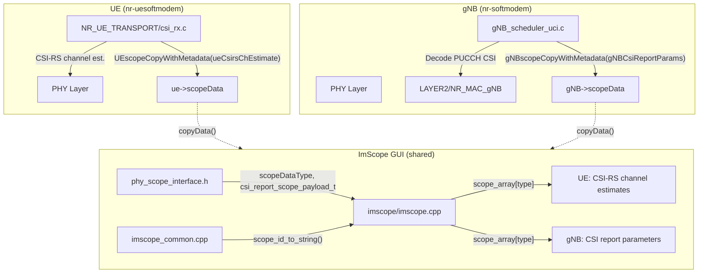
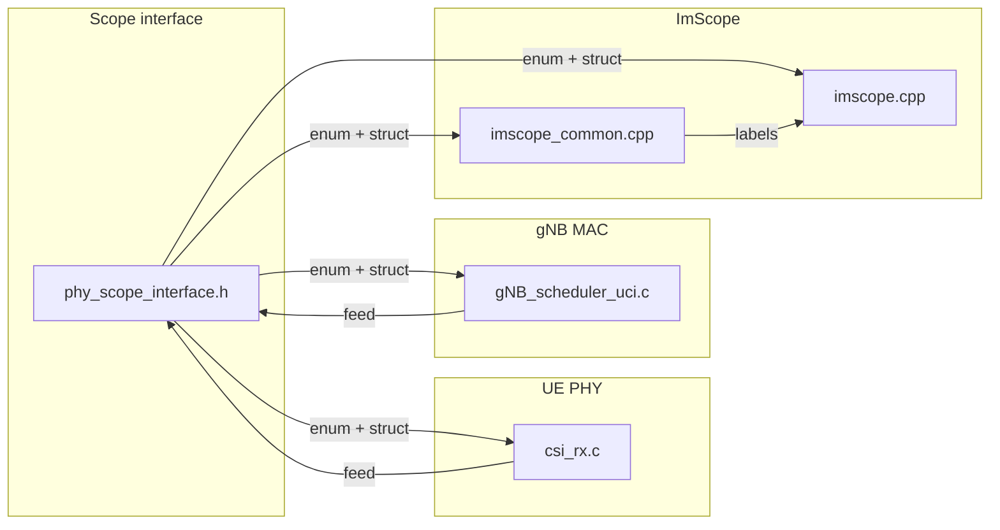

# ImScope CSI-RS and CSI Report Modifications – Block Diagram

This document describes the codebase layout and modifications made to add **CSI-RS channel** visualization at the UE and **CSI report parameters** (RI, PMI, CQI, RSRP, SINR) at the gNB in the ImScope GUI.

---

## High-level block diagram

---

## Data flow

| Path | Source | Scope type | Sink (ImScope window) |
|------|--------|------------|------------------------|
| **UE CSI-RS** | `csi_rx.c` after `nr_csi_rs_channel_estimation()` | `ueCsirsChEstimate` | "UE CSI-RS channel estimates" (IQ histogram) |
| **gNB CSI report** | `gNB_scheduler_uci.c` after PUCCH CSI decode | `gNBCsiReportParams` | "CSI report parameters" (RI, CQI, PMI, RSRP, SINR) |

---

## Files modified (summary)

---

## File-by-file modifications

### 1. `openair1/PHY/TOOLS/phy_scope_interface.h`

| Change | Description |
|--------|--------------|
| **Enum** | Added `ueCsirsChEstimate` and `gNBCsiReportParams` to `scopeDataType` (before `EXTRA_SCOPE_TYPES`). |
| **Struct** | Added `csi_report_scope_payload_t` (frame, slot, rnti, ri, cqi, pmi_x1, pmi_x2, rsrp_dBm, sinr_dB, csi_report_id) for gNB CSI scope payload. |

### 2. `openair1/PHY/NR_UE_TRANSPORT/csi_rx.c`

| Change | Description |
|--------|--------------|
| **Include** | `#include "PHY/TOOLS/phy_scope_interface.h"` |
| **Feed** | After `nr_csi_rs_channel_estimation()` (when `measurement_bitmap > 1`), call `UEscopeCopyWithMetadata(ue, ueCsirsChEstimate, &csi_rs_estimated_channel_freq[0][0][0], sizeof(c16_t), 1, lineSz, 0, &meta)` with slot/frame in `meta`. |

### 3. `openair2/LAYER2/NR_MAC_gNB/gNB_scheduler_uci.c`

| Change | Description |
|--------|--------------|
| **Include** | `#include "openair1/PHY/TOOLS/phy_scope_interface.h"` |
| **Feed** | After decoding PUCCH format 2/3/4 CSI part1, when `cri_ri_li_pmi_cqi_report.print_report` is set: fill `csi_report_scope_payload_t` from `sched_ctrl->CSI_report`, set RSRP/SINR from `csirs_rsrp_report` / `ssb_rsrp_report` when available, then `gNBscopeCopyWithMetadata(RC.gNB[Mod_id], gNBCsiReportParams, &payload, ...)`. |

### 4. `openair1/PHY/TOOLS/imscope/imscope_common.cpp`

| Change | Description |
|--------|--------------|
| **Labels** | In `scope_id_to_string()`: added cases returning `"ueCsirsChEstimate"` and `"gNBCsiReportParams"` for the new scope types. |

### 5. `openair1/PHY/TOOLS/imscope/imscope.cpp`

| Change | Description |
|--------|--------------|
| **Include** | `#include <cstring>` for `memcpy`. |
| **UE panel** | New window "UE CSI-RS channel estimates": `TryCollect(&scope_array[ueCsirsChEstimate], ...)` and draw via `IQHist` (same pattern as PDSCH Chan est). |
| **gNB panel** | New window "CSI report parameters": read `scope_array[gNBCsiReportParams]`, copy blob to `csi_report_scope_payload_t`, display frame/slot/RNTI, **RI+1 (layers)**, CQI, PMI, RSRP, and SINR (or "SINR N/A (not in CQI report)" when 0). |

---

## Build and run

- Build with ImScope: `-DENABLE_IMSCOPE=ON`.
- Run UE with `--imscope` to see "UE CSI-RS channel estimates" when CSI-RS is configured and measurement includes channel estimation.
- Run gNB with `--imscope` to see "CSI report parameters" when a CRI/RI/PMI/CQI report is decoded from PUCCH.

---

## Scope type summary

| Type | Data | Producer | Consumer (ImScope) |
|------|------|----------|--------------------|
| `ueCsirsChEstimate` | IQ (c16_t), lineSz = nb_rx × ports × (ofdm_symbol_size + FILTER_MARGIN) | UE `csi_rx.c` | "UE CSI-RS channel estimates" |
| `gNBCsiReportParams` | `csi_report_scope_payload_t` (RI, CQI, PMI, RSRP, SINR, etc.) | gNB `gNB_scheduler_uci.c` | "CSI report parameters" |

---

## Incremental update (since previous documentation)

This section documents additional changes made after the initial CSI/imscope integration, focused on 4-layer context and 4x4 behavior visibility.

### A) gNB imscope RSRP fix for 4x4 / `num_antenna_ports >= 4`

**Problem observed**
- In 4x4 scenarios, imscope often showed `RSRP = 0 dBm` on the gNB CSI panel.

**Root cause**
- For some CSI report configurations with 4 ports, RSRP is decoded as `ssb_Index_RSRP`.
- That value is stored in `sched_ctrl->CSI_report.ssb_rsrp_report`.
- The imscope feed previously relied on `csirs_rsrp_report` only.

**Fix implemented**
- In `openair2/LAYER2/NR_MAC_gNB/gNB_scheduler_uci.c`, payload RSRP now falls back to SSB RSRP when CSI-RS RSRP is absent:
  - use `csirs_rsrp_report` first,
  - otherwise use `ssb_rsrp_report`.
- Existing SINR behavior remains unchanged except for maintaining the existing SSB fallback path.

### B) Added DL MIMO context fields to gNB CSI payload

To avoid confusion between **reported CSI rank** and **configured DL MIMO capability**, `csi_report_scope_payload_t` was extended in:
- `openair1/PHY/TOOLS/phy_scope_interface.h`

**New fields**
- `max_dl_mimo_layers`: configured serving-cell max PDSCH layers (from `UE->sc_info.maxMIMO_Layers_PDSCH`, with fallback).
- `pdsch_logical_ports`: logical DL ports from `N1 * N2 * XP` (`nrmac->radio_config.pdsch_AntennaPorts`).

These replace the old padding byte in the payload struct.

### C) gNB fills new fields when publishing CSI to imscope

In `openair2/LAYER2/NR_MAC_gNB/gNB_scheduler_uci.c` (same CSI publish block):
- `payload.max_dl_mimo_layers` is filled from `maxMIMO_Layers_PDSCH` when available, otherwise derived from logical ports.
- `payload.pdsch_logical_ports` is filled from `pdsch_AntennaPorts`.

### D) ImScope UI wording updated to disambiguate RI meaning

In `openair1/PHY/TOOLS/imscope/imscope.cpp`, the gNB panel now shows:
- `CSI RI <n> (preferred DL layers)` (RI shown as `ri + 1`),
- `Cell DL MIMO: max PDSCH layers <x> logical DL ports <y>`.

This makes it explicit that:
- CSI RI is what UE reported (dynamic),
- max PDSCH layers / logical ports are configured capability constraints (static/semistatic).

### E) Optional UE-side heuristic adjustment for RI=4 reachability

In `openair1/PHY/NR_UE_TRANSPORT/csi_rx.c`:
- `nr_ri_from_sorted_eigs()` thresholds were slightly relaxed for the 4x4 eigenvalue heuristic.
- Goal: make RI=4 (`rank_indicator = 3`) reachable more often in rfsim-like full-rank channels.

Note: this is a heuristic tuning, not a standards-signaled change.

### F) Build verification after incremental changes

The following targets were rebuilt successfully after these updates:
- `nr-softmodem`
- `imscope`
- `nr-uesoftmodem`
