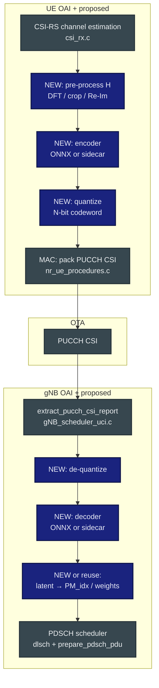
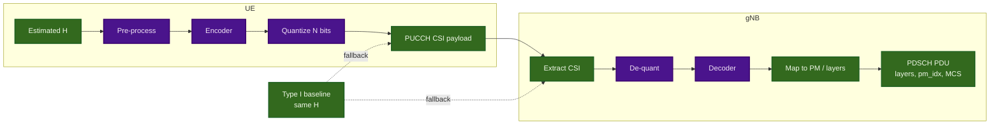

# CSI-Net and AI-Enabled CSI Feedback: Suggested OAI NR Repo Modifications

**Audience:** Industry wireless research (systems, PHY/MAC, ML-for-RAN)  
**Purpose:** Progress / roadmap slides for **integrating CSINet-style or autoencoder-based CSI compression** alongside **Type I single-panel** feedback in OpenAirInterface5G NR.

**Primary guides (read in full for implementation detail):**

- `doc/InterDigital_WI/CSINET_EXPLORATION_WITH_TYPEI.md` — Type I baseline, recording formats, offline vs online, **Python sidecar + thin C bridge**.
- `doc/InterDigital_WI/AI_ENABLED_CSI_FEEDBACK_FROM_PAPER.md` — Paper-aligned block diagram, **ONNX Runtime**, quantization, exact OAI file/function map, PDSCH precoder lifecycle.

**Supporting repo docs cited therein:** `doc/CSI_RECORD_MODIFICATIONS.md`, `doc/5G_CHANNELS_IMPLEMENTATION_AND_TRACING_GUIDE.md`.

---

## Slide 1 — Research question and why OAI is a good testbed

### Question
Can we **compress CSI** (channel state) into a **small feedback payload** while preserving **scheduling-relevant** information for DL MIMO (layers, precoder, MCS), and do it **reproducibly** on a real NR stack?

### Why OAI fits
- **Type I single-panel** is already configured and exercised (`nr_radio_config.c` → `config_csi_codebook()`).
- **Ground-truth data** exists via `--csi-record-path`: raw **H** (`H_f*_s*.bin`) + **Type I labels** (`csi_reports.csv`, `gnb_csi_feedback.csv`).
- **End-to-end path** from CSI-RS estimation → PUCCH → MAC decode → `get_pm_index()` → PDSCH PDU is **documented and localized** (see paper-mapping doc §2–2.4).

**Positioning for reviewers:** This is **experimental RAN integration**, not a replacement 3GPP CSI mode without RRC and coexistence design.

---

## Slide 2 — Baseline: what the repo already gives you (no CSINet code yet)

| Asset | Role for CSI-Net / autoencoder research |
|--------|----------------------------------------|
| **Type I report** | Strong **discrete baseline** (RI, i1, i2, CQI) + codebook precoders at gNB init |
| **`csi_record_write()`** | Supervised labels + aligned **H** tensors per `(frame, slot)` |
| **PUCCH CSI payload** | Known **bit container** (`part1` / `part2`) and report templates |
| **gNB `extract_pucch_csi_report()`** | Single choke point to reinterpret payload for a new “AI report” |

**Takeaway:** Phase-0 research can be **100% offline** on recorded OAI traces; online integration is a **controlled extension** of the same tensors and payloads.

---

## Slide 3 — Two integration philosophies (from the two guides)

| Approach | Pros | Cons / risk |
|----------|------|----------------|
| **A. Offline only** (`CSINET` Option A) | Zero fork risk; full ML freedom in Python | No OTA validation of latency / quantization |
| **B. ONNX in C (paper)** (`AI_ENABLED…` §5.3–5.4) | Sub-ms inference path; no Python in critical path | Build/link complexity; fixed-point / ORT integration |
| **C. Python sidecar + thin C bridge** (`CSINET` Option B recommended) | Fast research iteration; minimal OAI diffs | IPC latency/jitter; needs **timeout + Type I fallback** |

**Suggested team strategy:** **Offline → sidecar prototype → ONNX hardening** (matches risk reduction for industry demos and publications).

---

## Slide 4 — Paper framework → OAI modules (high-level map)

**Narration:** Solid = existing OAI. Dark blue = **new** research modules; the scientific task is to define **interfaces** (tensor shape, bit budget, fallback) not to rewrite the whole L1.

---

## Slide 5 — Suggested repo modification phases (executive roadmap)

| Phase | Goal | Repo impact | Success metric |
|-------|------|-------------|------------------|
| **0** | Dataset + baseline | **None** (use `--csi-record-path`) | NMSE / rate vs Type I **offline** |
| **1** | **Sidecar** encoder/decoder | **1 new C file** (bridge) + **2–4 guarded calls** | OTA loop with **timeout → Type I** |
| **2** | **Dedicated report config** “AI codeword” | RRC template + `extract_pucch_csi_report` branch | gNB never mis-parses Type I reports |
| **3** | **ONNX Runtime** in UE/gNB | New `csi_onnx_*.c`, link ORT | Latency distribution **< slot budget** |
| **4** | **PDSCH integration** | Map decoder output → `pm_idx` **or** parallel precoder | BLER / throughput vs Type I **A/B** |

Phases 0–1 align with `CSINET_EXPLORATION_WITH_TYPEI.md`; phases 3–4 align with `AI_ENABLED_CSI_FEEDBACK_FROM_PAPER.md`.

---

## Slide 6 — Concrete UE touchpoints (minimal-diff principle)

| Step | File | Function / data |
|------|------|-------------------|
| Read **H** | `openair1/PHY/NR_UE_TRANSPORT/csi_rx.c` | `csi_rs_estimated_channel_freq[rx][port][sc]` after `nr_csi_rs_channel_estimation()` |
| **Pre-process** | New `csi_preprocess.c` *or* local helper | Paper example: average symbols → 2D DFT → crop → `[24,2,2]` real (`AI_ENABLED…` §4) |
| **Encode + quantize** | New module **or** bridge RPC | Output: **N-bit** codeword fitting PUCCH CSI field |
| **Pack UCI** | `openair2/LAYER2/NR_MAC_UE/nr_ue_procedures.c` | `nr_get_csi_payload()` → `get_csirs_RI_PMI_CQI_payload()`; also `part1_payload` / `part2_payload` assembly (~lines cited in paper doc) |

**Research suggestion:** Implement **one** `CSIReportConfig`-selectable path so default OAI behavior stays unchanged for regression.

---

## Slide 7 — Concrete gNB touchpoints (decode → precoding)

| Step | File | Function |
|------|------|----------|
| PUCCH CSI ingress | `openair2/LAYER2/NR_MAC_gNB/gNB_scheduler_uci.c` | `handle_nr_uci_pucch_2_3_4()` → `extract_pucch_csi_report()` |
| Type I today | same | `evaluate_ri_report`, `evaluate_pmi_report`, `evaluate_cqi_report` |
| **AI path** | same + new decoder | For “AI report”: **skip** Type-I evaluators; treat bits as codeword |
| Layers / PM / MCS | `gNB_scheduler_primitives.c`, `gNB_scheduler_dlsch.c` | `get_dl_nrOfLayers()`, `get_pm_index()`, CQI→`dl_max_mcs` chain (paper doc §2.3) |
| Precoder store | `openair2/LAYER2/NR_MAC_gNB/config.c` | `init_DL_MIMO_codebook()` — **precomputed** weights; runtime is **index lookup** (paper doc §2.4) |

**Integration fork (design choice):**

1. **Map decoder output → synthetic Type-I fields** so `get_pm_index()` unchanged.  
2. **Parallel precoding path** when AI report active (more code, cleaner semantics).

Industry audiences often prefer (1) first for **controlled comparisons**.

---

## Slide 8 — Payload and 3GPP-adjacent constraints (talk track)

- **PUCCH CSI part1/part2** bit budgets are **tight**; CSINet latent must fit or you move to **PUSCH** (larger payload, scheduler/RRC impact — called out in `CSINET_EXPLORATION_WITH_TYPEI.md`).
- **Quantization** is not optional for OTA integer channels (paper + both docs).
- **Coexistence:** gNB must know whether bits mean **Type I** or **AI codeword** (`CSINET` §3 compatibility; paper §5.6 fallback).

**Highlight for research:** Treat **reportConfigId / flag** as part of the **experimental protocol**, not an afterthought.

---

## Slide 9 — Latency, threading, and safety (paper + OAI reality)

From `AI_ENABLED_CSI_FEEDBACK_FROM_PAPER.md`:

- Reported ballpark: **pre-processing ~0.23 ms**, encoder **~0.06–0.1 ms**, decoder **~0.1–0.28 ms** (paper setup).

**Suggested OAI adaptations:**

- Run **encode/decode off the hot PHY callback** (worker thread + double buffer), as the paper suggests for inference.
- **Deadline + fallback:** if inference exceeds budget → **send Type I** (already computed in parallel in many stacks, or reuse last valid).

This is essential for **industry credibility**: live demos fail without explicit **SLO + fallback**.

---

## Slide 10 — Data contract (from `CSINET` recording spec)

### `H_f{frame}_s{slot}.bin` header (5 × `int32`)
`frame`, `slot`, `nr_rx`, `n_ports`, `n_subc` → then `nr_rx * n_ports * n_subc` × `c16_t` row-major.

### `csi_reports.csv`
`frame,slot,rsrp_dBm,ri,i1_0,i1_1,i1_2,i2,cqi,sinr_dB`

**Research use:**  
- Train encoder to predict **H** or **precoder** from compressed code.  
- Use Type I as **teacher / baseline comparator** on identical `(frame, slot)` keys.

---

## Slide 11 — Publications / demos checklist (what reviewers ask)

1. **Dataset card:** band, BW, MIMO geometry, CSI-RS pattern, mobility, SNR sweep.  
2. **Baseline:** Type I NMSE / achievable rate under same channel snapshots.  
3. **Bit budget sweep:** NMSE vs **N bits** (paper-style curves).  
4. **Latency CDF:** UE encode + gNB decode + scheduling decision boundary.  
5. **Fallback rate:** how often Type I took over (should be logged).  
6. **Regression:** standard OAI CSI sanity (attach, CQI, RI stability) with AI path **disabled**.

---

## Slide 12 — Risk register (short, honest)

| Risk | Mitigation |
|------|------------|
| Mis-parsed UCI breaks MAC | Dedicated report config + gating |
| IPC / ORT stalls PHY | Timeout + Type I fallback |
| Decoder output ≠ codebook index | Explicit mapping layer + unit tests |
| Over-claiming “3GPP compliant AI CSI” | Frame as **vendor-specific / experimental** until RRC + TS alignment is written |

---

## Slide 13 — Recommended next engineering tickets (copy-paste for backlog)

1. **Offline dataloader:** Python package: read `H_*.bin` + join `csi_reports.csv` + export training shards.  
2. **Bridge skeleton:** `csi_ml_bridge.c` (UE + gNB) per `CSINET_EXPLORATION_WITH_TYPEI.md` §Option B sketch.  
3. **gNB branch:** `extract_pucch_csi_report()` early dispatch by `report_id` / flag.  
4. **UE branch:** post-`nr_process_csi_rs()` hook with feature flag.  
5. **ONNX PoC:** ORT C API wrapper + micro-benchmark outside OAI, then integrate.  
6. **Telemetry:** log codeword length, inference time, fallback events (align with `--print-csi-debug` style gating if desired).

---

## Slide 14 — References in-repo

| Document | Use |
|----------|-----|
| `doc/InterDigital_WI/CSINET_EXPLORATION_WITH_TYPEI.md` | Recording formats, offline pipeline, **sidecar architecture** |
| `doc/InterDigital_WI/AI_ENABLED_CSI_FEEDBACK_FROM_PAPER.md` | **Paper mapping**, ONNX, quantization, **full MAC→PDSCH chain**, NN shapes |
| `doc/CSI_RECORD_MODIFICATIONS.md` | `--csi-record-path` operational detail |
| `doc/5G_CHANNELS_IMPLEMENTATION_AND_TRACING_GUIDE.md` | Channel tracing context |
| `doc/InterDigital_WI/NR_4X4_2X4_CSI_INDUSTRY_RESEARCH_PROGRESS.md` | Recent Type-I **semantics + observability** improvements that **benefit any future AI CSI A/B** |

---

## Appendix — Mermaid: paper-style end-to-end (condensed)

---

*End of deck — `NR_CSINET_REPO_MODIFICATIONS_INDUSTRY_RESEARCH_PROGRESS.md`*
