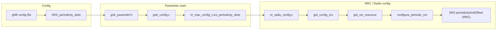

# SRS Periodicity Configuration and SRS Channel Estimate Monitoring in imscope

This document describes two related modifications:

1. **Configurable SRS periodicity** – A gNB configuration parameter `SRS_periodicity_slots` (analogous to `CSI_RS_periodicity_slots`) that sets a minimum update rate for periodic SRS, so you can control how often the gNB receives SRS-based UL channel estimates.
2. **SRS channel estimate in gNB imscope** – A new imscope data type and window that displays the SRS channel estimates at the gNB, allowing you to visually monitor how often the UL channel estimate changes as you vary the SRS periodicity.

Together, these changes support tuning and observing SRS-based UL channel tracking (e.g. for codebook/non-codebook usage) in the same way CSI-RS periodicity and the UE imscope support DL channel monitoring.

---

## 1. SRS Periodicity Configuration

### 1.1 Overview

Periodic SRS is configured by RRC with a periodicity and offset chosen from a set of standard values (3GPP 38.331). Previously, OAI used an internal “ideal” period (derived from frame structure). The modification adds an optional **configured** period: when `SRS_periodicity_slots > 0`, the code selects a standard period that respects your request and TDD constraints, so you can force more frequent (or less frequent) SRS transmissions.

| Concept | Description |
|--------|-------------|
| **Parameter** | `SRS_periodicity_slots` in the gNB config (same level as other gNB params, e.g. next to `CSI_RS_periodicity_slots`). |
| **Meaning** | Desired SRS period in slots. `0` = auto (use internal ideal period). Positive value = request that period (or nearest valid standard period). |
| **Standard periods (slots)** | 4, 5, 8, 10, 16, 20, 32, 40, 64, 80, 160, 320, 640, 1280, 2560 (3GPP 38.331). |
| **TDD** | For TDD, the chosen period is a multiple of the TDD period (e.g. 10 slots for 5 ms, 20 for 10 ms at 30 kHz SCS). |

### 1.2 Data flow (high level)



- **Config file** – You set `SRS_periodicity_slots` (e.g. `4`) in the gNB configuration (see example below).
- **Parameter definition** – The value is read via `gnb_paramdef.h` (param index 41, `GNB_SRS_PERIODICITY_SLOTS_IDX`) and stored in `nr_mac_config_t.srs_periodicity_slots` in `gnb_config.c`.
- **RRC** – When building SRS resources, `get_config_srs()` is called with `configuration->srs_periodicity_slots` and passes it to `get_srs_resource()` → `configure_periodic_srs(scc, uid, configured_period_slots)`.
- **Period selection** – Inside `configure_periodic_srs()`:
  - If `configured_period_slots == 0`: use the existing “ideal” period (unchanged behaviour).
  - If `configured_period_slots > 0`: pick the **smallest standard period ≥ configured** that is valid for TDD (multiple of `numb_slots_period`); if none, pick the **largest standard period ≤ configured** that is valid. The result is used for all `check_periodicity(..., period_to_use, fs)` branches when setting `periodicityAndOffset` in the ASN.1 SRS resource.

### 1.3 Standard SRS periods (code)

Defined in `openair2/LAYER2/NR_MAC_gNB/nr_radio_config.c`:

```c
static const int srs_standard_periods[] = {4, 5, 8, 10, 16, 20, 32, 40, 64, 80, 160, 320, 640, 1280, 2560};
static const int srs_standard_periods_num = sizeof(srs_standard_periods) / sizeof(srs_standard_periods[0]);
```

These match the periodicities allowed for SRS in 3GPP 38.331 (e.g. `SRS-PeriodicityAndOffset`).

### 1.4 Configuration example

In your gNB config (e.g. `targets/PROJECTS/GENERIC-NR-5GC/CONF/gnb.sa.band78.fr1.106PRB.usrpb210.conf`), at the same level as other gNB parameters:

```lua
# SRS periodicity in slots (0 = auto). Allowed: 4,5,8,10,16,20,32,40,64,80,160,320,640,1280,2560. Lower = more frequent UL channel measurements.
# SRS_periodicity_slots                                     = 4;
```

Uncomment and set to the desired period (e.g. `4` for the most frequent standard period, subject to TDD). Use `0` or omit to keep auto behaviour.

### 1.5 File-by-file modifications (SRS periodicity)

| File | Change |
|------|--------|
| **openair2/LAYER2/NR_MAC_gNB/nr_mac_gNB.h** | Added `int srs_periodicity_slots` to `nr_mac_config_t`. |
| **openair2/GNB_APP/gnb_paramdef.h** | Added `GNB_CONFIG_STRING_SRS_PERIODICITY_SLOTS` (`"SRS_periodicity_slots"`), `GNB_SRS_PERIODICITY_SLOTS_IDX` (41), param row in the gNB param table, and one additional entry in `GNBPARAMS_CHECK` for index 41. |
| **openair2/GNB_APP/gnb_config.c** | Read param: `config.srs_periodicity_slots = *GNBParamList.paramarray[0][GNB_SRS_PERIODICITY_SLOTS_IDX].iptr;` (next to `csi_rs_periodicity_slots`). |
| **openair2/LAYER2/NR_MAC_gNB/nr_radio_config.c** | (1) `srs_standard_periods[]` and `srs_standard_periods_num`. (2) `configure_periodic_srs(scc, uid, configured_period_slots)`: when `configured_period_slots > 0`, compute `period_to_use` (smallest standard ≥ configured and TDD-valid, else largest ≤ configured and TDD-valid); use `period_to_use` in all `check_periodicity(period, period_to_use, fs)` branches. (3) `get_srs_resource(..., do_srs, srs_periodicity_slots)` and pass through to `configure_periodic_srs`. (4) `get_config_srs(..., do_srs, srs_periodicity_slots)` and pass through to `get_srs_resource`. (5) All call sites of `get_config_srs`: pass `configuration->srs_periodicity_slots` where `configuration` exists; pass `0` at the initial-BWP call that uses `do_srs=0`. |
| **targets/.../gnb.sa.band78.fr1.106PRB.usrpb210.conf** | Commented example and short description for `SRS_periodicity_slots`. |

---

## 2. SRS Channel Estimate in gNB imscope

### 2.1 Overview

The gNB imscope (imgui-based scope, built with `ENABLE_IMSCOPE=ON`) already had a “CSI report parameters” window (RI, PMI, CQI, RSRP, SINR from decoded CSI) and PUSCH IQ/LLR windows. There was no way to visualize the **SRS channel estimates** at the gNB. A new scope data type and window were added so you can:

- See the SRS-based UL channel estimate (IQ per subcarrier/antenna/port) in the gNB imscope.
- Observe how often the estimate updates when you change `SRS_periodicity_slots` (e.g. period 4 vs 80).

The implementation mirrors the existing **UE CSI-RS channel estimate** window (`ueCsirsChEstimate`): same copy-with-metadata API and same style of IQ plot in the UI.

### 2.2 Data flow (high level)

```mermaid
flowchart LR
  subgraph PHY["gNB PHY"]
    SRS_RX[nr_srs_rx_procedures]
    SRS_RX --> H["srs_estimated_channel_freq\n[nb_rx][N_ap][ofdm_symbol_size*N_symb_SRS]"]
    H --> Feed[gNBscopeCopyWithMetadata\n(gNB, gNBSrsChEstimate, ...)]
  end

  subgraph Scope["imscope"]
    Feed --> scope_array[gNBSrsChEstimate]
    scope_array --> UI["Window: SRS channel estimates"]
    UI --> IQHist["IQHist(SRS channel IQ)"]
  end
```

- **When** – Each time the gNB processes an SRS occasion for a UE (in `phy_procedures_nr_gNB.c`), after `nr_srs_rx_procedures()` fills `srs_estimated_channel_freq`, the code calls `gNBscopeCopyWithMetadata()` with type `gNBSrsChEstimate`.
- **What** – The buffer is the full SRS channel estimate in frequency domain: `nb_antennas_rx × N_ap × (ofdm_symbol_size * N_symb_SRS)` complex (c16_t) values, flattened.
- **Where it goes** – The scope’s `copyData` (e.g. `copyDataThreadSafe` when imscope is loaded) copies the data into `scope_array[gNBSrsChEstimate]` with slot/frame metadata.
- **UI** – In the gNB scope, the window “SRS channel estimates” uses an `IQHist("SRS channel IQ")` that pulls from `scope_array[gNBSrsChEstimate]`, same pattern as “UE CSI-RS channel estimates” on the UE side.

### 2.3 New scope type

In `openair1/PHY/TOOLS/phy_scope_interface.h`, the enum `scopeDataType` was extended:

```c
ueCsirsChEstimate,   /* CSI-RS channel estimates at UE (IQ per ant/port/subcarrier) */
gNBCsiReportParams,  /* CSI report at gNB (RI, PMI, CQI, RSRP, SINR, etc.) */
gNBSrsChEstimate,    /* SRS channel estimates at gNB (IQ per ant/port/subcarrier) */
EXTRA_SCOPE_TYPES
```

- **gNBSrsChEstimate** – Identifies the SRS channel estimate buffer in the scope pipeline and in the UI (e.g. scope selection / labels).

### 2.4 Buffer layout fed to imscope

| Field | Value |
|-------|--------|
| **Pointer** | `&srs_estimated_channel_freq[0][0][0]` |
| **Element size** | `sizeof(c16_t)` (2 × int16 per complex sample). |
| **colSz** | 1 |
| **lineSz** | `nb_antennas_rx * N_ap * (ofdm_symbol_size * N_symb_SRS)` |
| **Metadata** | `slot = slot_rx`, `frame = frame_rx` |

So the scope receives one “line” of length `lineSz` complex samples (all RX antennas and SRS ports, over the SRS bandwidth and symbols, in the same order as in the 3D array).

### 2.5 File-by-file modifications (SRS imscope)

| File | Change |
|------|--------|
| **openair1/PHY/TOOLS/phy_scope_interface.h** | New enum value `gNBSrsChEstimate` (before `EXTRA_SCOPE_TYPES`). |
| **openair1/PHY/TOOLS/imscope/imscope_common.cpp** | In `scope_id_to_string()`: add `case gNBSrsChEstimate: return "gNBSrsChEstimate";`. |
| **openair1/PHY/TOOLS/imscope/imscope.cpp** | In `ShowGnbScope()`: add a window “SRS channel estimates” with `IQHist("SRS channel IQ")` and `TryCollect(&scope_array[gNBSrsChEstimate], ...)` / `Draw(...)`, same pattern as “UE CSI-RS channel estimates”. |
| **openair1/SCHED_NR/phy_procedures_nr_gNB.c** | After `nr_srs_rx_procedures(...)` (and while `srs_estimated_channel_freq` is in scope), call `gNBscopeCopyWithMetadata(gNB, gNBSrsChEstimate, &srs_estimated_channel_freq[0][0][0], sizeof(c16_t), 1, lineSz, 0, &meta)` with `lineSz = nb_antennas_rx * N_ap * (ofdm_symbol_size * N_symb_SRS)` and `meta = { .slot = slot_rx, .frame = frame_rx }`. File already includes `phy_scope_interface.h`. |

No change to `phy_scope_interface.c`: when imscope is loaded, it replaces `copyData` with its own implementation, which already supports all extra scope types (including the new one) via `scope_array[type]`.

---

## 3. Usage summary

### 3.1 SRS periodicity

1. In the gNB config file, set (e.g. uncomment and set):
   - `SRS_periodicity_slots = 4;` for more frequent SRS (subject to TDD).
   - `SRS_periodicity_slots = 0;` or omit for auto (previous behaviour).
2. Restart the gNB so the new RRC SRS configuration (with the selected period) is applied to UEs.

### 3.2 SRS channel estimate in imscope

1. Build with imscope: e.g. add `-DENABLE_IMSCOPE=ON` to your CMake command and build the `imscope` target (see `openair1/PHY/TOOLS/readme.md`).
2. Run the gNB with the `--imscope` flag (e.g. `./nr-softmodem ... --imscope`).
3. In the gNB imscope window, open **“SRS channel estimates”** to view the SRS-based UL channel estimate IQ.
4. Vary `SRS_periodicity_slots` (e.g. 4 vs 80) and compare how often the SRS channel estimate window updates, to monitor the effect of periodicity on UL channel tracking.

---

## 4. Summary table of modified files

| Area | File | Purpose of change |
|------|------|-------------------|
| **SRS periodicity** | `openair2/LAYER2/NR_MAC_gNB/nr_mac_gNB.h` | Add `srs_periodicity_slots` to `nr_mac_config_t`. |
| | `openair2/GNB_APP/gnb_paramdef.h` | Param name, index 41, param row, `GNBPARAMS_CHECK` entry. |
| | `openair2/GNB_APP/gnb_config.c` | Read `srs_periodicity_slots` into `config`. |
| | `openair2/LAYER2/NR_MAC_gNB/nr_radio_config.c` | Standard periods, `configure_periodic_srs(..., configured_period_slots)`, `get_srs_resource`/`get_config_srs` signatures and call sites. |
| | `targets/.../gnb.sa.band78.fr1.106PRB.usrpb210.conf` | Commented `SRS_periodicity_slots` example. |
| **SRS imscope** | `openair1/PHY/TOOLS/phy_scope_interface.h` | New enum `gNBSrsChEstimate`. |
| | `openair1/PHY/TOOLS/imscope/imscope_common.cpp` | String for `gNBSrsChEstimate` in `scope_id_to_string`. |
| | `openair1/PHY/TOOLS/imscope/imscope.cpp` | “SRS channel estimates” window and IQ plot. |
| | `openair1/SCHED_NR/phy_procedures_nr_gNB.c` | Feed SRS channel buffer to imscope via `gNBscopeCopyWithMetadata(..., gNBSrsChEstimate, ...)`. |

---

## 5. Troubleshooting: SRS channel estimate empty in imscope

If the **“SRS channel estimates”** window in the gNB imscope stays empty, check the following in order.

### 5.1 imscope enabled and loaded

| Check | What to do |
|-------|------------|
| **Run with `--imscope`** | The gNB must be started with the `--imscope` flag. Without it, `gNB->scopeData` is NULL and `gNBscopeCopyWithMetadata` does nothing. |
| **Build with imscope** | Configure with `-DENABLE_IMSCOPE=ON` and build so the imscope library (e.g. `libimscope.so`) is present. The gNB loads it at startup when `--imscope` is set; if the library is missing, the scope (and the SRS window) will not be available. |
| **gNB scope, not UE scope** | The SRS channel estimate is only in the **gNB** imscope. Use “gNB Scope” (or the gNB view), then open the “SRS channel estimates” window. The UE scope has “CSI-RS channel estimates”, not SRS. |

### 5.2 SRS enabled and configured

| Check | What to do |
|-------|------------|
| **`do_SRS = 1`** | In the gNB config, ensure SRS is enabled (e.g. `do_SRS = 1`). If `do_SRS = 0`, periodic SRS is not configured for UEs and the gNB will not run the SRS RX path that feeds the scope. |
| **UE has SRS resource** | SRS is only computed when the gNB has an active SRS occasion for a UE (matching frame/slot). Ensure at least one UE is connected and has been given an SRS config (e.g. codebook or non-codebook usage). |

### 5.3 SRS occasions are happening

| Check | What to do |
|-------|------------|
| **UE transmitting SRS** | The gNB only feeds the scope when it **processes** an SRS slot (in `phy_procedures_nr_gNB.c`: loop over `gNB->max_nb_srs`, condition `srs->active && srs->frame == frame_rx && srs->slot == slot_rx`). So the UE must be sending SRS in those slots. Check that the UE is in RRC connected and that UL sync/timing is OK so SRS is actually received. |
| **Periodicity** | With a large SRS period (e.g. 80 or 320 slots), the window updates only every N slots. Wait for at least one full period, or set `SRS_periodicity_slots = 4` (or 10 for TDD) to see updates more often. |
| **Logs** | Enable `LOG_D(NR_PHY, ...)` or look for “gNB is waiting for SRS” in the logs to confirm that the gNB is entering the SRS processing block for the current frame/slot. |

### 5.4 Debug logs (what to look for)

When debugging an empty SRS channel estimate window, run the gNB and watch the logs:

| Log message | Meaning |
|-------------|---------|
| **`SRS: max_nb_srs=0, no SRS occasions will be processed`** | gNB has no SRS slots allocated (e.g. init or config). Check `do_SRS` and gNB initialization. |
| **`(frame.slot) gNB processing SRS occasion id=N`** | An SRS occasion was found for this frame/slot; PHY is running SRS RX and will feed imscope if scopeData is set. |
| **`SRS channel imscope feed: frame=X slot=Y lineSz=Z`** | Data is being sent to the scope (scopeData was non-NULL). If the window still shows 0/0, the issue may be in imscope (e.g. window not consuming, or different scope instance). |
| **`SRS channel imscope: scopeData is NULL (run gNB with --imscope)`** | The gNB was not started with `--imscope`, or the imscope library did not load. Start with `--imscope` and ensure the imscope library is built and loadable. |
| **`SRS channel imscope: lineSz=... (nb_rx=... N_ap=... ofdm_sz=... N_symb=...), skip feed`** | The computed buffer size is 0 or negative (e.g. `nb_antennas_rx` or `ofdm_symbol_size` is 0). Check gNB/PHY init and frame params so that UL RX antennas and symbol size are set correctly. |
| **`imscope copyData: type N out of range, skip (rebuild imscope?)`** | The imscope library was built before `gNBSrsChEstimate` was added. Do a **clean rebuild** of the imscope target (and the gNB) so the scope type enum matches. |
| **`imscope copyData: lineSz=0 elementSz=..., skip`** | The PHY passed zero length; see the “lineSz=... skip feed” log above for the root cause. |

If you **never** see “gNB processing SRS occasion” or “SRS channel imscope feed”, then no SRS occasions are being processed (check `do_SRS`, UE connection, and SRS configuration). If you see “SRS channel imscope feed” with a positive lineSz but the window still shows 0/0, do a **full clean rebuild** of the imscope library (e.g. `make clean` in the build dir, then rebuild with `-DENABLE_IMSCOPE=ON`) so that `gNBSrsChEstimate` is present in the scope array.

### 5.5 Quick checklist

1. gNB started with **`--imscope`**.
2. imscope built and loaded (no missing library / scope UI comes up).
3. In the gNB scope, **“SRS channel estimates”** window is open (not the UE scope).
4. **`do_SRS = 1`** in gNB config.
5. At least one **UE connected** with SRS configured.
6. Wait for at least one **SRS occasion** (one or more slots depending on periodicity).

If all of the above are satisfied and the window is still empty, check that no other scope type is overwriting or blocking (e.g. scope selection set to a different stream) and that the PHY is not erroring out before the `gNBscopeCopyWithMetadata` call (e.g. assert or early return in `nr_srs_rx_procedures`).

### 5.6 UE connected to gNB but not to core network

**Yes: if the UE is RRC-connected to the gNB but not connected to the core network, SRS is typically not scheduled**, and the SRS channel estimates in imscope will stay empty/NULL.

**Reason (OAI behaviour):**

- The **initial** RRC configuration sent when the UE connects (e.g. from `get_initial_cellGroupConfig`) is built **without** SRS: the initial uplink BWP uses `do_SRS = 0` (see comment in `nr_radio_config.c`: *“periodic SRS will only be enabled in update_cellGroupConfig()”*).
- SRS is added to the UE’s config only when **`update_cellGroupConfig()`** is run. That happens when the gNB-DU handles **UE Context Setup Request** or **UE Context Modification Request** from the CU, which in SA mode is triggered by the **Initial Context Setup** procedure (AMF sends INITIAL CONTEXT SETUP REQUEST to the gNB-CU, which then triggers F1 UE Context Setup toward the DU).
- If the UE never completes registration with the core (e.g. AMF unreachable, or registration failure), the AMF typically does **not** send Initial Context Setup Request. The UE then never receives an RRC Reconfiguration that includes SRS-Config. So the UE has no SRS resources, does not transmit SRS, the gNB has no SRS occasions to process, and **no SRS channel estimates are fed to imscope** (the “SRS channel estimates” window stays empty).

**What to do:**

- To get SRS (and thus SRS channel estimates in imscope), the UE must receive the full context that includes SRS. In normal SA operation that requires a successful connection to the core (registration + Initial Context Setup). Ensure the core is reachable and that registration completes so that Initial Context Setup is sent and the DU can run `update_cellGroupConfig` with `do_SRS = 1`.
- For **phy-test** or other setups without a core, the code path that sends RRC Reconfiguration with SRS may never run; in that case SRS will not be scheduled and imscope SRS channel estimates will remain empty unless the code is changed to add SRS in the initial config or via another path.

---

## 6. References

- **CSI-RS periodicity** – Same pattern for `CSI_RS_periodicity_slots` and `set_csirs_periodicity()` / `config_csirs()` in `nr_radio_config.c`; see also config and paramdef for CSI-RS.
- **UE CSI-RS in imscope** – `ueCsirsChEstimate` and `UEscopeCopyWithMetadata` in `openair1/PHY/NR_UE_TRANSPORT/csi_rx.c` and “UE CSI-RS channel estimates” in imscope.
- **imscope build/run** – `openair1/PHY/TOOLS/readme.md` (e.g. `ENABLE_IMSCOPE`, `--imscope`).
- **3GPP 38.331** – SRS periodicity and offset (e.g. `SRS-PeriodicityAndOffset`).
