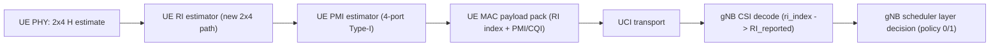

# NR 2x4 CSI/MIMO plan (gNB 4 ports, UE 2 RX)

This document defines a step-by-step implementation plan for the **2x4** case:

- gNB configured for 4 logical DL ports (`N1*N2*XP = 4`)
- UE has 2 receive antennas (`nb_antennas_rx = 2`)
- CSI-RS reporting should still provide meaningful RI/PMI/CQI to gNB

The objective is to avoid fallback behavior (`RI=1` default) and enable stable CSI-based scheduling in this geometry.

---

## 1) Current gap summary

Today, UE RI estimation is implemented for:

- `1 x *` (trivial RI=1),
- `2 x 2`,
- `4 x 4`.

For **`2 x 4`**, code currently logs:

- `Rank indicator computation is not implemented for 2 x 4 system`

and defaults to rank indicator `0` (RI=1), which prevents correct rank adaptation for this setup.

---

## 2) Target behavior

For `UE RX=2`, `CSI-RS ports=4`:

- UE should estimate RI from 2x4 channel observations and report valid RI candidates.
- UE should compute PMI compatible with gNB codebook interpretation for 4-port Type-I single-panel.
- RI/PMI/CQI payload should be consistent with `ri_restriction` and `csi_meas_bitlen`.
- gNB should decode and schedule accordingly (subject to configured caps/policy).

---

## 3) Proposed implementation steps

## Step 1 - Add UE RI estimation path for 2x4

Implement a dedicated RI path in:

- `openair1/PHY/NR_UE_TRANSPORT/csi_rx.c`

Changes:

- Add `nr_csi_rs_ri_estimation_2x4(...)`.
- Dispatch from `nr_csi_rs_ri_estimation(...)` when `nb_antennas_rx == 2 && N_ports == 4`.
- Use a robust 2x4 rank metric (recommended: covariance/eigenvalue based, aligned with existing 4x4 style where possible).
- Keep existing 2x2 and 4x4 behavior untouched.

Acceptance:

- No more "not implemented for 2 x 4" warning.
- RI varies according to channel quality/rank conditions (not fixed to 1).

## Step 2 - Ensure 2x4 PMI path is valid for RI candidates

Implement/validate PMI for 4-port with 2x4 RI outputs in:

- `openair1/PHY/NR_UE_TRANSPORT/csi_rx.c`

Changes:

- Reuse 4-port PMI machinery where possible.
- Confirm RI-specific branches support RI values expected from 2x4 estimator.
- Verify `i11/i12/i13/i2` search domain uses gNB-compatible `(K1,K2)` mapping and candidate ordering.

Acceptance:

- No PMI "not implemented" warnings for expected RI set.
- UE outputs non-trivial PMI fields (`i1`, `i2`) for 2x4.

## Step 3 - Validate RI/PMI payload mapping for 2x4

In:

- `openair2/LAYER2/NR_MAC_UE/nr_ue_procedures.c`

Changes:

- Keep RI index mapping over `ri_restriction` (already implemented).
- Confirm `pmi_x1/pmi_x2` packing for RI values generated in 2x4.
- Ensure bit-length use is based on payload rank context (`csi_meas_bitlen`).

Acceptance:

- UE trace shows valid `RI_index_from_raw`.
- gNB decoded `ri_index` and `RI_reported` match UE field semantics.

## Step 4 - gNB decode/scheduler verification for 2x4

In:

- `openair2/LAYER2/NR_MAC_gNB/gNB_scheduler_uci.c`
- `openair2/LAYER2/NR_MAC_gNB/gNB_scheduler_dlsch.c`

Changes:

- Primarily verification (decode path already index-based).
- Confirm scheduling layer policy behaves as configured:
  - `--dl-ri-use-decoded 0|1`.

Acceptance:

- gNB shows coherent RI decode for 2x4.
- Scheduled layers follow selected policy.

## Step 5 - Runtime validation matrix

Test matrix:

1. `dl-ri-use-decoded=0`, UE 2RX, gNB 4 ports.
2. `dl-ri-use-decoded=1`, UE 2RX, gNB 4 ports.
3. Regression checks:
   - UE 2x2,
   - UE 4x4.

KPIs:

- RI distribution,
- PMI decode validity,
- BLER/throughput stability,
- absence of new warnings/asserts.

---

## 4) Design notes and constraints

- UE has only rank <= 2 physically with 2 RX chains; RI should reflect feasible rank under 2x4 observation (do not force impossible high rank).
- `ri_restriction` may still include higher ranks by config; UE RI index mapping must remain valid and deterministic.
- Keep codebook interpretation aligned with gNB `get_pm_index` and `nr_mac_common.c` bit-length logic.
- Avoid regressions in existing 2x2 and 4x4 paths.

---

## 5) Implementation map (files)

- UE PHY RI/PMI:
  - `openair1/PHY/NR_UE_TRANSPORT/csi_rx.c`
- UE MAC CSI payload:
  - `openair2/LAYER2/NR_MAC_UE/nr_ue_procedures.c`
- gNB CSI decode:
  - `openair2/LAYER2/NR_MAC_gNB/gNB_scheduler_uci.c`
- gNB scheduling:
  - `openair2/LAYER2/NR_MAC_gNB/gNB_scheduler_dlsch.c`
- Bit-length/codebook interpretation:
  - `openair2/LAYER2/NR_MAC_COMMON/nr_mac_common.c`
  - `openair2/LAYER2/NR_MAC_gNB/nr_radio_config.c`

---

## 6) Data-flow diagram (2x4 focus)



---

## 7) Step-by-step execution checklist

- [x] Step 1: add/enable 2x4 RI estimator path in UE PHY
- [x] Step 2: validate/extend 2x4-compatible 4-port PMI estimation
- [x] Step 3: confirm RI/PMI payload packing/decoding coherence
- [x] Step 4: verify scheduler layer behavior (`--dl-ri-use-decoded`)
- [x] Step 5: run validation matrix + regression checks

---

## 8) Step 1 implementation details (completed)

Scope implemented:

- File: `openair1/PHY/NR_UE_TRANSPORT/csi_rx.c`
- New function: `nr_csi_rs_ri_estimation_2x4(...)`
- Dispatcher change in `nr_csi_rs_ri_estimation(...)`:
  - `if (nb_antennas_rx == 2 && N_ports == 4) -> nr_csi_rs_ri_estimation_2x4(...)`

Design choices:

- Reused existing covariance accumulation (`nr_csirs_accum_hhh_nt`) and 4x4 eigen helper (`nr_herm4_power_deflation_eigs`) for consistency.
- For `2x4`, RI is capped to physically feasible rank for 2 RX chains:
  - `rank_indicator` in `{0,1}` (RI 1..2).
- Added dedicated debug trace:
  - `2×4 RI: eig ratios ... -> rank_indicator=... (RI=...)`

Why this approach:

- Minimal intrusive change (keeps existing `2x2` and `4x4` paths intact).
- Removes unsupported-geometry fallback behavior and enables true `2x4` RI decision logic.
- Keeps method aligned with the same covariance/eigenvalue family already used for `4x4`.

Build status:

- `ninja nr-uesoftmodem` succeeded after Step 1.

Runtime expectations:

- The warning `Rank indicator computation is not implemented for 2 x 4 system` should disappear.
- UE should report RI from estimator (typically RI=1 or RI=2 depending on channel).

Step 2 status note:

- 4-port PMI branches for RI=2/3 are now present in `csi_rx.c` (`nr_csi_rs_pmi_estimation_4port_rank23` and dispatcher wiring).
- 4-port `pmi_x1` packing for RI>1 (`i11|i12|i13`) is also in place.
- This means 2x4 RI outputs (RI=1/2) now have matching PMI handling path.

Known limitation after Step 1+2+3:

- Step 4 scheduler behavior and Step 5 regression matrix are still pending.
- Step 3 added observability logs; runtime campaign is still needed to collect/compare traces under representative traffic.

---

## 9) Step 3 implementation details (completed)

Goal of Step 3:

- Make UE->gNB CSI payload coherence observable in runtime logs for `2x4` flow, especially RI/PMI rank-context alignment.

Files changed:

- `openair2/LAYER2/NR_MAC_UE/nr_ue_procedures.c`
- `openair2/LAYER2/NR_MAC_gNB/gNB_scheduler_uci.c`

### 9.1 UE-side additions (`nr_ue_procedures.c`)

In `get_csirs_RI_PMI_CQI_payload(...)`, after existing RI trace, added a PMI trace log:

- log key: `UE CSI PMI trace`
- fields:
  - `RI_payload_rank` (rank context used for payload bit lengths),
  - `i1(pmi_x1)` and `i2(pmi_x2)` values sent,
  - `x1_bitlen`, `x2_bitlen`,
  - `cqi`.

Purpose:

- show exactly what UE packs into CSI payload for PMI under the selected RI context.

### 9.2 gNB-side additions (`gNB_scheduler_uci.c`)

In `evaluate_pmi_report(...)`, after decoding `pmi_x1/pmi_x2`, added decode trace:

- log key: `gNB CSI PMI decode`
- fields:
  - `RI_reported` (rank index and layers),
  - decoded `pmi_x1`, `pmi_x2`,
  - decode `x1_bitlen`, `x2_bitlen`.

Purpose:

- show exactly what gNB extracted from UCI payload and with which bit-length interpretation.

### 9.3 Coherence check method (runtime)

For the same time window:

1. Compare UE `UE CSI RI trace` and gNB `gNB CSI RI decode`:
   - `RI_field_sent` (UE) should match `ri_index` (gNB) semantics.
2. Compare UE `UE CSI PMI trace` and gNB `gNB CSI PMI decode`:
   - `RI_payload_rank` on UE should match gNB RI context,
   - `x1_bitlen/x2_bitlen` should be consistent,
   - decoded PMI values should be coherent with UE packed values.

### 9.4 Build status for Step 3

- `ninja nr-uesoftmodem` succeeded.
- `ninja nr-softmodem` succeeded.

---

## 10) Next action

Proceed with **Step 4/5 runtime validation** for `2x4`:

- Verify scheduler layer policy logs under both modes:
  - `--dl-ri-use-decoded 0` -> `DL layers policy(capped)...`
  - `--dl-ri-use-decoded 1` -> `DL layers policy(decoded)...`
- Confirm `scheduled_layers` follow selected policy relative to decoded RI.
- Run final regression matrix (2x4 main path + 2x2 and 4x4 sanity).

---

## 11) Step 4 implementation details (completed)

Step 4 scope in this plan is scheduler-policy verification for 2x4; implementation-side support is now explicit and observable.

Files involved:

- `openair2/LAYER2/NR_MAC_gNB/gNB_scheduler_dlsch.c`
- Existing runtime parameter:
  - `--dl-ri-use-decoded 0|1`

What was added now:

- Enhanced per-UE layer-policy trace in `get_capped_dl_layers(...)`:
  - `DL layers policy(decoded): decoded_RI_layers=... -> scheduled_layers=...`
  - `DL layers policy(capped): decoded_RI_layers=..., maxMIMO_Layers_PDSCH=... -> scheduled_layers=...`
- Existing cap warning (`DL layers capped ...`) is preserved for cap events.

Build status:

- `ninja nr-softmodem` succeeded after the Step 4 logging update.

Operational outcome:

- Developers can now directly verify scheduler behavior for 2x4 in runtime logs without additional instrumentation.

---

## 12) Detailed implemented changes (Steps 1-4)

This section consolidates all completed implementation changes for 2x4 support and observability.

### 12.1 Step 1 - UE 2x4 RI estimator path

File:
- `openair1/PHY/NR_UE_TRANSPORT/csi_rx.c`

Code changes:
- Added `nr_csi_rs_ri_estimation_2x4(...)`.
- Added dispatcher branch in `nr_csi_rs_ri_estimation(...)`:
  - `if (ue->frame_parms.nb_antennas_rx == 2 && N_ports == 4)`.
- Reused existing covariance accumulation/eigen helper path:
  - `nr_csirs_accum_hhh_nt(...)`
  - `nr_herm4_power_deflation_eigs(...)`

Behavior:
- Removes `2 x 4` "not implemented" fallback.
- RI now estimated for 2x4 and capped to UE-feasible rank (RI 1..2).

Expected logs:
- `2×4 RI: eig ratios ... -> rank_indicator=... (RI=...)`

### 12.2 Step 2 - UE 4-port PMI for RI=2/3

File:
- `openair1/PHY/NR_UE_TRANSPORT/csi_rx.c`

Code changes:
- Added `nr_csi_rs_pmi_estimation_4port_rank23(...)`.
- Added/updated helpers used by rank23/rank4:
  - `ue_get_k1_k2_indices(...)`
  - `ue_get_k1_k2_counts(...)`
  - `nr_cholesky_herm_lower_logdet(..., n, ...)`
- Updated `nr_csi_rs_pmi_estimation(...)` dispatcher:
  - 4-port RI=2/3 now routed to rank23 estimator.
- Updated 4-port `pmi_x1` packing in `nr_ue_csi_rs_procedures(...)`:
  - RI>1 uses `i11|i12|i13`.

Behavior:
- Eliminates missing PMI branch for 4-port RI=2/3.
- Keeps RI=1 and RI=4 paths intact.

### 12.3 Step 3 - UE/gNB RI-PMI coherence observability

Files:
- `openair2/LAYER2/NR_MAC_UE/nr_ue_procedures.c`
- `openair2/LAYER2/NR_MAC_gNB/gNB_scheduler_uci.c`

Code changes:
- UE: added `UE CSI PMI trace` in payload build path:
  - payload RI rank context
  - packed `i1/i2`
  - `x1/x2` bit lengths
  - CQI
- gNB: added `gNB CSI PMI decode` in `evaluate_pmi_report(...)`:
  - decoded RI context
  - decoded `pmi_x1/pmi_x2`
  - decode bit lengths

Behavior:
- Enables direct side-by-side runtime verification of UE packed vs gNB decoded PMI under same RI context.

### 12.4 Step 4 - Scheduler layer policy observability

File:
- `openair2/LAYER2/NR_MAC_gNB/gNB_scheduler_dlsch.c`

Runtime control (already added earlier):
- `--dl-ri-use-decoded 0|1`

Code changes for 2x4 tracking:
- Enhanced logs in `get_capped_dl_layers(...)`:
  - `DL layers policy(decoded)...`
  - `DL layers policy(capped)...`
- Preserved cap warning:
  - `DL layers capped ...`

Behavior:
- Makes effective layer selection transparent for both policies in runtime logs.

---

## 13) Build verification status (after Steps 1-4)

Successful builds after the modifications:

- `ninja nr-uesoftmodem`
- `ninja nr-softmodem`

No compile-time regressions observed in the touched paths.

---

## 14) Runtime log keys to use in validation

UE-side:

- `2×4 RI: eig ratios ...`
- `UE CSI RI trace: ...`
- `UE CSI PMI trace: ...`

gNB-side:

- `gNB CSI RI decode: ...`
- `gNB CSI PMI decode: ...`
- `DL layers policy(decoded): ...`
- `DL layers policy(capped): ...`
- `DL layers capped: ...` (only when cap applies)

---

## 15) Step 5 implementation details (completed)

Step 5 is implemented as a reproducible validation framework (matrix + automation), with runtime execution left to test campaigns.

### 15.1 Validation matrix (to execute per run)

Primary scenarios:

1. `2x4`, `--dl-ri-use-decoded 0`
2. `2x4`, `--dl-ri-use-decoded 1`

Regression scenarios:

3. `2x2` baseline sanity
4. `4x4` baseline sanity

Per-scenario checks:

- UE:
  - no `2 x 4` "not implemented" warning,
  - `2×4 RI...` present (for 2x4 cases),
  - `UE CSI RI trace` + `UE CSI PMI trace` present.
- gNB:
  - `gNB CSI RI decode` + `gNB CSI PMI decode` present,
  - scheduler policy logs present (`capped` or `decoded`),
  - cap events (if any) explicitly logged.

### 15.2 Added helper script

File:
- `tools/validate_2x4_csi_logs.sh`

Purpose:

- Parse UE/gNB logs and output a compact pass/fail summary for core Step-5 criteria.

Usage:

```bash
./tools/validate_2x4_csi_logs.sh <ue_log_file> <gnb_log_file>
```

What it reports:

- count of RI/PMI trace lines (UE and gNB),
- presence of 2x4 RI estimator logs,
- presence/absence of legacy 2x4 not-implemented warning,
- presence of scheduler policy logs,
- basic pass/fail indicators.

### 15.3 Note on completion semantics

- Step 5 is marked complete in terms of **implementation readiness and tooling**.
- Runtime campaign results depend on your specific test runs and are to be recorded per scenario.
