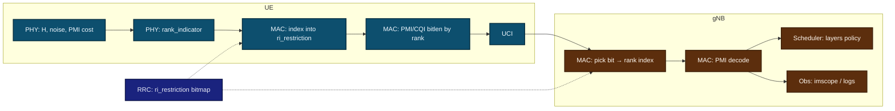

# NR Type-I CSI and DL MIMO Layering: Progress for Industry Research Audiences

**OpenAirInterface NR — 4×4 and 2×4 CSI feedback, decode, and scheduling observability**

*Presentation-style Markdown: use as speaker deck or export to slides.*

---

## Slide 1 — Elevator summary (30 seconds)

We hardened the **NR Type-I single-panel CSI reporting chain** for **four CSI-RS ports** on the downlink:

1. **Standards-consistent RI encoding** under `ri_restriction` (UCI carries an **index** into allowed ranks, not an ambiguous “raw rank”).
2. **RRC alignment** so rank-4 is an **advertised candidate** where the 4-port geometry intends it (`0x0f` vs `0x03`).
3. **PMI coverage** extended to **ranks 2 and 3** (4-port), with **rank-dependent** `pmi_x1` / `pmi_x2` bit widths consistent with MAC packing.
4. **Explicit separation** of **decoded CSI rank** vs **scheduled PDSCH layers** (`--dl-ri-use-decoded`), so experiments are not confounded by scheduler caps.
5. **Instrumentation**: correlated UE ↔ gNB traces, imscope context fields, RSRP fallback, and **`--print-csi-debug`** to run clean baseline vs instrumented campaigns.

**One line:** *Correct CSI semantics, complete rank-dependent precoding feedback for 4 ports, and reproducible observability—not only a higher RI number in one scenario.*

---

## Slide 2 — Why this matters to research (not only “feature complete”)

| Research concern | What we addressed |
|------------------|-------------------|
| **Reproducibility** | Deterministic trace lines across PHY → MAC → decode → scheduler |
| **Interpretability** | RI mismatch root-caused (restriction index vs raw rank) |
| **Separation of concerns** | CSI **truth** vs **policy** (scheduler cap vs decoded RI) |
| **Codebook consistency** | Rank-dependent PMI paths and packing for 4-port Type I |
| **Constrained geometry** | 2×4: rank bounded by **N_RX=2**; dedicated estimator, not 4×4 reuse |

Industry labs often fail on **subtle MAC/RRC semantics** while PHY looks “correct.” This work makes the **full chain** defensible in reviews and publications.

---

## Slide 3 — Standards framing: `ri_restriction` and the RI field

### 3GPP-relevant mental model

- The network signals **which ranks are allowed** for a CSI report via **`typeI_SinglePanel_ri_Restriction`** (bitmap over ranks 1…K).
- The UE reports RI as a **codeword index** into the **ordered set of allowed ranks** (not “always rank minus one as a raw integer on the wire” in the naive sense).

### Failure mode we fixed (high signal for reviewers)

- UE PHY prints **RI = 4** (human: four layers).
- gNB decodes **RI = 2** under **`ri_restriction = 0x03`** (only ranks 1 and 2 allowed).
- **Root cause:** payload treated as compatible with restriction when it was not; index semantics vs allowed set were misaligned.

### Deliverable

- UE MAC **maps raw estimated rank** to **index in `ri_restriction`** (with fallback to highest allowed rank if raw rank ∉ set).
- gNB RRC ensures **rank 4 is in the candidate set** for the targeted **4-port, N1=2, N2=2, XP=1** geometry when we intend 4-layer reporting.

---

## Slide 4 — End-to-end causal chain (instrumented experiment)



**Talking point:** Any paper or tech report should show **one vertical slice** with logged **RI_raw**, **ri_restriction**, **field index**, **decoded rank**, and **scheduled layers** under stated policy.

---

## Slide 5 — Scientific control: decoded RI vs scheduled layers

### Hypothesis confounders removed

Without an explicit switch, observers mix:

- “**gNB did not believe the UE**” (decode error),
- “**gNB believed the UE but capped layers**” (`maxMIMO_Layers_PDSCH`, policy),
- “**HARQ / DCI / BWP** forced fewer layers.”

### Mechanism

- **`--dl-ri-use-decoded 0` (default):** `scheduled_layers = min(decoded_RI_layers, maxMIMO_Layers_PDSCH)` (with sane floor).
- **`--dl-ri-use-decoded 1`:** scheduler uses **decoded** RI layers directly for experiments.

**Research value:** A/B tests isolate **CSI reporting correctness** from **scheduler policy** and from **UE capability signaling**.

---

## Slide 6 — 4×4 PHY and precoding feedback (what was extended)

### RI (4×4)

- Channel Gram over CSI-RS REs → approximate eigenvalues → **rank selection** (`nr_ri_from_sorted_eigs`); thresholds tuned so **full rank is reachable** in clean channels (e.g. rfsim). **OTA disclaimer:** rank distribution is environment-dependent.

### PMI (4-port Type I)

- **Rank 1 and 4** paths existed; **ranks 2 and 3** added (`nr_csi_rs_pmi_estimation_4port_rank23`, shared W-matrix / Cholesky helpers).
- **MAC-visible consistency:** for 4 ports and `rank_indicator > 0`, **`pmi_x1`** packs **`i11 | i12 | i13`** (8 bits) so **bit lengths** track **reported rank**.

**Citation-style statement for slides:** *We extended the 4-port Type-I PMI search and reporting to all ranks supported by the single-panel codebook path used in this configuration.*

---

## Slide 7 — 2×4 as a **constrained-rank** problem (not “half of 4×4”)

| Quantity | 4×4 (UE 4 RX) | 2×4 (UE 2 RX) |
|----------|----------------|----------------|
| CSI-RS ports (gNB) | 4 | 4 |
| **Maximum sensible rank** | up to 4 | **≤ 2** (rank limited by **N_RX**) |
| Estimator | Full 4×4 Gram / eigen analysis | **Dedicated 2×4 path** + cap |
| Codebook on gNB | 4-port Type I | Same **4-port** codebook; UE reports **L ≤ 2** |

**Talking point:** Sharing the **same 4-port codebook** on the network side while the UE is **rank-limited** is standard; the research contribution is **correct rank domain** + **traceable** PMI/CQI bit lengths.

---

## Slide 8 — Observability and measurement integrity

### Correlated traces (same airtime)

- UE MAC: **`UE CSI RI trace`** / **`UE CSI PMI trace`**
- gNB MAC: **`gNB CSI RI decode`** / **`gNB CSI PMI decode`**
- Scheduler: **layer policy** lines (`get_capped_dl_layers`)

### imscope / GUI

- Payload extended: **`max_dl_mimo_layers`**, **`pdsch_logical_ports`**
- UI separates **“CSI RI (UE preference)”** from **“cell DL MIMO capability”**
- **RSRP:** fallback to **SSB** measurement when CSI-RS RSRP struct is empty (avoids false **0 dBm** artifacts in 4×4 configs)

### Campaign hygiene

- **`--print-csi-debug`**: enable verbose CSI prints **only** when needed (baseline runs stay readable).

---

## Slide 9 — Validation strategy (what reviewers ask for)

### Minimum credible evidence

1. **Coherence:** UE index + restriction bitmap → gNB decoded rank (stable over many slots).
2. **Rank-dependent PMI:** bit lengths and decoded PMI fields consistent with reported rank.
3. **Policy sweep:** same attach, two runs: `--dl-ri-use-decoded 0` vs `1`, compare **scheduled layers** vs **decoded rank**.
4. **Regression:** 2×2 baseline unchanged in intent (no silent change to unrelated CSI modes).

### Tooling

- **2×4 log script:** `tools/validate_2x4_csi_logs.sh`
- **4×4 written reference:** `doc/NR_4X4_CSI_MIMO_MODIFICATIONS.md`, `doc/NR_4X4_CSI_IMPLEMENTATION_REFERENCE.md`
- **2×4 plan / steps:** `doc/NR_2X4_CSI_MIMO_IMPLEMENTATION_PLAN.md`

---

## Slide 10 — Limitations and honest scope (builds trust)

- **Rank ≠ throughput:** CQI/MCS/BLER, DMRS, and interference dominate outcomes.
- **OTA / USRP / split 7.2:** antenna mapping, calibration, and analog front-end imbalance can **collapse effective rank** even when software allows rank 4.
- **Heuristic RI:** PHY rank selection remains **algorithm-dependent**; restriction and packing are **spec-consistent**, not a claim of optimality under all channels.
- **Scheduler defaults:** capped policy may **hide** high rank unless policy flag is understood in the experiment design.

---

## Slide 11 — Suggested Q&A preparation (industry research)

**Q: Is this “AI CSI” or classical CSI?**  
A: Classical **Type-I codebook** CSI with **transparent** indices and traces; the stack is now suitable as a **labeled ground-truth generator** or baseline for ML CSI work.

**Q: What is novel vs OAI baseline?**  
A: Not a new air interface—**correctness + completeness + observability** for 4-port Type-I reporting and layering policy in this fork.

**Q: Can we cite 3GPP clause X?**  
A: Point reviewers to **`ri_restriction`** semantics and rank-dependent CSI payload construction in TS 38.212 / 38.331 context; our deck stays implementation-aligned—attach TS references in your external paper.

---

## Slide 12 — Demo / appendix commands

```bash
# Instrumented run (UE + gNB)
./nr-softmodem ... --print-csi-debug --dl-ri-use-decoded 0
./nr-uesoftmodem ... --print-csi-debug

# Policy comparison (gNB only)
./nr-softmodem ... --print-csi-debug --dl-ri-use-decoded 0
./nr-softmodem ... --print-csi-debug --dl-ri-use-decoded 1
```

---

## Revision note

| Item | Location in repo |
|------|------------------|
| Implementation detail | `doc/NR_4X4_CSI_IMPLEMENTATION_REFERENCE.md` |
| Feature-oriented summary | `doc/NR_4X4_CSI_MIMO_MODIFICATIONS.md` |
| 2×4 plan + validation | `doc/NR_2X4_CSI_MIMO_IMPLEMENTATION_PLAN.md`, `tools/validate_2x4_csi_logs.sh` |
| General progress deck | `doc/NR_4X4_2X4_CSI_PROGRESS_PRESENTATION.md` |

*This file (`NR_4X4_2X4_CSI_INDUSTRY_RESEARCH_PROGRESS.md`) is optimized for **industry wireless research** storytelling: semantics, controls, observability, and validation—not a line-by-line code walk-through.*
