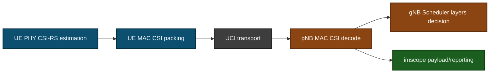
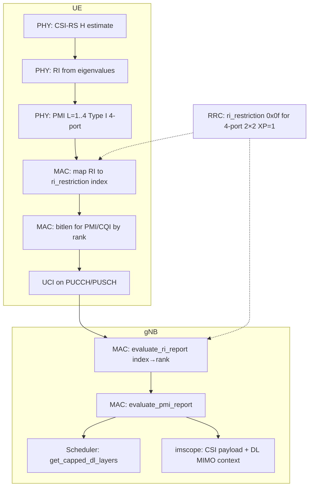
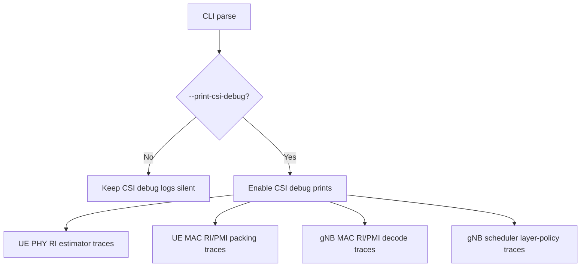

# 4x4 and 2x4 CSI/MIMO Progress Update
## OpenAirInterface NR - Developer Progress Report

### How to read this deck
- **4x4 CSI/MIMO feedback (main track):** Slides **5, 5A–5D**, **8–9**, **11–12**, **14** (RI index packing, `ri_restriction` rank-4, PMI for L=2–4, scheduler policy, imscope/RSRP, coherence example).
- **2x4 extension:** Slides **6**, **10**, and **15** (plus `tools/validate_2x4_csi_logs.sh`) — same 4-port codebook on gNB, UE with 2 RX only.

---

## Slide 1 - Objective and Scope

### Objective
- Enable robust CSI feedback behavior for:
  - `4x4`: gNB 4 ports, UE 4 RX capability path
  - `2x4`: gNB 4 ports, UE 2 RX capability path
- Make RI/PMI/CQI behavior observable and explainable in logs and imscope
- Close RI mismatch between UE and gNB decode

### Scope Implemented
- UE PHY: RI/PMI estimation paths
- UE MAC: CSI payload packing and tracing
- gNB MAC: CSI decode tracing and imscope payload reporting
- gNB scheduler: RI-to-layer policy with runtime switch
- Documentation and validation tooling

---

## Slide 2 - Initial Problem Statement

### Observed Before Fixes
- UE PHY often prints `RI=4`
- gNB/imscope often shows `RI=2`
- imscope could show `RSRP=0` in 4x4 scenarios
- `2x4` path had "not implemented" behavior in RI estimation

### Why This Matters
- Wrong RI interpretation causes wrong layer scheduling decisions
- Poor observability slows debugging and field validation
- Incomplete 2x4 path blocks realistic deployment validation

---

## Slide 3 - Root Cause of RI Mismatch

### Core Root Cause
- UE was effectively sending raw RI semantics while gNB decodes RI as index over `ri_restriction`.
- Example:
  - `ri_restriction=0x03` allows only ranks 1 and 2
  - UE-side report representing rank 4 is not valid in this restricted set
  - gNB decodes corresponding index to rank 2

### Result
- UE and gNB appear inconsistent even when channel estimate suggests higher rank

---

## Slide 4 - End-to-End Architecture (After Changes)



---

## Slide 5 - 4x4 Workstream Summary

### 4x4 Key Deliverables
1. UE RI field encoded as index into allowed `ri_restriction` set
2. gNB codebook config updated to allow rank-4 for 4-port geometry (`0x0f`)
3. UE 4-port PMI support extended for RI=2 and RI=3
4. gNB scheduler layer policy made explicit and configurable
5. imscope payload enriched with DL MIMO context and RSRP fallback

### Main Outcome
- UE `RI=4` and gNB decode can now align when restriction allows rank 4

---

## Slide 5A - 4x4 CSI/MIMO Feedback: Enablement Pipeline (Detail)

### What “enabling 4x4 MIMO feedback” required (not optional extras)
1. **UE estimates rank** from 4×4 channel Gram (CSI-RS), then selects PMI for reported rank (Type I single-panel, 4 ports).
2. **gNB advertises allowed ranks** via RRC `typeI_SinglePanel_ri_Restriction` — rank 4 must appear in the bitmap or the UE cannot legally report RI=4 as index 3.
3. **UE MAC packs RI as index** into that allowed set (not “raw layer count” in the bit field).
4. **gNB MAC decodes** the same index → `RI_reported` (0-based rank).
5. **Scheduler** maps decoded rank to scheduled `nrOfLayers` (may still cap vs `maxMIMO_Layers_PDSCH` unless `--dl-ri-use-decoded 1`).



---

## Slide 5B - 4x4 UE PHY: RI and PMI (4 CSI-RS Ports)

### RI for 4x4 (`csi_rx.c`)
- Accumulate averaged **HᴴH** (Gram) over CSI-RS REs, approximate eigenvalues (power deflation).
- **`nr_ri_from_sorted_eigs()`** maps eigenvalue ratios to `rank_indicator` (0-based → **RI layers = rank+1**).
- Thresholds were relaxed so **rank 4 is reachable** in clean channels (e.g. rfsim); OTA may still often prefer lower rank.

### PMI for 4x4 (same file)
- **Rank 1 and rank 4** paths existed; **rank 2 and rank 3** added via `nr_csi_rs_pmi_estimation_4port_rank23()` and shared helpers (`nr_type1_build_w_l_layer_4port`, Cholesky/logdet for variable L).
- **`pmi_x1` packing** for 4 ports and `rank_indicator > 0`: packs **`i11 | i12 | i13`** (8 bits total) so MAC layer matches codebook bit layout for L>1.

### Debug
- With `--print-csi-debug`, PHY can log **4×4 RI: eig ratios … → rank_indicator** for correlation with MAC traces.

---

## Slide 5C - 4x4 gNB: RRC, Decode, Scheduler (Feedback “Works” vs “Scheduled”)

### RRC / codebook (`nr_radio_config.c`)
- For **4 ports, N1=2, N2=2, XP=1**, ensure `ri_layers` is at least **4** before `(1 << ri_layers) - 1` → **`ri_restriction = 0x0f`** (ranks 1–4 allowed).

### MAC decode (`gNB_scheduler_uci.c`)
- **`evaluate_ri_report`**: `ri_index` selects the **n-th set bit** in `ri_restriction` → `sched_ctrl->CSI_report...ri`.
- **`evaluate_pmi_report`**: bit lengths from `csi_meas_bitlen` indexed by decoded **RI** (0-based).

### Scheduler (`gNB_scheduler_dlsch.c`)
- **`get_capped_dl_layers()`**: default **`min(decoded_RI_layers, maxMIMO_Layers_PDSCH)`**; override with **`--dl-ri-use-decoded 1`** for test campaigns.

**Takeaway:** Feedback can show **RI=4** while scheduled layers stay ≤ cap — that is intentional policy, not a decode bug.

---

## Slide 5D - 4x4 Observability: imscope, RSRP, Struct, CLI

### `csi_report_scope_payload_t` (`phy_scope_interface.h`)
- Added **`max_dl_mimo_layers`** and **`pdsch_logical_ports`** so imscope can show **“CSI RI from UE”** vs **“cell DL MIMO capability”** side by side.

### imscope UI (`imscope.cpp`)
- Separate lines for **CSI RI (preferred layers)** and **Cell DL MIMO** (max PDSCH layers / logical ports).

### RSRP fix (`gNB_scheduler_uci.c`)
- If CSI-RS RSRP report is empty, **fallback to SSB RSRP** so 4x4 configs do not show **RSRP=0** in imscope when only SSB measurement is populated.

### CLI
- **`--print-csi-debug`**: gates verbose CSI traces on UE and gNB.
- **`--dl-ri-use-decoded`**: gNB-only scheduler layer policy (0 = cap, 1 = use decoded RI layers).

### Deeper written reference (repo)
- `doc/NR_4X4_CSI_MIMO_MODIFICATIONS.md`
- `doc/NR_4X4_CSI_IMPLEMENTATION_REFERENCE.md`

---

## Slide 6 - 2x4 Workstream Summary

### 2x4 Key Deliverables
1. Added dedicated UE RI estimator path for `UE RX=2, N_ports=4`
2. Capped RI to physically feasible ranks for 2 RX (`RI <= 2 layers`)
3. Verified/used 4-port PMI path compatibility for RI>1
4. Added UE/gNB PMI decode traces for coherence checks
5. Added runtime validation helper script for log auditing

### Main Outcome
- 2x4 no longer falls into missing-path behavior and is testable with coherent traces

---

## Slide 7 - Code Areas Touched

### UE-side
- `openair1/PHY/NR_UE_TRANSPORT/csi_rx.c`
- `openair2/LAYER2/NR_MAC_UE/nr_ue_procedures.c`

### gNB-side
- `openair2/LAYER2/NR_MAC_gNB/gNB_scheduler_uci.c`
- `openair2/LAYER2/NR_MAC_gNB/gNB_scheduler_dlsch.c`
- `openair2/LAYER2/NR_MAC_gNB/nr_radio_config.c`

### Observability/CLI
- `openair1/PHY/TOOLS/phy_scope_interface.h`
- `openair1/PHY/TOOLS/imscope/imscope.cpp`
- `executables/softmodem-common.h`
- `executables/softmodem-common.c`

### Validation Tooling
- **4x4:** coherence checks via **`--print-csi-debug`** traces (UE RI/PMI + gNB decode + scheduler policy) and imscope; full step write-ups in `doc/NR_4X4_CSI_MIMO_MODIFICATIONS.md` / `doc/NR_4X4_CSI_IMPLEMENTATION_REFERENCE.md`.
- **2x4:** `tools/validate_2x4_csi_logs.sh` (automated grep-style pass on captured logs).

---

## Slide 8 - Critical Logic Change #1 (4x4 / shared: UE RI Packing)

### Before
- RI field could represent raw rank semantics, causing decode mismatch under restrictive mask

### After
- RI sent as **index over allowed ranks** from `ri_restriction`
- If raw rank not in restriction:
  - fallback to highest allowed rank/index

```c
/* RI in CSI payload is an index over allowed ranks (ri_restriction), not raw rank */
const uint8_t ri_rank_for_payload = (ri_index_from_raw >= 0) ? ri_raw : highest_allowed_rank;
const uint8_t ri_field_sent = (ri_index_from_raw >= 0) ? (uint8_t)ri_index_from_raw
                                                       : (uint8_t)(allowed_rank_count - 1);
```

---

## Slide 9 - Critical Logic Change #2 (4x4: gNB Rank-4 in `ri_restriction`)

### gNB RRC Codebook Config Update
- For 4-port geometry (`N1=2, N2=2, XP=1`)
- Force advertised RI candidates to include rank 4

```c
if (num_ant_ports == 4 && antennaports->N1 == 2 && antennaports->N2 == 2 &&
    antennaports->XP == 1 && ri_layers < 4)
  ri_layers = 4;
singlePanelConfig->typeI_SinglePanel_ri_Restriction.buf[0] = (1 << ri_layers) - 1;
```

### Effect
- `ri_restriction` becomes `0x0f` instead of `0x03` in targeted 4-port path

---

## Slide 10 - Critical Logic Change #3 (2x4-only: UE RI Estimation Path)

### New 2x4 PHY Branch
- Added `nr_csi_rs_ri_estimation_2x4(...)`
- Uses covariance/eigenvalue method similar to 4-port analysis
- Applies 2 RX physical cap

```c
/* UE has only 2 RX chains in 2x4; cap RI to max 2 layers. */
uint8_t rank_raw = 0;
if (lam[0] > 1e-6 && lam[1] > lam[0] * 5e-5)
  rank_raw = 1;
*rank_indicator = rank_raw;
```

### Effect
- Removes unsupported branch behavior for 2x4
- Produces valid RI domain for UE RX=2

---

## Slide 11 - Critical Logic Change #4 (4x4 / shared: Scheduler Layer Policy)

### Added Runtime Policy Switch
- `--dl-ri-use-decoded 0|1`
  - `0`: cap scheduled layers by configured max (default)
  - `1`: use decoded RI layers directly

```c
if (get_softmodem_params()->dl_ri_use_decoded == 1)
  return decoded_layers;
int selected_layers = min(decoded_layers, (int)max_cfg_layers);
```

### Value
- Separates CSI decode correctness from scheduler policy
- Enables controlled testing and A/B comparisons

---

## Slide 12 - Observability Improvements

### imscope Improvements
- CSI report payload now includes:
  - `max_dl_mimo_layers`
  - `pdsch_logical_ports`
- RSRP fallback from CSI-RS to SSB path when CSI-RS report empty

### Terminal Trace Improvements
- UE RI/PMI trace logs
- gNB RI/PMI decode logs
- Scheduler layer-policy logs

### New CLI Debug Gate
- `--print-csi-debug` on both UE and gNB
- Prevents log flooding in normal runs

---

## Slide 13 - CSI Debug Control Path



---

## Slide 14 - Example Runtime Coherence (4x4 Success Case)

### Expected Pattern
- UE:
  - `RI_raw=3 (layers=4), ri_restriction=0x0f, RI_field_sent=3 (index)`
- gNB:
  - `ri_index=3, ri_restriction=0x0f -> RI_reported=3 (layers=4)`
- Scheduler:
  - policy trace indicates selected layer count and whether capping happened

### Interpretation
- Packing, decode, and policy are now independently visible and consistent

---

## Slide 15 - Validation Strategy

### Completed
- Build verification after major steps
- Runtime trace instrumentation and coherence checks
- 2x4 helper script:
  - `tools/validate_2x4_csi_logs.sh`

### Recommended Campaign Matrix
1. 2x2 regression baseline
2. 2x4 with capped policy (`--dl-ri-use-decoded 0`)
3. 2x4 with decoded policy (`--dl-ri-use-decoded 1`)
4. 4x4 capped policy
5. 4x4 decoded policy

---

## Slide 16 - Risks and Known Constraints

### Technical Constraints
- RI reporting is recommendation, not strict scheduler command
- Final throughput depends on MCS/BLER/RB/control constraints
- RF realism (especially OTA/USRP) can reduce achievable rank

### Integration Risks
- Antenna-port mapping consistency across stack
- RU/fronthaul configuration in split deployments
- Codebook/profile mismatch between UE and gNB assumptions

---

## Slide 17 - USRP / Split 7.2 Notes

### Support Position
- Changes are stack-level (UE PHY/MAC, gNB MAC/scheduler), not rfsim-only
- Testable with USRP and with split 7.2 if port mapping/capability chain is correct

### Preconditions
- 4 coherent DL chains for 4-port CSI-RS path at gNB/RU side
- Correct RU/DU antenna mapping and timing/sync discipline
- Matching UE RX chain count for target scenario (2x4 or 4x4)

---

## Slide 18 - Team Handoff and Next Steps

### Immediate Next Steps
1. Execute full runtime matrix on target hardware profile
2. Capture KPI table (RI/PMI coherence, scheduled layers, BLER, throughput)
3. Add final empirical results into docs

### Optional Enhancements
- Add automated parser for 4x4 traces similar to 2x4 helper
- Add presentation screenshots from imscope and terminal trace windows
- Add CI-style smoke check for `--print-csi-debug` gated logs

---

## Appendix A - Suggested Demo Commands

### Enable CSI debug traces on both nodes
```bash
# gNB
./nr-softmodem ... --print-csi-debug --dl-ri-use-decoded 0

# UE
./nr-uesoftmodem ... --print-csi-debug
```

### Compare scheduler policies
```bash
# Policy A: capped
./nr-softmodem ... --print-csi-debug --dl-ri-use-decoded 0

# Policy B: decoded
./nr-softmodem ... --print-csi-debug --dl-ri-use-decoded 1
```

---

## Appendix B - Key Message for Management

- 4x4 and 2x4 CSI feedback paths are now functionally complete and observable.
- RI mismatch issue was fixed through standards-correct RI index packing + restriction alignment.
- Scheduler policy is now explicitly controllable for test and deployment tuning.
- Validation tooling and documentation are in place; final hardware campaign is the next execution step.
