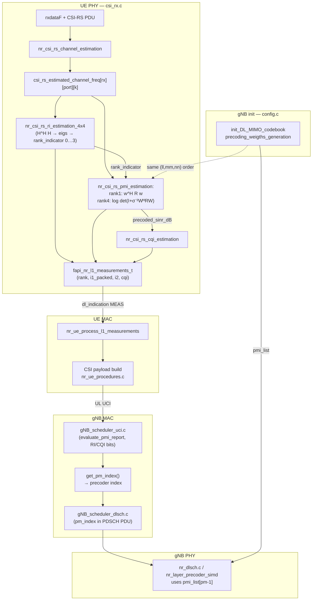
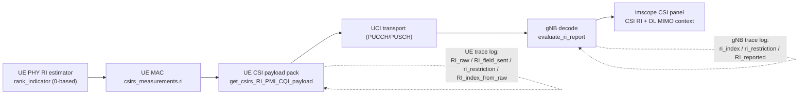

# NR 4×4 CSI / MIMO — implementation reference (files, code, call graph)

This companion to **`doc/NR_4X4_CSI_MIMO_MODIFICATIONS.md`** records **every touched file**, **representative code** (added vs modified), a **block diagram**, and **function-to-function links** so you can navigate the fork or port the same logic to another tree.

**Repository root (this workspace):**  
`/root/Tawfik/OAI-Projects/OAI-nrgNB/openairinterface5g`

---

## 1. Files changed (index)

| File (absolute path) | Role |
|----------------------|------|
| `/root/Tawfik/OAI-Projects/OAI-nrgNB/openairinterface5g/openair1/PHY/NR_UE_TRANSPORT/csi_rx.c` | UE CSI-RS: **4×4 RI** (report **RI 1…4**), **rank-1 + rank-4 PMI**, **rank-dependent `pmi_x1` packing**; **2×2 path unchanged** (see **§2.1**) |
| `/root/Tawfik/OAI-Projects/OAI-nrgNB/openairinterface5g/openair2/LAYER2/NR_MAC_gNB/gNB_scheduler_primitives.c` | gNB DL scheduler: **`get_pm_index()`** uses real logical ports + **(N1,N2)**; no blanket identity on **XP=1** |
| `/root/Tawfik/OAI-Projects/OAI-nrgNB/openairinterface5g/openair2/LAYER2/NR_MAC_gNB/config.c` | gNB codebook build: **second polarization block** only if **`num_antenna_ports > N1·N2`** |
| `/root/Tawfik/OAI-Projects/OAI-nrgNB/openairinterface5g/openair2/LAYER2/NR_MAC_gNB/nr_radio_config.c` | RRC: **4 ports + (2,2,1)** → **`two_two`** codebook restriction for PMI bit lengths |

### 1.1 Blast radius — **2×2** and other MIMO sizes

All **rank-4** and **uncapped RI** logic is gated on **`nb_antennas_rx == 4`** and **`N_ports == 4`** (RI/PMI) and on **`mapping_parms.ports == 4` && `rank_indicator == 3`** for the **8-bit `pmi_x1` pack**. The legacy **2×2** RI/PMI block (**`nb_antennas_rx == 2`**, **`N_ports == 2`**) and **SISO** paths in **`csi_rx.c`** are **unchanged**. **gNB** files in §1 were not modified by the rank-4 UE work alone.

---

## 2. Intuition block diagram (end-to-end CSI)

**Idea:** CSI-RS gives per-RE channel estimates **H[rx][port]**. The UE forms **R ≈ E[H^H H]** (port-side covariance), infers **rank**, picks a **precoder column w** that maximizes beamforming gain **w^H R w**, maps **(i11,i12,i2)** into **UCI**, and the gNB maps the same indices back to a **PM index** into **`pmi_list`** built like **TS 38.214** Type I single-panel.



**RI / PMI intuition:** **4×4** RI can report **up to RI = 4**. **Rank-1** and **rank-4** PMI paths exist for **four CSI-RS ports**; **RI = 2 or 3** still has **no PMI** (PHY returns **`-1`** until implemented — see overview **§10**). **Rank-4** PMI search matches gNB **`precoding_weigths_generation`** for **L = 4** (see limitations in **§8** regarding **XP = 1** column structure).

---

## 3. Function call graph (UE CSI path)

| Step | Function | Calls / notes |
|------|----------|----------------|
| 1 | **`nr_ue_csi_rs_procedures`** | Entry from UE PHY slot processing when CSI-RS PDU is present |
| 2 | **`nr_csi_rs_channel_estimation`** | LS + filter → **`csi_rs_estimated_channel_freq`** |
| 3 | **`nr_csi_rs_ri_estimation`** | If **4 RX & 4 ports** → **`nr_csi_rs_ri_estimation_4x4`**; else **2×2** legacy; else warn |
| 4 | **`nr_csi_rs_pmi_estimation`** | If **4 ports & rank_indicator==0** → **`nr_csi_rs_pmi_estimation_4port_rank1`**; if **== 3** → **`nr_csi_rs_pmi_estimation_4port_rank4`**; if **4 ports & rank ∈ {1,2}** → **LOG_W** + **`-1`** |
| 5 | **`nr_csi_rs_cqi_estimation`** | Uses **`precoded_sinr_dB`** from PMI |
| 6 | **`ue->if_inst->dl_indication`** | Delivers **`fapi_nr_l1_measurements_t`** to MAC |
| 7 | **`nr_ue_process_l1_measurements`** | `openair2/LAYER2/NR_MAC_UE/nr_ue_procedures.c` — copies **rank, i1, i2, cqi** into **`mac->csirs_measurements`** |
| 8 | **PUCCH CSI packing** | **`get_csirs_RI_PMI_CQI_payload`** etc. — uses **`csi_meas_bitlen`** from RRC template |

**gNB DL precoding side**

| Step | Function | Notes |
|------|----------|--------|
| A | **`init_DL_MIMO_codebook`** | **`precoding_weights_generation`** fills **`gNB->pmi_list`** |
| B | **`get_pm_index`** | Inverts **(i11,i12,i13,i2)** from CSI report → **linear `lay_index`** → **1 + prev_layers + lay_index** |
| C | **`nr_layer_precoder_simd` / `_cm`** | `openair1/PHY/NR_TRANSPORT/nr_dlsch.c` — applies **`pmi_pdu->weights`** |

**RRC / bit lengths**

| Step | Function | Notes |
|------|----------|--------|
| R1 | **`config_csi_codebook`** | `nr_radio_config.c` — **two_two** for **(2,2,1)** 4-port |
| R2 | **`compute_pmi_bitlen`** | `nr_mac_common.c` — fills **`csi_report_template[].csi_meas_bitlen`** |

---

## 4. `csi_rx.c` — added helpers and 4×4 path

### 4.1 Includes (modified)

```32:35:openair1/PHY/NR_UE_TRANSPORT/csi_rx.c
#include <complex.h>
#include <limits.h>
#include <math.h>
```

### 4.2 Added: covariance accumulation **H^H H** over CSI-RS REs

```526:559:openair1/PHY/NR_UE_TRANSPORT/csi_rx.c
static void nr_csirs_accum_hhh_nt(const NR_DL_FRAME_PARMS *fp,
                                   const fapi_nr_dl_config_csirs_pdu_rel15_t *csirs,
                                   uint8_t mem_offset,
                                   const c16_t (*H)[4][fp->ofdm_symbol_size + FILTER_MARGIN],
                                   int n_rx,
                                   double complex Racc[4][4],
                                   int *n_re)
{
  memset(Racc, 0, sizeof(double complex) * 16);
  *n_re = 0;
  for (int rb = csirs->start_rb; rb < csirs->start_rb + csirs->nr_of_rbs; rb++) {
    if (csirs->freq_density <= 1 && csirs->freq_density != (rb % 2))
      continue;
    uint16_t k0 = (fp->first_carrier_offset + rb * NR_NB_SC_PER_RB) % fp->ofdm_symbol_size;
    int k_base = k0 + mem_offset;
    for (int sc = 0; sc < NR_NB_SC_PER_RB; sc++) {
      int k_offset = k_base + sc;
      if (k_offset < 0 || k_offset >= fp->ofdm_symbol_size + FILTER_MARGIN)
        continue;
      for (int i = 0; i < 4; i++) {
        for (int j = 0; j < 4; j++) {
          double complex sij = 0;
          for (int rx = 0; rx < n_rx; rx++) {
            const c16_t hi = H[rx][i][k_offset];
            const c16_t hj = H[rx][j][k_offset];
            sij += conj((double)hi.r + I * (double)hi.i) * ((double)hj.r + I * (double)hj.i);
          }
          Racc[i][j] += sij;
        }
      }
      (*n_re)++;
    }
  }
}
```

### 4.3 Added: approximate eigenvalues + RI from ratios

```561:617:openair1/PHY/NR_UE_TRANSPORT/csi_rx.c
static void nr_herm4_power_deflation_eigs(double complex Rin[4][4], double lam[4])
{
  // ... power iteration + Hermitian deflation ×4, then sort lam descending ...
}

static uint8_t nr_ri_from_sorted_eigs(const double lam[4])
{
  if (lam[0] < 1e-6)
    return 0;
  int r = 1;
  if (lam[1] > lam[0] * 8e-5)
    r++;
  if (lam[2] > lam[0] * 4e-4)
    r++;
  if (lam[3] > lam[0] * 2e-3)
    r++;
  return (uint8_t)(r - 1);
}
```

### 4.4 **`nr_csi_rs_ri_estimation_4x4`** — full **RI 1…4** reporting

```658:687:openair1/PHY/NR_UE_TRANSPORT/csi_rx.c
static int nr_csi_rs_ri_estimation_4x4(const PHY_VARS_NR_UE *ue,
                                       const fapi_nr_dl_config_csirs_pdu_rel15_t *csirs_config_pdu,
                                       uint8_t mem_offset,
                                       c16_t csi_rs_estimated_channel_freq[][4][ue->frame_parms.ofdm_symbol_size + FILTER_MARGIN],
                                       uint8_t *rank_indicator)
{
  ...
  const uint8_t rank_raw = nr_ri_from_sorted_eigs(lam);
  /* Report full RI; rank-1 and rank-4 Type I PMI for 4 ports are implemented. Ranks 2–3 PMI not implemented yet. */
  const uint8_t max_rank_indicator_for_pmi = 3;
  *rank_indicator = rank_raw > max_rank_indicator_for_pmi ? max_rank_indicator_for_pmi : rank_raw;
  LOG_D(NR_PHY,
        "4×4 RI: eig ratios ... → rank_indicator=%u (RI=%u)\n",
        ...
        *rank_indicator,
        *rank_indicator + 1u);
  return 0;
}
```

**Note:** **`max_rank_indicator_for_pmi = 3`** only clips impossible **RI > 4**; it does **not** force **RI = 1** anymore.

### 4.5 Added: **`nr_csi_rs_pmi_estimation_4port_rank1`**

Uses **`nr_type1_fill_v_lm`**, **`nr_csirs_accum_hhh_nt`**, **`nr_wh_r_w`**, nested loops aligned with **`precoding_weigths_generation`** for **L=1**, **N1=N2=2**, **O1=O2=4** (see file from line **704** through **783**).

### 4.6 Modified: **`nr_csi_rs_ri_estimation`** — dispatch 4×4

```955:965:openair1/PHY/NR_UE_TRANSPORT/csi_rx.c
  if (ue->frame_parms.nb_antennas_rx == 1 || N_ports == 1) {
    return 0;
  }
  if (ue->frame_parms.nb_antennas_rx == 4 && N_ports == 4) {
    return nr_csi_rs_ri_estimation_4x4(ue, csirs_config_pdu, mem_offset, csi_rs_estimated_channel_freq, rank_indicator);
  }
  if (!(ue->frame_parms.nb_antennas_rx == 2 && N_ports == 2)) {
    LOG_W(NR_PHY, "Rank indicator computation is not implemented for %i x %i system\n",
          ue->frame_parms.nb_antennas_rx, N_ports);
    return -1;
  }
```

### 4.7 Modified: **`nr_csi_rs_pmi_estimation`** — 4-port rank-1, rank-4, guard

```1106:1131:openair1/PHY/NR_UE_TRANSPORT/csi_rx.c
  if (N_ports == 4 && rank_indicator == 0) {
    return nr_csi_rs_pmi_estimation_4port_rank1(ue,
                                                ...
                                                precoded_sinr_dB);
  }
  if (N_ports == 4 && rank_indicator == 3) {
    return nr_csi_rs_pmi_estimation_4port_rank4(ue,
                                                ...
                                                precoded_sinr_dB);
  }
  if (N_ports == 4 && rank_indicator > 0) {
    LOG_W(NR_PHY, "PMI for 4 CSI-RS ports with rank %u is not implemented (only RI=1 and RI=4)\n", ...);
    return -1;
  }
```

(Plus **`N_ports != 2`** guard before the legacy **2-port** PMI block — unchanged.)

### 4.8 Added: **`nr_csi_rs_pmi_estimation_4port_rank4`** and helpers

New static symbols in **`csi_rx.c`** (approximate line range **~780–~950**, subject to drift): **`ue_get_k1_k2_rank4_n2x2`**, **`nr_type1_build_w_4layer_4port`**, **`nr_form_m_wherm_rw`**, **`nr_cholesky_herm_lower4_logdet`**, **`nr_csi_rs_pmi_estimation_4port_rank4`**. They mirror **`precoding_weigths_generation`** for **L = 4**, **N1 = N2 = 2**, **XP = 1** (four rows of **`W`**), score **`log₂ det(I + inv_noise·M)`** with **M = WᴴRW**, and set **`i1[0]=i11`, `i1[1]=i12`, `i1[2]=i13`, `i2[0]=i2`**.

### 4.9 Modified: **`nr_ue_csi_rs_procedures`** — **rank-dependent `pmi_x1` packing**

```1567:1591:openair1/PHY/NR_UE_TRANSPORT/csi_rx.c
  /* Wideband Type I single-panel: pack into pmi_x1 (LSB = i13 in gNB get_pm_index unpack order). */
  uint16_t i1_packed = i1[0];
  if (mapping_parms.ports == 4) {
    const unsigned b11 = 3;
    const unsigned b12 = 3;
    const unsigned b13 = 2;
    if (rank_indicator == 3) {
      /* RI=4: i11 (MSB) | i12 | i13 (LSB) — matches nr_mac_common set_bitlen + get_pm_index. */
      i1_packed = (uint16_t)((((unsigned)i1[0] & ((1u << b11) - 1u)) << (b12 + b13))
                              | (((unsigned)i1[1] & ((1u << b12) - 1u)) << b13)
                              | ((unsigned)i1[2] & ((1u << b13) - 1u)));
    } else {
      i1_packed = (uint16_t)(((unsigned)i1[0] & ((1u << b11) - 1u)) << b12) | ((unsigned)i1[1] & ((1u << b12) - 1u));
    }
  }

  fapi_nr_l1_measurements_t l1_measurements = {
    ...
    .i1 = i1_packed,
```

---

## 5. `gNB_scheduler_primitives.c` — **`get_pm_index()`** (modified)

**Before:** early return when **`xp_pdsch_antenna_ports == 1`**; **`antenna_ports = (N1*N2)<<1`**.  
**After:** use **`tot_logical_ports = N1·N2·XP`** from **`radio_config.pdsch_AntennaPorts`**; use **`ap->N1`, `ap->N2`** for **`lay_index`**.

```206:225:openair2/LAYER2/NR_MAC_gNB/gNB_scheduler_primitives.c
uint16_t get_pm_index(const gNB_MAC_INST *nrmac,
                      const NR_UE_info_t *UE,
                      nr_dci_format_t dci_format,
                      int layers,
                      int xp_pdsch_antenna_ports)
{
  (void)xp_pdsch_antenna_ports;
  const nr_pdsch_AntennaPorts_t *ap = &nrmac->radio_config.pdsch_AntennaPorts;
  const int tot_logical_ports = ap->N1 * ap->N2 * ap->XP;
  if (dci_format == NR_DL_DCI_FORMAT_1_0 || nrmac->identity_pm || tot_logical_ports < 2)
    return 0;
  const NR_UE_sched_ctrl_t *sched_ctrl = &UE->UE_sched_ctrl;
  const int report_id = sched_ctrl->CSI_report.cri_ri_li_pmi_cqi_report.csi_report_id;
  const nr_csi_report_t *csi_report = &UE->csi_report_template[report_id];
  /* Precoding matrix layout follows gNB antenna layout (must match init_DL_MIMO_codebook). */
  const int N1 = ap->N1;
  const int N2 = ap->N2;
  const int antenna_ports = tot_logical_ports;
  if (antenna_ports < 2)
    return 0; // single antenna port
```

**Callers:** `gNB_scheduler_dlsch.c` — passes **`mac->radio_config.pdsch_AntennaPorts.XP`** (now unused inside **`get_pm_index`** via **`(void)`**).

---

## 6. `config.c` — **`precoding_weigths_generation`** (modified)

Second polarization loop wrapped:

```151:169:openair2/LAYER2/NR_MAC_gNB/config.c
              /* Second polarization block only when logical ports include XP (num_antenna_ports > N1*N2). */
              if (num_antenna_ports > N1 * N2) {
                for (int i_rows = N1 * N2; i_rows < 2 * N1 * N2; i_rows++) {
                  nfapi_nr_pm_weights_t *weights = &mat->pmi_pdu[pmiq].weights[j_col][i_rows];
                  res_code = sqrt(1 / (double)L) * (phase_sign)*theta_n[nn] * v_lm[llc][mmc][i_rows - N1 * N2];
                  c16_t precoder_weight = convert_precoder_weight(res_code);
                  *weights = precoder_weight;
                  ...
                }
              }
```

**Caller:** **`init_DL_MIMO_codebook`** (same file).

---

## 7. `nr_radio_config.c` — **`config_csi_codebook`** case 4 (modified)

```2087:2105:openair2/LAYER2/NR_MAC_gNB/nr_radio_config.c
        case 4:
          /* (N1,N2,XP)=(2,2,1): four co-polarized ports on a 2×2 UPA — use two-two codebook mapping so PMI bit
           * lengths match init_DL_MIMO_codebook (N1=2,N2=2). Otherwise keep two-one (e.g. four ports on a 4×1 line). */
          if (antennaports->N1 == 2 && antennaports->N2 == 2 && antennaports->XP == 1) {
            moreThanTwo->n1_n2.present =
                NR_CodebookConfig__codebookType__type1__subType__typeI_SinglePanel__nrOfAntennaPorts__moreThanTwo__n1_n2_PR_two_two_TypeI_SinglePanel_Restriction;
            moreThanTwo->n1_n2.choice.two_two_TypeI_SinglePanel_Restriction.size = 4;
            ...
          } else {
            moreThanTwo->n1_n2.present =
                NR_CodebookConfig__codebookType__type1__subType__typeI_SinglePanel__nrOfAntennaPorts__moreThanTwo__n1_n2_PR_two_one_TypeI_SinglePanel_Restriction;
            ...
          }
          break;
```

**Downstream:** **`get_n1n2_o1o2_singlepanel`** in **`openair2/LAYER2/NR_MAC_COMMON/nr_mac_common.c`** maps **`two_two`** → **n1=2, n2=2, o1=4, o2=4** for **`compute_pmi_bitlen`**.

---

## 8. Limitations (code-level)

| Topic | Detail |
|--------|--------|
| **UE PMI (4 ports)** | **Rank 1** and **rank 4** implemented; **`rank_indicator ∈ {1,2}`** → **`-1`** (no PMI) |
| **UE RI (4×4)** | **Heuristic** eigenvalues; **`max_rank_indicator_for_pmi = 3`** only prevents **RI > 4** |
| **UE PMI geometry** | **Hard-coded N1=N2=2, O1=O2=4** in **rank-1** and **rank-4** helpers |
| **Rank-4 metric / CQI** | PMI maximizes **`log₂ det(I + σ⁻²WᴴRW)`**; CQI input uses **`trace(M)/(4σ²)`** — **heuristic** |
| **OAI L = 4, XP = 1** | gNB **W** construction can be **rank-deficient** in strict linear algebra; UE **matches OAI** for **index alignment** |
| **gNB `get_pm_index`** | **`lay_index`** uses **`ap->N1/N2`**; **PMI bit fields** still come from **`csi_report_template`** (must stay consistent with RRC **`two_two`**) |
| **ASN** | **`two_two`** restriction buffer **size = 4** bytes for the **(2,2,1)** branch — validate per your **38.331** / toolchain |

---

## 9. Related upstream symbols (not modified here, but linked)

| Symbol | File | Role |
|--------|------|------|
| **`init_DL_MIMO_codebook`** | `openair2/LAYER2/NR_MAC_gNB/config.c` | Builds **`pmi_list`** — **UE PMI search must stay in lockstep** |
| **`get_K1_K2`** | `config.c` | Layer-dependent **K1,K2** for codebook loops |
| **`get_k1_k2_indices`** | `gNB_scheduler_primitives.c` | Maps **i13** → **k1,k2** for **`get_pm_index`** |
| **`evaluate_pmi_report`** | `openair2/LAYER2/NR_MAC_gNB/gNB_scheduler_uci.c` | Unpacks UE **UCI** into **`pmi_x1`, `pmi_x2`, `ri`** |
| **`nr_ue_process_l1_measurements`** | `openair2/LAYER2/NR_MAC_UE/nr_ue_procedures.c` | Copies **`fapi_nr_l1_measurements_t`** into **`mac->csirs_measurements`** |

---

## 10. Incremental 4x4 observability changes (2026-04-15)

### 10.1 Scope and intent

These updates do not change the core 4x4 RI/PMI architecture; they improve observability and interpretation across UE logs, gNB decode logs, and imscope.

### 10.2 Files touched in this increment

| File | Purpose |
|------|---------|
| `openair1/PHY/TOOLS/phy_scope_interface.h` | Extend `csi_report_scope_payload_t` with DL MIMO context fields |
| `openair2/LAYER2/NR_MAC_gNB/gNB_scheduler_uci.c` | RSRP fallback for 4-port reports, fill new payload fields, RI decode trace log |
| `openair1/PHY/TOOLS/imscope/imscope.cpp` | Show CSI RI separately from configured DL MIMO capability |
| `openair2/LAYER2/NR_MAC_UE/nr_ue_procedures.c` | UE-side RI trace log at CSI payload packing |
| `openair1/PHY/NR_UE_TRANSPORT/csi_rx.c` | Relaxed 4x4 RI heuristic thresholds |

### 10.3 New payload fields and producer mapping

| Payload field | Source | Meaning |
|---------------|--------|---------|
| `max_dl_mimo_layers` | `UE->sc_info.maxMIMO_Layers_PDSCH` (fallback to logical ports) | Configured max DL layers at serving-cell level |
| `pdsch_logical_ports` | `nrmac->radio_config.pdsch_AntennaPorts` (`N1*N2*XP`) | Configured logical DL ports |

### 10.4 RI trace data path diagram



### 10.5 Interpreting mismatches

- UE PHY `RI = ...` line is an estimator output.
- gNB `evaluate_ri_report` output is what was decoded from UCI.
- If they differ, inspect `ri_restriction` and RI index mapping from the new UE/gNB trace logs.

#### Concrete observed example (captured in rfsim)

- UE PHY: `RI = 4`
- UE MAC trace: `RI_raw=3, ri_restriction=0x03, RI_field_sent=3, RI_index_from_raw=-1`
- gNB MAC trace: `ri_index=1, ri_restriction=0x03 -> RI_reported=1 (layers=2)`

Meaning:
- `ri_restriction=0x03` effectively allows only ranks 1..2 for this report.
- Raw RI=4 cannot be represented in that allowed set (`RI_index_from_raw=-1`).
- gNB decode is therefore consistent with configured restriction and received RI bits.

### 10.6 Build verification (increment)

Targets rebuilt successfully after this increment:
- `nr-softmodem`
- `nr-uesoftmodem`
- `imscope`

### 10.7 Suggested implementation sequence (execution checklist)

Use this checklist for the upcoming RI=4 end-to-end work:

1. UE RI index packing fix in `get_csirs_RI_PMI_CQI_payload`.
2. RRC/CSI configuration update so `ri_restriction` includes rank-4.
3. Runtime verification with UE/gNB RI trace logs (same frame/slot).
4. gNB layer scheduling verification (decoded RI -> scheduled layers).
5. Add 4-port PMI support for RI=2 and RI=3.

### 10.8 Known limitations before/after step 1-2

- With `ri_restriction=0x03`, RI=4 is intentionally unrepresentable.
- UE can estimate RI=4 in PHY while gNB decodes RI=2 if RI field mapping is not index-based.
- Even after RI decode is fixed, missing PMI for RI=2/3 remains a functional gap.
- Full benefit requires alignment across RRC bit lengths, UE packer, gNB decoder, and scheduler layer selection.

### 10.9 Step 1 implementation details (completed)

File/function:
- `openair2/LAYER2/NR_MAC_UE/nr_ue_procedures.c`
- `get_csirs_RI_PMI_CQI_payload(...)`

What changed:
- Added explicit mapping from `RI_raw` to allowed-rank index using `ri_restriction`.
- Packed RI field now uses `RI_field_sent` (index), not raw rank value.
- When raw RI is not representable in the allowed set, fallback selects highest allowed rank/index.
- PMI/CQI bit lengths are selected using `RI_rank_for_payload`, matching the payload rank context.

Runtime trace enhancement:
- UE log now includes `RI_field_sent (index)` and `RI_rank_for_payload` in addition to `RI_raw`, `ri_restriction`, `RI_index_from_raw`.

### 10.10 Step 2 implementation details (completed)

File/function:
- `openair2/LAYER2/NR_MAC_gNB/nr_radio_config.c`
- `config_csi_codebook(...)`

What changed:
- Added `ri_layers` logic for RI restriction generation.
- For 4-port `N1=2, N2=2, XP=1`, `ri_layers` is raised to at least 4 before mask generation.
- Restriction mask now uses `(1 << ri_layers) - 1` (bounded by logical port count).

Resulting behavior:
- On this geometry, CSI report RI restriction is expected to include ranks 1..4 (`0x0f`) instead of rank 1..2 (`0x03`).
- This complements Step 1 so UE index-based RI packing can represent rank-4 candidates consistently.

### 10.11 Step 4 implementation details (completed)

Files/functions:
- `openair2/LAYER2/NR_MAC_gNB/gNB_scheduler_dlsch.c`
  - `get_capped_dl_layers(...)` (centralized DL layer policy)
  - call sites switched from direct `get_dl_nrOfLayers(...)` to policy helper in retransmission + new scheduling paths
- `executables/softmodem-common.h`
  - new CLI/runtime field `dl_ri_use_decoded`
  - new option `--dl-ri-use-decoded`
- `executables/softmodem-common.c`
  - value validation (`0` or `1`) and startup policy log

Policy semantics:
- `--dl-ri-use-decoded 0` (default): scheduler uses capped policy (`decoded layers` constrained by `maxMIMO_Layers_PDSCH`).
- `--dl-ri-use-decoded 1`: scheduler uses decoded RI layers directly.

Operational intent:
- Keeps safe default behavior while allowing explicit developer override for decoded-RI transmission experiments.

### 10.12 Step 5 implementation details (completed)

File/function:
- `openair1/PHY/NR_UE_TRANSPORT/csi_rx.c`

What changed:
- Added UE-side PMI estimator for 4 ports and RI=2/3:
  - `nr_csi_rs_pmi_estimation_4port_rank23(...)`
- Added generic helpers used by RI=2/3 and RI=4 paths:
  - `ue_get_k1_k2_indices(...)` (aligned with gNB mapping behavior)
  - `ue_get_k1_k2_counts(...)`
  - `nr_cholesky_herm_lower_logdet(..., n, ...)` (variable `n`)
- Updated dispatcher in `nr_csi_rs_pmi_estimation(...)`:
  - 4-port RI=2/3 now routed to the new estimator instead of `not implemented`.
- Updated 4-port `pmi_x1` packing in `nr_ue_csi_rs_procedures(...)`:
  - RI>1 uses `i11|i12|i13` layout (RI=2/3/4).

Runtime expectations:
- UE warning for 4-port RI=2/3 PMI not implemented should disappear.
- gNB should decode PMI for RI=2/3 reports with the usual rank-indexed bit lengths.

---

## 11. Revision

| Date | Change |
|------|--------|
| 2026-04-12 | Initial **implementation reference** (paths, snippets, mermaid, call table, limitations). |
| 2026-04-12 | **Rank-4 PMI**, **uncapped RI**, **rank-dependent `pmi_x1` packing**; updated **§1**, **§2**, **§3** table, **§4.4/4.7–4.9**, **§8**, **§1.1** blast radius. |
| 2026-04-15 | Added **§10** incremental observability changes: imscope DL MIMO context fields, gNB RSRP fallback, UE/gNB RI trace logs, and RI interpretation flow diagram. |
| 2026-04-15 | Added **§10.9**: Step 1 completed — UE RI payload now packs index over `ri_restriction` (with fallback), plus updated RI trace semantics. |
| 2026-04-15 | Added **§10.10**: Step 2 completed — gNB `config_csi_codebook` now extends RI restriction to rank-4 for 4-port `(2,2,1)` path (`ri_layers` mask generation). |
| 2026-04-15 | Added **§10.11**: Step 4 completed — scheduler layer policy centralized and made runtime-selectable via `--dl-ri-use-decoded {0|1}`. |
| 2026-04-15 | Added **§10.12**: Step 5 completed — UE 4-port PMI implemented for RI=2/3 and packing/score helpers generalized for RI>1 handling. |
