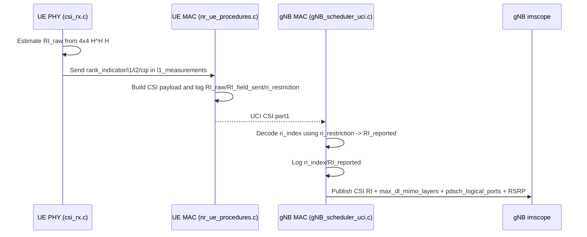

# NR 4×4 MIMO and CSI feedback — local modifications log

**Detailed implementation companion** (every file, **code citations**, **mermaid** data flow, **function link table**, limitations):  
`doc/NR_4X4_CSI_IMPLEMENTATION_REFERENCE.md` — full path:  
`/root/Tawfik/OAI-Projects/OAI-nrgNB/openairinterface5g/doc/NR_4X4_CSI_IMPLEMENTATION_REFERENCE.md`

This document describes **out-of-tree / fork-specific** changes added to support **4 RX × 4 CSI-RS port** operation with **gNB antenna layout (N1, N2, XP)** aligned to configurations such as:

```text
pdsch_AntennaPorts_N1 = 2;
pdsch_AntennaPorts_N2 = 2;
pdsch_AntennaPorts_XP = 1;
pusch_AntennaPorts    = 4;
maxMIMO_layers        = 4;
```

It also records **why** each change was made, **how** it fits the OAI codebase, **known limits**, and **how to re-apply** the same ideas on another repository clone.

---

## 0. Executive overview — implemented, assumptions, gaps

This section is the **single-page view**: what accepting the modification **fixes**, what is **in scope today**, **explicit assumptions**, and what you still need for a **complete** gNB↔UE **4×4 CSI-RS / MIMO** story (beyond this fork).

### 0.1 Problems this modification solves

| Problem (before) | Effect after accepting the change |
|------------------|-------------------------------------|
| UE **`nr_csi_rs_ri_estimation`** only supported **2×2**; **4 RX × 4 CSI-RS ports** hit “not implemented” and **default RI** | UE can compute a **heuristic RI** for **4×4** (when **4 RX** and **4 ports**), **reporting RI = 1…4** (capped only at 4). |
| UE PMI for four ports only used **ports 0–1**; not a full **Type I** rank-1 search | UE runs a **rank-1 Type I** search aligned with gNB **`precoding_weigths_generation`** for **N1=N2=2**. |
| No **rank-4** PMI on **4 ports**; RI often capped to 1 to avoid PMI failure | UE can run **rank-4 (L=4) Type I** PMI aligned with gNB **`precoding_weigths_generation`** for **XP=1**, four ports; **`pmi_x1`** uses **8 bits (i11\|i12\|i13)** per **`get_pm_index`** / **`set_bitlen_size_singlepanel`** for rank 4. |
| **`fapi_nr_l1_measurements_t.i1`** used only **`*i1`** (first byte) | **`pmi_x1`** is **packed** for four ports: **rank 1** → **i11 \| i12**; **rank 4** → **i11 \| i12 \| i13** (bit order per **`get_pm_index`**) so MAC can match gNB decode. |
| gNB **`get_pm_index()`** forced **identity** whenever **`XP == 1`**, ignoring CSI PMI | gNB uses **CSI PMI** when **`N1·N2·XP ≥ 2`** (subject to DCI / `identity_pm`), including **single-pol multi-port**. |
| Precoder weights always filled **two** **N1·N2** blocks (8 rows for a **4-port** XP=1 cell) | Second polarization block is **skipped** when **`num_antenna_ports ≤ N1·N2`**. |
| RRC **4-port** codebook always **`two_one`** → **(n1,n2)=(2,1)** while MAC precoding used **(2,2)** for **(2,2,1)** | For **(N1,N2,XP)=(2,2,1)** and **4 ports**, RRC uses **`two_two`** so **PMI bit lengths / n1,n2** align with **2×2 single-pol** precoding. |

**Bottom line:** Accepting the change fixes **broken or ignored DL CSI (RI + rank-1 PMI + precoding + RRC codebook alignment)** for the **target deployment**: **4 UE RX**, **4 CSI-RS ports**, **Type I single-panel**, **(2,2,1)** DL logical antenna layout, **wideband cri-RI-PMI-CQI** style reporting. **Rank-4 PMI** is added on the UE for the same geometry; **RI=2 and RI=3** PMI on four ports is still missing. It does **not** by itself implement **full 3GPP** coverage for every rank / subband / LI variant, nor **UL 4×4**.

### 0.2 What is implemented (checklist)

- [x] **UE RI** for **`nb_antennas_rx == 4`** and **`N_ports == 4`** (averaged **H^H H**, power/deflation eigen estimate, ratio → **rank_indicator 0…3** ≡ **RI 1…4**; only cap is **at most RI=4**).
- [x] **UE PMI** for **`N_ports == 4`**, **`rank_indicator == 0`** (rank 1) — **Type I** beam search matching gNB **N1=N2=2, O1=O2=4, K1=K2=1, I2=4**.
- [x] **UE PMI** for **`N_ports == 4`**, **`rank_indicator == 3`** (rank 4) — exhaustive **(i11,i12,i13,i2)** search (**512** candidates), **W** built like gNB **`precoding_weigths_generation`** for **L=4** and **four logical ports**; PMI score **`log₂ det(I + (1/σ²) WᴴRW)`** (Cholesky on **I + inv_noise·M**); CQI driver uses **`trace(M)/(4σ²)`** heuristic.
- [ ] **UE PMI** for **`N_ports == 4`**, **`rank_indicator ∈ {1,2}`** (RI = 2 or 3) — **not implemented** (explicit **`LOG_W`** and **`-1`**).
- [x] **UE → MAC `pmi_x1` packing** for **4 ports**: rank 1 → **(i11≪3)\|i12**; rank 4 → **(i11≪5)\|(i12≪2)\|i13** (LSB **i13** = gNB **`get_pm_index`** unpack order).
- [x] **gNB `get_pm_index()`** — logical port count **`N1·N2·XP`**, no blanket identity on **XP=1**; **`lay_index`** uses **`radio_config.pdsch_AntennaPorts` (N1, N2)**.
- [x] **gNB precoding** — second polarization block only if **`num_antenna_ports > N1·N2`**.
- [x] **gNB RRC `CodebookConfig`** — **`two_two`** for **4 ports** and **`(2,2,1)`**; legacy **`two_one`** for other **4-port** cases.

### 0.3 Assumptions made (read carefully)

| # | Assumption | Risk if violated |
|---|------------|-------------------|
| A1 | **UE PHY** is configured with **`nb_antennas_rx == 4`** (and RF/rfsim provides **4 RX**). | **4×4 RI path never runs**; old “not implemented” behavior for other **(rx × port)** pairs. |
| A2 | DL logical layout matches **(N1,N2,XP) = (2, 2, 1)** and **CSI-RS exposes 4 ports** consistent with that. | PMI search / **v_lm** geometry may **not** match the cell’s real **CodebookConfig** or CSI-RS mapping. |
| A3 | **UE rank-1 and rank-4 PMI helpers hard-code `N1 = N2 = 2`, `O1 = O2 = 4`** (same as gNB **`init_DL_MIMO_codebook`** for this config). | **Other 4-port layouts** (e.g. **4×1**) need code changes or **(N1,N2)** fed from RRC/MAC. |
| A4 | **RI** thresholds are **heuristic** (good for **rfsim / strong channels**); not **3GPP conformance**-tuned. | **RI** may be **too high / too low** on real channels; AMC/layers may be suboptimal. |
| A4b | **RI=2 / RI=3** on **4 ports** have **no PMI estimator** yet (`nr_csi_rs_pmi_estimation` returns **`-1`**). | If the **4×4 RI** heuristic returns **rank_indicator 1 or 2**, **PMI/CQI** can still fail until **rank-2 / rank-3** paths are added (or RI is restricted in RRC to **{1,4}** only). |
| A5 | Wideband **Type I**, **codebookMode 1**: **rank 1** uses **`pmi_x1 = (i11 << 3) \| i12`** (**3+3** bits); **rank 4** uses **`pmi_x1 = (i11 << 5) \| (i12 << 2) \| i13`** (**3+3+2** bits) per **`set_bitlen_size_singlepanel`** / **`get_pm_index()`** for **N1=N2=2**, rank 4. | If RRC uses **different** rank / mode / subset, **packing must be updated** to match **`csi_meas_bitlen`** (see **`nr_mac_common.c`**). |
| A6 | **`two_two_TypeI_SinglePanel_Restriction`** buffer **size = 4** bytes is acceptable for this OAI/ASN build. | **RRC encode/decode** or **tooling** may require a **different size** per release — verify against **38.331** for your branch. |
| A7 | **`identity_pm`** is false and **DCI 1_1** (or equivalent) is used when you expect **non-identity** PMI. | Scheduler may still choose **PMI 0** by policy. |

### 0.4 What is still needed (roadmap toward “complete” 4×4 CSI-RS / MIMO)

Ordered roughly by **dependency** (do earlier items first).

| Priority | Item | Why it is needed |
|----------|------|------------------|
| P1 | **UE PMI for ranks 2–3** with **4 CSI-RS ports** | **Rank 4** PMI exists; **RI=2** and **RI=3** still need **`nr_csi_rs_pmi_estimation`** branches + **`pmi_x1`/`pmi_x2`** packing per **`csi_meas_bitlen`**, aligned with **`precoding_weigths_generation`** for **L=2** and **L=3**. |
| P2 | **Pass (N1, N2, XP, codebookMode, rank)** from **RRC/MAC → PHY** (e.g. extend **`nr_csi_info_t`** or reuse existing config) | Removes **hard-coded N1=N2=2** and supports **all** OAI **4-port** codebook shapes. |
| P3 | **gNB scheduler** — tie **scheduled layers**, **PM index**, **MCS** to **decoded RI / PMI / CQI** every TTI (respect **maxMIMO_layers**, **RI restriction**, **codebook subset**) | Without this, CSI is **reported** but **not fully exploited**. |
| P4 | **RI calibration** — noise-aware thresholds, optional **3GPP** / simulation validation | Improves **rank** stability on **real RF** vs **rfsim**. |
| P5 | **Subband PMI/CQI**, **LI**, **CRI**, **dual CQI**, **aperiodic CSI** as per product goals | **“Complete CSI”** in product terms often includes these; each needs **UE PHY + MAC pack + gNB decode + scheduler**. |
| P6 | **UL 4×4** — **SRS**, **TPMI**, **PUSCH** DMRS / layers (**`pusch_AntennaPorts`**) | **DL CSI-RS** does **not** implement **UL MIMO**; UL needs its own **beam / rank** path. |
| P7 | **Tests / CI** — short **rfsim** or **L2** scenario: **non-identity PM** when **XP=1**, **PM index** vs reported **(i11,i12,i2)** | Prevents **regressions** when merging upstream OAI. |

**Definition of “complete” (suggested):** UE reports **RI, PMI, CQI** for **all ranks** you intend to schedule (**1…4**), gNB **decodes** them without bit mismatches, **scheduler** selects **layers + PM index + MCS** from CSI, and **UL** (if required) has matching **SRS/TPMI** behavior — all under your **RRC CSI-ReportConfig** and **CodebookConfig**.

---

## 1. Problem statement (before the change)

### 1.1 UE (`nr-uesoftmodem`)

- **`nr_csi_rs_ri_estimation()`** in `openair1/PHY/NR_UE_TRANSPORT/csi_rx.c` only implemented rank logic for **exactly 2 RX antennas and 2 CSI-RS ports**. For **4×4**, it logged a warning and returned **`-1`**, leaving **`rank_indicator == 0`** (displayed as **RI = 1** in logs because the printout uses `rank_indicator + 1`).
- **`nr_csi_rs_pmi_estimation()`** effectively exercised **two ports only** (ports 0 and 1), not a full **Type I single-panel** search for four ports.
- **MAC indication:** `fapi_nr_l1_measurements_t.i1` was filled with **`*i1`** (first byte only), which is insufficient when **pmi_x1** carries **i11 | i12 | …** in more than 8 bits.

### 1.2 gNB (`nr-softmodem`)

- **`get_pm_index()`** in `openair2/LAYER2/NR_MAC_gNB/gNB_scheduler_primitives.c` treated **`pdsch_AntennaPorts_XP == 1`** as “always use **identity** precoding (PMI index 0)”, so **CSI PMI was ignored** for single-polarization multi-port setups even when **N1·N2·XP ≥ 2**.
- It also used **`antenna_ports = (N1 * N2) << 1`**, i.e. an implicit **×2** that does **not** match **`N1 * N2 * XP`** for general `(N1, N2, XP)`.
- **`precoding_weigths_generation()`** in `openair2/LAYER2/NR_MAC_gNB/config.c` always filled **two polarization blocks** of size **N1·N2**, which is wrong when **`num_antenna_ports == N1 * N2`** (single polarization: **XP = 1**).
- **RRC `CodebookConfig`:** for **`num_antenna_ports == 4`**, OAI always selected **`two_one`** in `config_csi_codebook()`, which maps to **(n1, n2) = (2, 1)** in `get_n1n2_o1o2_singlepanel()`. That **does not match** a **(2, 2, 1)** four-port panel used by **`init_DL_MIMO_codebook()`**, which uses the **configured** `pdsch_AntennaPorts.N1` and `N2`.

---

## 2. Files modified and reasons

| File | Reason |
|------|--------|
| `openair1/PHY/NR_UE_TRANSPORT/csi_rx.c` | Implement **4×4 RI** (full **RI 1…4** reporting), **rank-1** and **rank-4 PMI** for 4 CSI-RS ports (Type I, **N1=N2=2**), **rank-dependent `pmi_x1` packing**; **2×2** and other branches unchanged (see **§2.1**). |
| `openair2/LAYER2/NR_MAC_gNB/gNB_scheduler_primitives.c` | Use **logical port count** and **configured (N1, N2)** for PMI index; **do not** force identity precoding solely because **XP = 1**. |
| `openair2/LAYER2/NR_MAC_gNB/config.c` | Skip second polarization block in precoder weights when **`num_antenna_ports <= N1 * N2`**. |
| `openair2/LAYER2/NR_MAC_gNB/nr_radio_config.c` | For **4 ports** and **`(N1,N2,XP)=(2,2,1)`**, use **`two_two`** codebook restriction so **RRC PMI bit lengths / n1,n2** align with **2×2 single-pol** precoding. |

### 2.1 Blast radius — **2×2**, SISO, and other **(RX × CSI-RS ports)** combinations

**Short answer:** the fork changes **do not alter** the legacy **2 RX × 2 CSI-RS port** RI/PMI path, **SISO**, or any combination that is **not** exactly **`nb_antennas_rx == 4`** **and** **`N_ports == 4`** for the new branches.

**Why (code structure in `csi_rx.c`):**

- **`nr_csi_rs_ri_estimation`**: the **4×4** path runs only when **`nb_antennas_rx == 4`** and **`N_ports == 4`**. The **2×2** path still requires **`nb_antennas_rx == 2`** and **`N_ports == 2`**; otherwise the function logs “not implemented” as before.
- **`nr_csi_rs_pmi_estimation`**: the **4-port** branches run only for **`N_ports == 4`** with **`rank_indicator == 0`** (rank 1), **`== 3`** (rank 4), or the **guard** for other ranks. The **2-port** PMI block is unchanged for **`N_ports == 2`**.
- **`pmi_x1` packing** at the end of **`nr_ue_csi_rs_procedures`**: the **8-bit rank-4** pack is applied only when **`mapping_parms.ports == 4`** **and** **`rank_indicator == 3`**. For **rank 1** on four ports, packing stays **6 bits**; for **two CSI-RS ports**, **`i1_packed = i1[0]`** (unchanged default).

**gNB files** listed in §2 were already part of the earlier alignment work; the **rank-4 UE** change does **not** require further gNB edits for **`get_pm_index`** / **`init_DL_MIMO_codebook`** if your cell already used **four layers** in the codebook list.

---

## 3. Implementation overview

### 3.1 UE — rank indicator (4 RX, 4 CSI-RS ports)

**Location:** `csi_rx.c` — new helpers + `nr_csi_rs_ri_estimation_4x4()`, called from `nr_csi_rs_ri_estimation()` when **`nb_antennas_rx == 4`** and **`N_ports == 4`**.

**Method:**

1. Accumulate **per-RE** the **4×4 Hermitian** matrix **R ≈ H^H H** (same structure as the existing **A_MF** construction: sum over RX of **conj(H_rx,i) H_rx,j**).
2. **Average** `R` over all CSI-RS REs used in the measurement.
3. Approximate **eigenvalues** with repeated **power iteration + Hermitian deflation** (four passes), then **sort descending**.
4. Map eigenvalue **ratios** to a discrete **0…3** `rank_indicator` (interpreted elsewhere as **RI = 1…4**).

**Note:** This is a **heuristic** (not a full 3GPP conformance test implementation). Thresholds are chosen to separate “strong” vs “weak” dimensions in **ideal / rfsim** conditions; real channels may need retuning.

### 3.2 UE — PMI (4 CSI-RS ports, rank 1)

**Location:** `csi_rx.c` — `nr_csi_rs_pmi_estimation_4port_rank1()`, invoked from `nr_csi_rs_pmi_estimation()` when **`N_ports == 4`** and **`rank_indicator == 0`** (rank 1).

**Method:**

1. Reuse the same **averaged R** idea (covariance of the port channel vector across RX).
2. Build **`v_lm`** beams exactly like **`init_DL_MIMO_codebook()`** / **`precoding_weigths_generation()`** on the gNB: **N1=2, N2=2, O1=4, O2=4**, **K1=K2=1**, **I2=4** for **L=1**.
3. For each candidate **(ll, mm, nn)** in the same nested order as the gNB codebook generator, form the **rank-1** column **w**, **normalize**, score **w^H R w** (real part).
4. Pick the best **(ll, mm, nn)** → store as **`i1[0]=ll`, `i1[1]=mm`, `i1[2]=0`, `i2[0]=nn`**.
5. **SINR / CQI input:** map **`best_metric / interference_plus_noise_power`** into the existing **`dB_fixed()`** path (same spirit as the 2-port PMI block).

**Hard-coded geometry in this path:** **N1=N2=2**. Other **4-port** layouts (e.g. **4×1**) would need a different **v_lm** loop or **(N1,N2)** passed from RRC/MAC into PHY.

### 3.2a UE — PMI (4 CSI-RS ports, rank 4)

**Location:** `csi_rx.c` — **`nr_csi_rs_pmi_estimation_4port_rank4()`**, static helpers **`ue_get_k1_k2_rank4_n2x2`**, **`nr_type1_build_w_4layer_4port`**, **`nr_form_m_wherm_rw`**, **`nr_cholesky_herm_lower4_logdet`**. Invoked from **`nr_csi_rs_pmi_estimation()`** when **`N_ports == 4`** and **`rank_indicator == 3`** (RI = 4).

**Method (aligned with gNB `config.c` `precoding_weigths_generation`, L = 4, XP = 1):**

1. Build **`v_lm`** as in rank 1 (**`nr_type1_fill_v_lm`**, **N1=N2=2**, **O1=O2=4**).
2. Form averaged **R** (**`nr_csirs_accum_hhh_nt`**), same as rank 1.
3. For each **i13 ∈ {0,1,2,3}**, compute **(k1,k2)** with the same rule as gNB **`get_k1_k2_indices`** for **layers = 4**, **N1 = N2 = 2** (local **`ue_get_k1_k2_rank4_n2x2`**).
4. For each **i11 ∈ [0, N1·O1)**, **i12 ∈ [0, N2·O2)**, **i2 ∈ {0,1}**, build **W** (**4×4**) with **`sqrt(1/L)`** and **`llc = i11 + k1·O1·(j_col&1)`**, **`mmc = i12 + k2·O2·(j_col&1)`** for column **j_col** (mirrors gNB loop body for **single-pol** four ports).
5. **M = Wᴴ R W**; candidate score **`log₂ det(I + inv_noise·M)`** via Cholesky on **B = I + inv_noise·M** (skip candidate if not numerically SPD).
6. Best **(i11,i12,i13,i2)** → **`i1[0..2]`**, **`i2[0]`**; **SINR proxy for CQI:** **`trace(M) / (4 · interference_plus_noise_power)`** → **`dB_fixed`** (heuristic, not full mutual-information mapping).

**Important OAI / 3GPP caveat (document for the next developer):** gNB **`precoding_weights_generation`** for **L = 4** and **only four co-polarized ports** repeats beam pairs on columns (**`j_col & 1`**), so the stored **4-column** matrix can be **rank deficient** in a strict linear-algebra sense. The UE **intentionally matches that OAI construction** so **`get_pm_index`** and the **UE search** refer to the **same** precoder index space — not necessarily an idealized standalone **38.214** rank-4 subspace in isolation.

### 3.3 UE — packing `pmi_x1` for MAC

**Location:** end of `nr_ue_csi_rs_procedures()` in `csi_rx.c`, when building **`fapi_nr_l1_measurements_t`**.

For **`mapping_parms.ports == 4`**:

- **Rank 1** (`rank_indicator == 0`): **`pmi_x1 = (i11 << 3) | i12`** (**3+3** bits). **`get_pm_index`** unpacks **i13** first with **bitlen = 0** (no bits consumed), then **i12**, then **i11** — consistent with rank-1 **`two_two`** wideband **Type I** mode 1.
- **Rank 4** (`rank_indicator == 3`): **`pmi_x1 = (i11 << 5) | (i12 << 2) | i13`** (**3+3+2** bits), **LSB = i13**, matching **`get_pm_index`** and **`set_bitlen_size_singlepanel`** for **rank 4**, **N1·N2 = 4**, **codebookMode 1** in **`nr_mac_common.c`**.

### 3.4 gNB — `get_pm_index()`

**Changes:**

- **`tot_logical_ports = N1 * N2 * XP`** from **`nrmac->radio_config.pdsch_AntennaPorts`**.
- Early **identity** only if **`tot_logical_ports < 2`**, or **DCI 1_0**, or **`identity_pm`** — **not** because **`XP == 1`** alone.
- Use **`ap->N1` and `ap->N2`** for **`lay_index`** (aligned with **`init_DL_MIMO_codebook()`**), instead of **`(N1*N2) << 1`**.

### 3.5 gNB — precoder weight generation

**Change:** Second polarization loop runs **only if** **`num_antenna_ports > N1 * N2`**.

So for **XP = 1** and **num_antenna_ports = N1·N2**, only the **first N1·N2** antenna rows are filled — consistent with **four physical logical ports**.

### 3.6 gNB — RRC `CodebookConfig` for 4 ports, (2,2,1)

**Change:** In **`config_csi_codebook()`**, **`case 4`**: if **`N1==2 && N2==2 && XP==1`**, allocate **`two_two_TypeI_SinglePanel_Restriction`** (buffer size **4** in this fork); else keep the legacy **`two_one`** branch.

**Intent:** **`compute_pmi_bitlen()`** uses **`get_n1n2_o1o2_singlepanel()`**, which maps **`two_two`** to **n1=2, n2=2, o1=4, o2=4**, matching the **MAC precoding** geometry for this deployment.

---

## 4. Limitations (explicit)

1. **UE PMI on 4 ports for RI = 2 or 3 is not implemented.** If **`nr_csi_rs_ri_estimation_4x4`** sets **`rank_indicator`** to **1** or **2**, **`nr_csi_rs_pmi_estimation`** logs a warning and returns **`-1`** → **no PMI / unreliable CQI** for that slot. **Next step:** add **`nr_csi_rs_pmi_estimation_4port_rank2`** / **`_rank3`** (or a unified **L-layer** builder) mirroring **`precoding_weigths_generation`** for **L = 2** and **L = 3**, plus **rank-specific `pmi_x1` / `pmi_x2` packing** per **`csi_meas_bitlen`** in **`nr_mac_common.c`**. Until then, use **RRC `ri-Restriction`** to limit reported ranks to **{1,4}** if you need stable CSI.
2. **Rank-4 PMI is OAI-aligned, not a full conformance claim.** Search metric is **`log₂ det(I + σ⁻² WᴴRW)`** with the **same W** as gNB **`precoding_weigths_generation`** for **L = 4**; **CQI input** uses **`trace(M)/(4σ²)`** — a **heuristic**. Tuning / MMSE / per-layer mapping is future work.
3. **OAI L = 4 precoder with XP = 1:** column construction uses **`j_col & 1`**, which can yield **linearly dependent columns** (effective rank **≤ 2** in strict linear algebra). The UE matches this for **index consistency** with **`get_pm_index`**; a future cleanup might revise **gNB `precoding_weigths_generation`** per **38.214** and then **re-sync** the UE.
4. **Hard-coded (N1,N2,O1,O2)** in both **rank-1** and **rank-4** helpers (**2, 2, 4, 4**); not read from RRC/MAC PHY side info.
5. **RI for 4×4** remains **heuristic** (eigen ratios); not validated against **3GPP** RI test vectors.
6. **End-to-end CSI** still depends on **RRC** (codebook, RI restriction, bit widths), **PUCCH/PUSCH** CSI packing in MAC, and **scheduler** use of **`get_pm_index()`** — any mismatch between **RRC `pmi_*_bitlen`** and **PHY `pmi_x1` packing** will break interpretation.
7. **RRC `two_two` buffer size (4 bytes)** is a fork choice; verify for your ASN.1 / release.
8. **UE must have `nb_antennas_rx == 4`** (and matching RF/rfsim **4 RX**) for the **4×4** RI/PMI paths; other **(RX × port)** pairs still use legacy or “not implemented” behavior (**§2.1**).

---

## 5. How to replicate on a **new** OAI clone (procedure)

This section is written so you (or another agent/human) can **re-do** the work on a clean tree without relying on chat history.

### 5.1 Preconditions

- Same **goal:** **4 DL logical ports** with **4 UE RX** chains, **CSI-RS** measurements including **RI/PMI/CQI**, **XP = 1** (single pol) **2×2** panel, **Type I single-panel** codebook **mode 1**.

### 5.2 Discovery phase (read-only)

1. Grep for the log string **`Rank indicator computation is not implemented`** → lands in **`csi_rx.c`** (`nr_csi_rs_ri_estimation`).
2. Read **`nr_csi_rs_pmi_estimation()`** and the **`fapi_nr_l1_measurements_t`** fill at the end of **`nr_ue_csi_rs_procedures()`**.
3. On gNB, grep **`get_pm_index`** and **`xp_pdsch_antenna_ports == 1`** → **`gNB_scheduler_primitives.c`**.
4. Read **`precoding_weigths_generation()`** and **`init_DL_MIMO_codebook()`** in **`openair2/LAYER2/NR_MAC_gNB/config.c`**.
5. Read **`config_csi_codebook()`** in **`nr_radio_config.c`** for **`case 4`** and cross-check **`get_n1n2_o1o2_singlepanel()`** in **`nr_mac_common.c`**.

### 5.3 Implementation phase (same order as this fork)

1. **`csi_rx.c`:** Add **complex / math** helpers; implement **4×4 RI** and **4-port PMI** for **rank 1** and **rank 4**; gate **`N_ports == 4`**; **rank-dependent `pmi_x1` packing** for wideband **X1**.
2. **`gNB_scheduler_primitives.c`:** Fix **`get_pm_index()`** identity condition and **logical port count**; use **`radio_config.pdsch_AntennaPorts`** for **(N1, N2, XP)**.
3. **`config.c`:** Guard the **second polarization** precoder block.
4. **`nr_radio_config.c`:** Special-case **`(N1,N2,XP)=(2,2,1)`** for **4 ports** to **`two_two`** codebook restriction (or equivalent correct **n1,n2** for your 3GPP interpretation).

### 5.4 Verification

```bash
cd build
cmake --build . -j"$(nproc)" --target nr-uesoftmodem nr-softmodem
```

Fix compile errors (missing headers, VLA/stack size, strict **`-Werror`**).

### 5.5 Runtime checks

- UE logs: **no** repeating **`Rank indicator computation is not implemented for 4 x 4`** when **4 RX / 4 CSI-RS ports** are configured.
- gNB: **non-zero `get_pm_index()`** when **CSI reports** carry PMI and **`identity_pm`** is false.
- Cross-check **PMI index** vs **UE-reported (i11, i12, i2)** under **wideband** reporting (MAC + scheduler logs).

---

## 6. “Agent process” — how decisions were made (meta)

This section documents **how an automated coding agent typically approached the task**, so you can compare with human review or replay on another repo.

| Step | What happened |
|------|----------------|
| **Locate truth in code** | Started from **user logs** and grepped the **exact warning string** → found **`nr_csi_rs_ri_estimation`** guard and **2×2-only** math. |
| **Separate “config” vs “missing feature”** | Confirmed **RI = 1** in logs was often **default `rank_indicator == 0`**, not a measured 4×4 rank. |
| **Trace end-to-end CSI** | Followed **PHY → `fapi_nr_l1_measurements_t` → UE MAC CSI payload → gNB `evaluate_pmi_report` / `get_pm_index`**. Found **gNB identity PMI** when **XP==1** and **(N1·N2)<<1` bug**. |
| **Align PHY precoding with RRC** | Compared **`init_DL_MIMO_codebook()`** (uses **configured N1,N2**) with **`config_csi_codebook()` `case 4`** (always **`two_one`**) → identified **inconsistency for (2,2,1)**. |
| **Minimize blast radius** | Kept **2×2** UE paths intact; added **parallel 4×4** branches; gNB changes scoped to **PMI selection + codebook + precoder fill**. |
| **Proof** | Built **`nr-uesoftmodem`** and **`nr-softmodem`** after edits. |

**Replication for another agent:** paste sections **§1–§4** of this file as the **spec**; use **§5** as the **checklist**; keep **§6** as the **expected reasoning template** (grep-driven, trace FAPI/MAC, align RRC with PHY).

---

## 7. Maintenance suggestions

- If you extend **rank ≥ 2 PMI** on the UE, mirror **`precoding_weigths_generation()`** layer loops (**K1, K2, I2, llc, mmc, phase_sign, theta_n**) for **L = rank+1** (**rank 4** already mirrors **L = 4** for **XP = 1**).
- Consider passing **(N1, N2, XP, codebookMode)** from **MAC/RRC** into PHY (or a small **side channel** in **`nr_csi_info_t`**) to remove **hard-coded N1=N2=2** in the UE PMI helper.
- Add a **short CI compile** or **unit test** that builds **`PHY_NR_UE`** + **`L2_NR`** when touching **`csi_rx.c`** / **`get_pm_index()`**.

---

## 8. Testing with the RF simulator (`--rfsim`)

The **rfsimulator** device exchanges IQ samples between **gNB** and **UE** over TCP (no USRP). See `radio/rfsimulator/README.md` and `doc/RUNMODEM.md`.

### 8.1 Preconditions

1. **Build** `nr-softmodem` and `nr-uesoftmodem` (see **§5.4**).
2. **gNB RU:** `RUs.[0].nb_tx` and `RUs.[0].nb_rx` must be **≥ 4** when you use **four DL logical ports** (your `myconfig/gnb.sa.band78.106prb.rfsim_csi_rs.conf` already has **`nb_tx = 4`**, **`nb_rx = 4`**).
3. **UE antennas:** pass **`--ue-nb-ant-rx 4`** and **`--ue-nb-ant-tx 4`** (or equivalent in your UE config) so **`nr_csi_rs_ri_estimation_4x4`** runs (**§0.3 A1**).
4. **CSI-RS + multi-port DL:** **`do_CSIRS = 1`** and **`pdsch_AntennaPorts` product > 1`** so the gNB configures **CSI-IM + `cri_RI_PMI_CQI`** reports (`nr_radio_config.c`). Your **4×4** MIMO block satisfies this.
5. **rfsimulator TCP role:** gNB config typically uses **`rfsimulator.serveraddr = "server"`** (listen); UE uses **`127.0.0.1`** (connect) — see `ue.conf` in `myconfig` (`serverport` must match, e.g. **4043**).

### 8.2 Terminal A — gNB

From the **build** directory (or use full path to the binary):

```bash
cd /path/to/openairinterface5g/cmake_targets/ran_build/build
sudo ./nr-softmodem \
  -O /path/to/openairinterface5g/targets/PROJECTS/GENERIC-NR-5GC/myconfig/gnb.sa.band78.106prb.rfsim_csi_rs.conf \
  --rfsim
```

- Add **`--noS1`** if you are **not** attaching a real **AMF** (coreless / PHY bring-up).
- If the gNB config does **not** set **`server`**, add: **`--rfsimulator.[0].serveraddr server`**.

### 8.3 Terminal B — UE

Use the **same band**, **SCS (numerology)**, **PRB count (`-r`)**, and **DL carrier (`-C`)** as the cell (see `doc/RUNMODEM.md`; for **n78**, **106 PRB**, **30 kHz**, a common pattern is **`--band 78 -r 106 --numerology 1 -C <DL_Hz>`** — the exact **`-C` / `--ssb`** values must match your **`servingCellConfigCommon`** / SSB ARFCN).

Example skeleton (adjust **`-C`** / **`--ssb`** to your gNB file):

```bash
cd /path/to/openairinterface5g/cmake_targets/ran_build/build
sudo ./nr-uesoftmodem --rfsim \
  -O /path/to/openairinterface5g/targets/PROJECTS/GENERIC-NR-5GC/myconfig/ue.conf \
  --band 78 -r 106 --numerology 1 -C 3619200000 --ssb <ssb_index> \
  --ue-nb-ant-rx 4 --ue-nb-ant-tx 4 \
  --rfsimulator.[0].serveraddr 127.0.0.1 --rfsimulator.[0].serverport 4043
```

- **`--rfsimulator.[0].serveraddr`** must reach the machine where the gNB **listens** (same host → **`127.0.0.1`**).
- If you use **5GC**, drop **`--noS1`** on gNB and align **PLMN / IMSI** with your core; for **minimal CSI testing**, **`--noS1`** on gNB is often enough once the UE can camp and receive CSI-RS.

### 8.4 Logs to confirm the fork

| What to check | Where / keyword |
|----------------|-----------------|
| **No** permanent **`Rank indicator computation is not implemented for 4 x 4`** | UE: **`NR_PHY`**, `csi_rx.c` path |
| **RI / PMI / CQI** lines (e.g. **`RI =`**, **`i1 =`**, **`i2 =`**, **`SINR`**, **`CQI`**) | UE: **`NR_PHY`** (CSI-RS measurement bitmap **26** or **27** in current code) |
| **Non-identity precoding** when CSI is used | gNB: **`get_pm_index`**, scheduler / MAC logs; ensure **`identity_pm`** is not forcing PMI **0** |
| **gNB receives CSI** | gNB MAC logs for CSI report / PMI decode (see `gNB_scheduler_uci.c` / `main.c` print paths) |

Increase detail, for example:

```bash
--log_config.global_log_options level,time
```

or component **`NR_PHY`** at **debug** if your build supports per-module log config.

### 8.5 Optional: CSI capture

Your **`ue.conf`** may set **`csi_record_path`** (CSV + optional **H** bins). After a run, inspect **`csi_reports.csv`** and **`csi_rs_channels/`** under that directory.

### 8.6 Common pitfalls

| Issue | Mitigation |
|--------|------------|
| UE never connects | **`server` vs `127.0.0.1`**, firewall, **port 4043**, start **gNB before UE**. |
| **4×4 RI** still not used | UE must report **`--ue-nb-ant-rx 4`** (and PHY must see **4 RX**). |
| **Always PMI 0** | gNB **`identity_pm`**, or **DCI 1_0** path; verify **`get_pm_index`** branch with **`--log_config`**. |
| **Wrong carrier** | Align **`-C` / `--ssb` / `-r` / `--numerology`** with **`servingCellConfigCommon`** in the gNB config. |

---

## 8.7 Incremental 4x4 CSI feedback updates (2026-04-15)

This subsection records the latest 4x4 CSI-RS feedback changes made after the earlier rank-4 PMI integration.

### A) gNB imscope RSRP fallback fix

- **Problem:** In some 4-port report configurations, gNB imscope showed `RSRP = 0 dBm`.
- **Cause:** RSRP could be decoded in `ssb_rsrp_report`, while imscope payload fill only consumed `csirs_rsrp_report`.
- **Fix:** In `openair2/LAYER2/NR_MAC_gNB/gNB_scheduler_uci.c`, payload RSRP now uses `csirs_rsrp_report` first and falls back to `ssb_rsrp_report`.

### B) gNB imscope payload now includes DL MIMO context

`csi_report_scope_payload_t` was extended in `openair1/PHY/TOOLS/phy_scope_interface.h` with:

- `max_dl_mimo_layers`
- `pdsch_logical_ports`

These are filled in `gNB_scheduler_uci.c` from `UE->sc_info.maxMIMO_Layers_PDSCH` (with fallback) and `N1*N2*XP`.

### C) imscope panel now disambiguates RI vs configuration

In `openair1/PHY/TOOLS/imscope/imscope.cpp`, the gNB panel now shows:

- `CSI RI ... (preferred DL layers)` (decoded report),
- `Cell DL MIMO: max PDSCH layers ... logical DL ports ...` (configured capability).

This prevents confusion when UE PHY rank estimation and reported CSI RI differ.

### D) UE/gNB RI trace logs for mismatch debugging

**UE log additions** (`openair2/LAYER2/NR_MAC_UE/nr_ue_procedures.c`, CSI payload builder):
- `RI_raw`
- `ri_restriction`
- `RI_field_sent`
- `RI_index_from_raw`

**gNB log additions** (`openair2/LAYER2/NR_MAC_gNB/gNB_scheduler_uci.c`, `evaluate_ri_report`):
- `ri_index`
- `ri_restriction`
- mapped `RI_reported`

### E) 4x4 RI heuristic tuning

In `openair1/PHY/NR_UE_TRANSPORT/csi_rx.c`, thresholds in `nr_ri_from_sorted_eigs()` were relaxed so RI=4 becomes reachable more often in rfsim-like near full-rank channels.

### F) New end-to-end trace diagram



**Operational rule:** the rank effectively received by gNB is the output of `evaluate_ri_report()` (gNB side), not the standalone UE PHY `RI = ...` estimator line.

### G) Captured field observation (UE RI=4 vs gNB RI=2)

Observed runtime logs:

- UE PHY: `RI = 4 ...`
- UE MAC trace: `RI_raw=3 (layers=4), ri_restriction=0x03, RI_field_sent=3, RI_index_from_raw=-1`
- gNB MAC trace: `ri_index=1, ri_restriction=0x03 -> RI_reported=1 (layers=2)`

Interpretation:

1. `ri_restriction=0x03` allows only rank indices `{0,1}` (layers `{1,2}`), so RI=4 is not allowed for this report config.
2. `RI_index_from_raw=-1` on UE confirms raw rank 4 cannot be mapped to allowed RI set.
3. UE still sends `RI_field_sent=3` (raw rank value), while gNB decodes RI field as an index over `ri_restriction`; with 1-bit RI this resolves to index 1 => rank index 1 (2 layers).

Conclusion:

- The mismatch is expected with this configuration and packing behavior.
- Effective RI at gNB is constrained to 2 layers in this case.
- To get RI=4 end-to-end: include rank-4 in `ri_restriction` and pack RI as allowed-set index (not raw rank value).

---

## 9. Revision history

| Date | Notes |
|------|--------|
| 2026-04-12 | Initial document: 4×4 CSI/PMI/RI fork changes, limits, replication, agent meta. |
| 2026-04-12 | Added **§0 Executive overview**: problems solved, implementation checklist, assumptions, roadmap for complete 4×4 CSI-RS / MIMO. |
| 2026-04-12 | Added **§8 Testing with rfsim** (gNB/UE commands, logs, pitfalls). |
| 2026-04-12 | **UE:** cap 4-port **reported RI** to rank 1 until rank≥2 PMI exists (fixes rfsim **PMI not implemented** / **CQI 0** / gNB **invalid cqi_idx 0**). **Doc §0 / §4** updated. |
| 2026-04-12 | Added **`doc/NR_4X4_CSI_IMPLEMENTATION_REFERENCE.md`** (file list, snippets, mermaid, function links); overview doc links to it. |
| 2026-04-12 | **UE:** **rank-4 PMI** for **4 CSI-RS ports** (`nr_csi_rs_pmi_estimation_4port_rank4`), **full RI 1…4** reporting (no RI→1 cap), **`pmi_x1`** **8-bit** packing for **RI=4**; **§0–§4**, **§2.1** blast-radius note, and **implementation reference** updated. **RI=2/3** PMI still **TODO**. |
| 2026-04-15 | Added **§8.7** incremental 4x4 CSI feedback updates: gNB imscope RSRP fallback, DL MIMO context fields in CSI payload/UI, UE↔gNB RI trace logs (`ri_restriction`/index mapping), and updated sequence diagram. |
| 2026-04-15 | Implemented **Step 1** from RI=4 plan: UE CSI RI payload now sends RI **index** over `ri_restriction` (with fallback when raw rank not allowed); updated `get_csirs_RI_PMI_CQI_payload` logs and payload-rank bitlen selection. |
| 2026-04-15 | Implemented **Step 2** from RI=4 plan: in `config_csi_codebook`, RI restriction for 4-port `(N1,N2,XP)=(2,2,1)` is extended to include rank-4 (`ri_layers`-based mask, expected `0x0f`). |
| 2026-04-15 | Implemented **Step 4** from RI=4 plan: centralized DL layer selection in scheduler with runtime toggle `--dl-ri-use-decoded {0|1}` (`0` default capped policy, `1` decoded-direct policy), with startup validation/logging. |
| 2026-04-15 | Implemented **Step 5** from RI=4 plan: UE 4-port PMI support added for RI=2/3 (new L=2/L=3 search path, `k1/k2` mapping helper, variable-size logdet), and 4-port `pmi_x1` packing generalized for RI>1. |

---

## 10. Where to continue (next developer)

1. **Highest impact gap:** implement **PMI for `rank_indicator ∈ {1,2}`** (**RI = 2, 3**) on **`N_ports == 4`**, using the same pattern as **rank 4**: enumerate **(i11, i12, i13, i2)** per **`set_bitlen_size_singlepanel`** / **`get_pm_index`**, build **W** exactly like **`precoding_weigths_generation`** for **L = 2** and **L = 3**, choose a metric (capacity / trace / MMSE), then extend **`nr_ue_csi_rs_procedures`** **`pmi_x1`/`pmi_x2` packing** for those ranks (grep **`pmi_x2_bitlen`** for rank 2 vs 4 in **`nr_mac_common.c`**).
2. **Remove hard-coded N1/N2:** pass **(N1, N2, XP, codebookMode)** from MAC/RRC into PHY (e.g. extend **`nr_csi_info_t`** or reuse an existing config pointer) and drive **`nr_type1_fill_v_lm`** + loop bounds from that struct.
3. **Optional gNB audit:** re-read **`precoding_weigths_generation`** for **L = 4**, **XP = 1** against **38.214**; if the OAI matrix is revised, update **`nr_type1_build_w_4layer_4port`** (and **`get_pm_index` / codebook size** if needed) in lockstep.
4. **Tests:** add a short **rfsim** or **unit** check that **reported `pmi_x1`** for **RI=4** maps to the same **`get_pm_index`** result as an internal golden vector for one **(i11,i12,i13,i2)** tuple.

### 10.1 Suggested step-by-step implementation plan (RI=4 end-to-end)

The next implementation should be done in this order:

1. **Fix UE RI field packing to send RI index (not raw rank value).**
   - In `openair2/LAYER2/NR_MAC_UE/nr_ue_procedures.c` (`get_csirs_RI_PMI_CQI_payload`), map `RI_raw` to index over `ri_restriction` before bit packing.
2. **Enable rank-4 in `ri_restriction` from RRC/CSI config.**
   - Ensure the generated CSI report template permits rank-4 for the active report/codebook.
3. **Validate UE->gNB RI consistency with the new trace logs.**
   - UE `RI_index_from_raw` must be non-negative for RI=4 cases.
   - gNB `ri_index`/`RI_reported` must match intended rank.
4. **Validate scheduler and layer usage with RI=4.**
   - Confirm gNB scheduling path (`get_dl_nrOfLayers`, PDSCH prep) uses the decoded RI and respects max layers/capability.
5. **Close remaining 4-port PMI gap for RI=2/3.**
   - Implement missing PMI branches for `rank_indicator in {1,2}` so dynamic RI operation remains stable.

### 10.2 Limitations and risks for this plan

- **Restriction mismatch risk:** if `ri_restriction` remains rank-2-only (e.g., `0x03`), RI=4 cannot be represented regardless of PHY estimate.
- **Index mapping risk:** if UE still packs raw rank instead of allowed-set index, gNB decode will continue to differ.
- **PMI completeness risk:** RI=2/3 on 4 ports still lacks PMI support; this can degrade or destabilize CSI-driven scheduling when RI varies.
- **Config alignment risk:** RRC codebook selection, `csi_meas_bitlen`, and UE/gNB bit interpretation must stay aligned.
- **Capability/path risk:** even with RI=4 decode, actual 4-layer scheduling depends on UE capability, `maxMIMO_Layers`, and scheduler constraints.
- **Heuristic RI risk:** UE 4x4 RI estimator thresholds are heuristic (rfsim-friendly), not a full conformance guarantee on all channels.

### 10.3 Step 1 status (implemented): UE RI index packing fix

Implemented in:
- `openair2/LAYER2/NR_MAC_UE/nr_ue_procedures.c`
- Function: `get_csirs_RI_PMI_CQI_payload`

Behavior change:
- RI field in CSI payload is now packed as **RI index over allowed ranks** from `ri_restriction`, not as raw rank value.
- If `RI_raw` is not in the allowed set, UE falls back to highest allowed rank/index for payload consistency.
- Bit-length selection for PMI/CQI now uses the selected payload rank (`RI_rank_for_payload`), keeping payload layout aligned with report template.

Trace log update:
- UE now logs:
  - `RI_raw`
  - `ri_restriction`
  - `RI_field_sent` (index)
  - `RI_index_from_raw`
  - `RI_rank_for_payload`

Expected effect:
- gNB `ri_index` decode in `evaluate_ri_report()` should now match UE RI-field semantics.
- This fixes representation mismatch; it does **not** by itself enable RI=4 if `ri_restriction` still excludes rank-4.

### 10.4 Step 2 status (implemented): enable rank-4 in RI restriction for 4-port (2,2,1)

Implemented in:
- `openair2/LAYER2/NR_MAC_gNB/nr_radio_config.c`
- Function: `config_csi_codebook`

Behavior change:
- RI restriction generation now uses `ri_layers` instead of directly using `max_layers`.
- For geometry `N1=2`, `N2=2`, `XP=1` with 4 logical ports, `ri_layers` is raised to at least 4.
- Restriction mask is generated as `(1 << ri_layers) - 1`.

Expected effect:
- For this 4-port path, `typeI_SinglePanel_ri_Restriction.buf[0]` becomes `0x0f` (ranks 1..4 allowed) instead of `0x03` (ranks 1..2 only), provided the same CSI report config path is used.
- Combined with Step 1 (UE index packing), this enables consistent RI representation for rank-4 candidates end-to-end.

### 10.5 Step 4 status (implemented): scheduler layer policy + runtime 0/1 switch

Implemented in:
- `openair2/LAYER2/NR_MAC_gNB/gNB_scheduler_dlsch.c`
- `executables/softmodem-common.h`
- `executables/softmodem-common.c`

Behavior change:
- DL scheduler layer selection now goes through a centralized helper (`get_capped_dl_layers`) across retransmission and new-transmission paths.
- New runtime parameter controls policy:
  - `--dl-ri-use-decoded 0` (default): use capped/scheduled layers (`min(decoded RI layers, maxMIMO_Layers_PDSCH)`).
  - `--dl-ri-use-decoded 1`: use decoded RI layers directly.
- Startup now logs the active policy and validates argument range (must be `0` or `1`).

Why this matters:
- Decoded RI consistency (Steps 1–3) and actual transmission layers are now explicitly linked and selectable at runtime.
- Developers can A/B test conservative (capped) vs experimental (decoded-direct) behavior without editing code.

Usage example:
- `./nr-softmodem ... --dl-ri-use-decoded 0`
- `./nr-softmodem ... --dl-ri-use-decoded 1`

### 10.6 Step 5 status (implemented): UE 4-port PMI for RI=2 and RI=3

Implemented in:
- `openair1/PHY/NR_UE_TRANSPORT/csi_rx.c`

Behavior change:
- Added UE PMI support for 4 CSI-RS ports when:
  - `rank_indicator == 1` (RI=2), and
  - `rank_indicator == 2` (RI=3).
- New search path now evaluates `(i11, i12, i13, i2)` candidates for L=2/L=3 using the same `k1/k2` mapping logic family as gNB (`get_k1_k2_indices` behavior).
- Candidate scoring uses `log2 det(I + inv_noise * W^H R W)` (same metric style as rank-4 path), with SINR proxy from normalized trace.
- Updated 4-port `pmi_x1` packing: for `rank_indicator > 0` (RI=2/3/4), pack `i11|i12|i13`; RI=1 keeps `i11|i12`.

Technical additions:
- Generic UE helper for `k1/k2` mapping.
- Generic SPD Cholesky-logdet helper for variable dimension (`n=2/3/4`).
- New estimator function for RI=2/3 (`nr_csi_rs_pmi_estimation_4port_rank23`).

Expected runtime effect:
- UE should no longer print "PMI for 4 CSI-RS ports with rank ... is not implemented" for RI=2/3.
- gNB should receive/decode RI=2/3 CSI reports with populated PMI fields instead of missing-path behavior.
